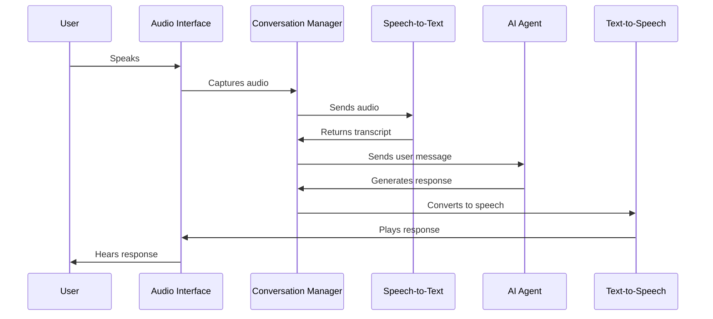

# Chapter 8: Conversational AI

In [Chapter 7: Speech-to-Text Conversion](07_speech_to_text_conversion_.md), we learned how to turn spoken words into written text. Now, let's explore how to combine this with text-to-speech to create interactive voice agents that can maintain natural conversations.

## What is Conversational AI?

Imagine having a digital assistant that not only understands what you say but can respond in a natural, human-like voice and remember your previous interactions. That's the magic of Conversational AI!

Think of it like this: if [Text-to-Speech Conversion](04_text_to_speech_conversion_.md) is like giving your computer a voice, and [Speech-to-Text Conversion](07_speech_to_text_conversion_.md) is like giving it ears, then Conversational AI is like giving it a brain that connects these abilities into a seamless experience.

With ElevenLabs' Conversational AI, you can create voice-based agents that:
- Listen to users and understand what they're saying
- Maintain context across multiple conversation turns
- Generate intelligent responses
- Speak back using natural-sounding AI voices

Let's create a simple virtual assistant that can answer questions about the weather!

## Key Components of Conversational AI

A conversational AI system consists of several key parts working together:

1. **Audio Interface**: Captures user's voice and plays the agent's responses
2. **Speech-to-Text**: Converts the user's speech into text
3. **Conversation Manager**: Maintains the conversation state and context
4. **Text-to-Speech**: Converts the agent's responses back into speech

ElevenLabs makes this easy by integrating all these components into a single `Conversation` class.

## Creating Your First Voice Agent

Let's start by creating a basic voice agent:

```python
from elevenlabs import ElevenLabs
from elevenlabs.conversational_ai.conversation import Conversation

# Initialize the client
client = ElevenLabs()

# Create a conversation object
conversation = Conversation(
    client=client,
    agent_id="your_agent_id"  # Get this from ElevenLabs dashboard
)
```

This code initializes a `Conversation` object, which is your interface to the conversational AI system. The `agent_id` parameter identifies which pre-configured agent to use - you can create these in the ElevenLabs dashboard.

## Adding Callbacks for Interaction

To make our agent interactive, we need to set up callbacks that handle different events:

```python
# Define what happens when the agent speaks
def on_agent_response(text):
    print(f"Assistant: {text}")

# Define what happens when the user's speech is recognized
def on_user_transcript(text):
    print(f"You said: {text}")
```

These simple functions will print the conversation to the console. In a real application, you might update a UI or trigger other actions based on what was said.

## Setting Up the Conversation

Now let's connect these callbacks to our conversation:

```python
# Create conversation with callbacks
conversation = Conversation(
    client=client,
    agent_id="your_agent_id",
    callback_agent_response=on_agent_response,
    callback_user_transcript=on_user_transcript
)
```

With these callbacks in place, our application will be notified whenever the user says something or the agent responds.

## Starting and Ending a Conversation

To begin interacting with our agent:

```python
# Start the conversation
conversation.start_session()

# Let it run for a while (in a real app, you'd have a UI to control this)
import time
time.sleep(60)  # Let conversation run for 60 seconds

# End the conversation when done
conversation.end_session()
```

When you call `start_session()`, the system begins listening through your default microphone and will respond through your speakers. The agent is now ready to engage in conversation!

## Making Your Agent Smarter with Custom Tools

Let's make our weather assistant actually able to check the weather:

```python
from elevenlabs.conversational_ai.conversation import ClientTools

# Create a tools manager
tools = ClientTools()

# Register a simple weather checking function
def get_weather(parameters):
    location = parameters.get("location", "New York")
    return f"It's currently sunny in {location} with a high of 75°F."

# Add this tool to our toolbox
tools.register("check_weather", get_weather)
```

This creates a function that our agent can call when a user asks about the weather. In a real application, this would connect to a weather API to get actual weather data.

## Using Tools in a Conversation

Now let's update our conversation to use this weather tool:

```python
# Create conversation with tool support
conversation = Conversation(
    client=client,
    agent_id="your_agent_id",
    callback_agent_response=on_agent_response,
    callback_user_transcript=on_user_transcript,
    client_tools=tools
)
```

With this setup, when a user asks "What's the weather like in Chicago?", the agent can call our custom `check_weather` function with `{"location": "Chicago"}` to get the information it needs.

## How Conversational AI Works Behind the Scenes

When you're having a conversation with an AI agent, here's what's happening under the hood:



1. You speak into your microphone
2. The Audio Interface captures your speech
3. The Conversation Manager sends this audio to Speech-to-Text
4. The transcript is sent to the AI Agent
5. The Agent generates a response based on the conversation context
6. The response is converted to speech using Text-to-Speech
7. You hear the response through your speakers

This entire cycle happens quickly, creating the feeling of a natural conversation.

## Asynchronous Tools for Complex Tasks

For operations that might take time (like calling external APIs), you can use asynchronous tools:

```python
import asyncio

# Register an async tool
async def fetch_weather_forecast(parameters):
    # In a real app, this would call a weather API
    await asyncio.sleep(1)  # Simulate network delay
    location = parameters.get("location", "New York")
    return f"5-day forecast for {location}: Sunny all week"

# Register as an async tool
tools.register(
    "weather_forecast", 
    fetch_weather_forecast, 
    is_async=True
)
```

Asynchronous tools are perfect for operations that might take time, allowing the conversation to remain responsive.

## The Internal Architecture

The Conversation class manages the complex flow of a voice interaction:

```python
# From src/elevenlabs/conversational_ai/conversation.py (simplified)
class Conversation:
    def __init__(self, client, agent_id, callback_agent_response=None, 
                 callback_user_transcript=None, client_tools=None):
        self._client = client
        self._agent_id = agent_id
        self._callback_agent_response = callback_agent_response
        self._callback_user_transcript = callback_user_transcript
        self._client_tools = client_tools
        # ... other initialization
    
    def start_session(self):
        # Initialize WebSocket connection
        # Start audio capturing
        # Begin listening for user input
        pass
        
    def end_session(self):
        # Close connections
        # Clean up resources
        pass
```

The system uses WebSockets for real-time communication, allowing for bidirectional streaming of audio and text between your application and ElevenLabs' servers.

## Customizing the Audio Experience

You can customize how the audio is handled:

```python
from elevenlabs.conversational_ai.default_audio_interface import DefaultAudioInterface

# Create a conversation with custom audio settings
conversation = Conversation(
    client=client,
    agent_id="your_agent_id",
    audio_interface=DefaultAudioInterface(
        input_device_index=1,  # Specify which microphone to use
        output_device_index=2  # Specify which speakers to use
    )
)
```

This allows you to select specific audio devices, which is useful for applications with multiple microphones or speakers.

## Practical Example: A Language Learning Assistant

Let's create a more complete example - a language learning assistant:

```python
def create_language_tutor(client):
    # Create tools for the tutor
    tools = ClientTools()
    
    def check_grammar(parameters):
        sentence = parameters.get("sentence", "")
        # This would use an actual grammar checking service
        return "Good job! Try using the past tense next time."
    
    tools.register("grammar_check", check_grammar)
```

This sets up a tool that our language tutor can use to check grammar. Now let's create the conversation:

```python
    # Define callbacks
    def on_tutor_response(text):
        print(f"Tutor: {text}")
    
    def on_student_speech(text):
        print(f"You said: {text}")
    
    # Create and start the tutor conversation
    tutor = Conversation(
        client=client,
        agent_id="language_tutor_agent_id",
        callback_agent_response=on_tutor_response,
        callback_user_transcript=on_student_speech,
        client_tools=tools
    )
    
    return tutor
```

This function creates a language tutor that can listen to a student speak, check their grammar, and provide feedback.

## Measuring Performance

You might want to know how responsive your conversation is:

```python
# Add a latency callback
def on_latency(milliseconds):
    print(f"Response took {milliseconds}ms")

# Include it in your conversation
conversation = Conversation(
    client=client,
    agent_id="your_agent_id",
    callback_latency_measurement=on_latency
)
```

This callback will be triggered each time the system measures how long it took to respond to the user, helping you monitor performance.

## Conclusion

In this chapter, we've explored Conversational AI - a powerful system that brings together speech-to-text and text-to-speech to create interactive voice agents. We've learned how to:

- Create a conversational agent
- Set up callbacks to handle different parts of the conversation
- Add custom tools to make the agent more capable
- Start and end conversation sessions
- Understand how the system works behind the scenes

Conversational AI opens up exciting possibilities for creating voice-based applications like virtual assistants, language tutors, customer service agents, and interactive characters for games or stories.

In the next chapter, [Webhooks System](09_webhooks_system_.md), we'll explore how to connect ElevenLabs with external services, allowing you to build even more sophisticated applications that integrate with your existing systems.

---

