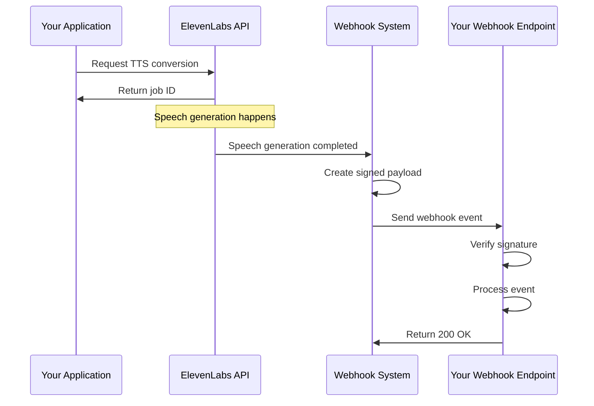

# Chapter 9: Webhooks System

In [Chapter 8: Conversational AI](08_conversational_ai_.md), we learned how to create interactive voice agents. Now, let's explore another powerful feature of ElevenLabs: the Webhooks System, which allows your applications to receive real-time notifications when events occur in the ElevenLabs platform.

## What are Webhooks and Why Use Them?

Imagine you're waiting for an important package. You could keep checking your doorstep every 5 minutes, or you could ask the delivery service to text you when they arrive. Webhooks are like that text message notification - instead of your application constantly checking if something happened in ElevenLabs, ElevenLabs can notify your application when events occur.

Webhooks allow for event-driven integration between ElevenLabs and your applications. For example:

- Get notified when a text-to-speech conversion is completed
- Receive an alert when a voice creation finishes
- Be informed when an error occurs in a process

Let's see how we can use webhooks to build a simple notification system for when a text-to-speech conversion is complete.

## Setting Up a Basic Webhook

Before we dive into code, you'll need a public URL where ElevenLabs can send webhook events. For development, you might use a service like ngrok or a cloud-hosted endpoint.

Here's a simple example of how webhook data might arrive at your endpoint:

```python
# This is what ElevenLabs will send to your endpoint
webhook_data = {
    "event_type": "speech.completed",
    "id": "abc123",
    "project_id": "proj456",
    "status": "completed",
    "timestamp": 1632145260
}
```

This payload contains information about the event, including what type of event occurred, related IDs, and when it happened.

## Verifying Webhook Signatures

When receiving webhooks, it's crucial to verify they actually came from ElevenLabs and not from someone pretending to be them. ElevenLabs includes a signature with each webhook for this purpose.

The ElevenLabs Python SDK makes verification easy:

```python
from elevenlabs import ElevenLabs

client = ElevenLabs()

# When you receive a webhook request
def handle_webhook(request_body, signature_header):
    webhook_secret = "your_webhook_secret"
    
    # Verify and parse the webhook
    event = client.webhooks.construct_event(
        request_body, 
        signature_header, 
        webhook_secret
    )
    
    return event
```

This code takes the raw request body and signature header from the webhook request, verifies the signature using your webhook secret, and returns the parsed event data if verification succeeds.

## How Webhook Verification Works

Signature verification is like checking the seal on a letter to ensure it truly came from the sender. Here's a simplified version of what happens:

```python
# To verify a webhook (simplified):
def verify_signature(body, signature, secret):
    # 1. Extract timestamp and signature hash
    timestamp = get_timestamp_from_header(signature)
    
    # 2. Create message to verify
    message = f"{timestamp}.{body}"
    
    # 3. Generate expected signature
    expected = hmac_sha256(message, secret)
    
    # 4. Compare signatures
    return expected == get_sig_hash(signature)
```

This verification process ensures that only webhooks actually sent by ElevenLabs (who know the secret) will be processed by your application.

## Processing Different Event Types

Different events in ElevenLabs will trigger different types of webhooks. Here's how you might handle them:

```python
def process_webhook(event):
    # Check the event type
    if event["event_type"] == "speech.completed":
        # Handle completed speech generation
        handle_completed_speech(event)
    elif event["event_type"] == "voice.created":
        # Handle new voice creation
        handle_new_voice(event)
    else:
        # Handle other event types
        print(f"Received event: {event['event_type']}")
```

This function checks what type of event occurred and routes it to the appropriate handler. It's like having different departments in a company handling different types of customer requests.

## Practical Example: Text-to-Speech Notification System

Let's build a simple notification system that alerts us when a text-to-speech conversion is complete:

```python
from flask import Flask, request, jsonify

app = Flask(__name__)
client = ElevenLabs()

@app.route("/webhook", methods=["POST"])
def webhook_handler():
    # Get the request data
    payload = request.data.decode("utf-8")
    signature = request.headers.get("X-Eleven-Signature")
    
    try:
        # Verify and parse the webhook
        event = client.webhooks.construct_event(
            payload, signature, "your_webhook_secret"
        )
        
        # Process the event
        if event["event_type"] == "speech.completed":
            # Send notification (e.g., email, push notification)
            send_notification(
                f"Speech generation complete! ID: {event['id']}"
            )
            
        return jsonify({"success": True}), 200
    except Exception as e:
        return jsonify({"error": str(e)}), 400
```

This Flask application creates an endpoint that receives webhooks from ElevenLabs, verifies them, and sends a notification when a speech generation is completed.

## How Webhooks Work Behind the Scenes

When you use the Webhooks system, here's what happens:



1. Your application requests a service from ElevenLabs (e.g., text-to-speech)
2. When the requested operation completes, ElevenLabs generates an event
3. The Webhook System creates a secure payload with a signature
4. This payload is sent to your webhook endpoint URL
5. Your application verifies the signature and processes the event
6. Your endpoint returns a 200 OK response to acknowledge receipt

The internal implementation of webhook verification in the SDK looks like this:

```python
# From src/elevenlabs/webhooks/client.py (simplified)
class WebhooksClient:
    def construct_event(self, payload, sig_header, secret):
        """Verifies and constructs an event from a webhook payload."""
        if not secret:
            raise BadRequestError("Webhook secret not configured")
            
        if not sig_header:
            raise BadRequestError("Missing signature header")
            
        # Extract timestamp and signature
        timestamp, signature = self._get_signature_parts(sig_header)
        
        # Verify timestamp is recent
        self._verify_timestamp(timestamp)
        
        # Verify signature
        self._verify_signature(payload, timestamp, signature, secret)
        
        # Parse and return event data
        return json.loads(payload)
```

This code ensures that webhooks are secure, recent, and properly formatted before your application processes them.

## Setting Up Webhooks in ElevenLabs

To start receiving webhooks, you need to:

1. Create a webhook endpoint in your application
2. Register this endpoint in the ElevenLabs dashboard
3. Configure which events you want to receive
4. Note your webhook secret for verification

Here's a simplified view of what a webhook configuration might look like:

```python
# Example webhook configuration (not actual API code)
webhook = {
    "name": "TTS Completion Notifier",
    "webhook_url": "https://your-app.com/webhook",
    "auth_type": "HMAC_SHA256",
    "usage": ["TEXT_TO_SPEECH"],
    "is_disabled": False
}
```

This configuration tells ElevenLabs to send notifications to your endpoint when text-to-speech events occur.

## Handling Webhook Failures

Sometimes webhooks might fail to deliver. ElevenLabs handles this with retries, but your application should be prepared:

```python
# In your webhook handler
def webhook_handler():
    try:
        # Process webhook
        # ...
        
        # Always return 200 if you processed it successfully
        return {"success": True}, 200
    except TemporaryError:
        # Return non-200 status to request a retry
        return {"error": "Please retry later"}, 500
    except PermanentError:
        # Return 200 even for errors you can't fix
        # This prevents endless retries
        return {"error": "Cannot process"}, 200
```

This pattern ensures ElevenLabs knows whether to retry sending a webhook or not, like telling a delivery person whether they should try again tomorrow or not.

## Security Best Practices

When working with webhooks, always follow these security practices:

1. **Always verify signatures** - Never skip this step
2. **Keep your webhook secret secure** - Don't commit it to public repositories
3. **Use HTTPS endpoints** - Ensures data is encrypted in transit
4. **Implement timeout handling** - Your handler should respond quickly

## Practical Example: Logging Completed Conversions

Let's create a simple logging system that records when text-to-speech conversions complete:

```python
@app.route("/webhook/tts-log", methods=["POST"])
def tts_logger():
    # Get request data
    payload = request.data.decode("utf-8")
    signature = request.headers.get("X-Eleven-Signature")
    
    # Verify webhook
    event = client.webhooks.construct_event(
        payload, signature, WEBHOOK_SECRET
    )
    
    # Log the completion
    if event["event_type"] == "speech.completed":
        with open("tts_log.txt", "a") as log:
            log.write(f"{event['timestamp']} - {event['id']}\n")
    
    return {"success": True}, 200
```

This endpoint receives webhooks about completed text-to-speech conversions and logs them to a file, creating a record of all your conversions.

## Conclusion

In this chapter, we've explored the Webhooks System in ElevenLabs, which allows your applications to receive real-time notifications about events. We've learned how to:

- Understand what webhooks are and why they're useful
- Verify webhook signatures for security
- Process different types of webhook events
- Implement a simple notification system
- Handle webhook failures appropriately

Webhooks are like having a team of assistants that tap you on the shoulder whenever something important happens, allowing your application to respond immediately to events in the ElevenLabs platform.

As we conclude this tutorial, you now have a comprehensive understanding of the major components of the ElevenLabs Python SDK. From creating lifelike voices to building conversational AI and integrating with external systems through webhooks, you have all the tools you need to build sophisticated voice applications.

The ElevenLabs platform continues to evolve with new features and capabilities. We encourage you to explore the [official documentation](https://elevenlabs.io/docs) for the latest updates and advanced features as you continue your journey with voice AI technology.

---

