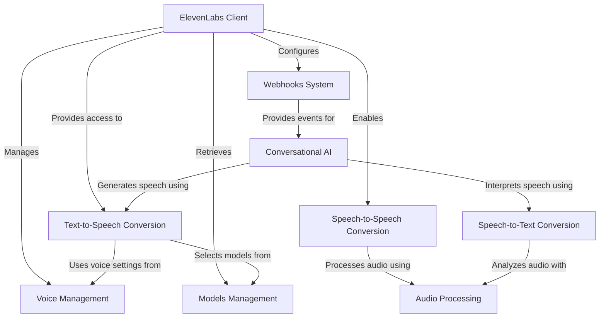

# Tutorial: elevenlabs-python

The **elevenlabs-python** library is a Python SDK for interacting with the ElevenLabs API, which provides advanced **voice synthesis** and **audio processing** capabilities. The library lets developers easily convert text to natural-sounding speech, transform speech between different voices, transcribe audio to text, create interactive voice agents, and process audio files. All functionality is accessed through a central **ElevenLabs client** that handles authentication and communication with the API, allowing developers to integrate lifelike voices into their applications with *minimal code*.

**Source Repository:** [https://github.com/elevenlabs/elevenlabs-python](https://github.com/elevenlabs/elevenlabs-python)

## Chapters

1. [ElevenLabs Client
](01_elevenlabs_client_.md)
2. [Voice Management
](02_voice_management_.md)
3. [Models Management
](03_models_management_.md)
4. [Text-to-Speech Conversion
](04_text_to_speech_conversion_.md)
5. [Audio Processing
](05_audio_processing_.md)
6. [Speech-to-Speech Conversion
](06_speech_to_speech_conversion_.md)
7. [Speech-to-Text Conversion
](07_speech_to_text_conversion_.md)
8. [Conversational AI
](08_conversational_ai_.md)
9. [Webhooks System
](09_webhooks_system_.md)

---

