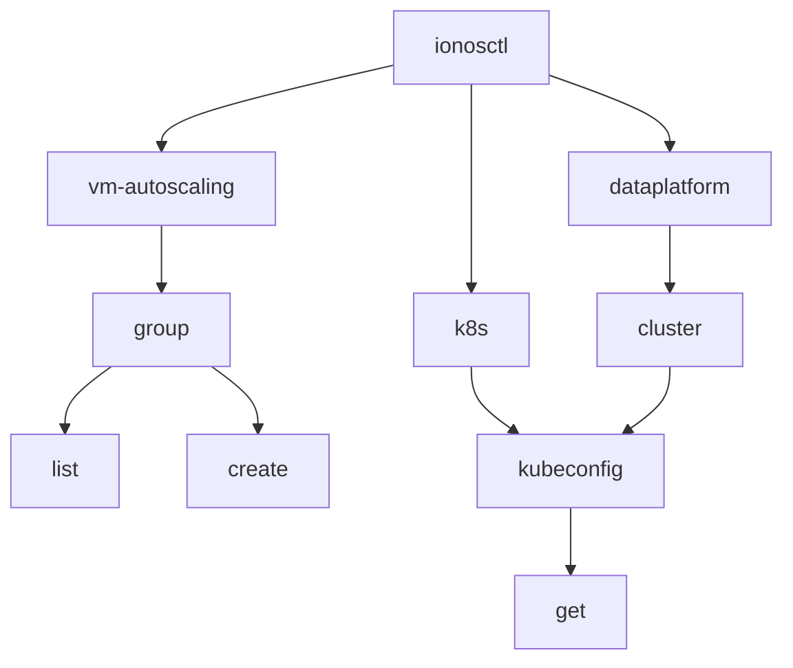
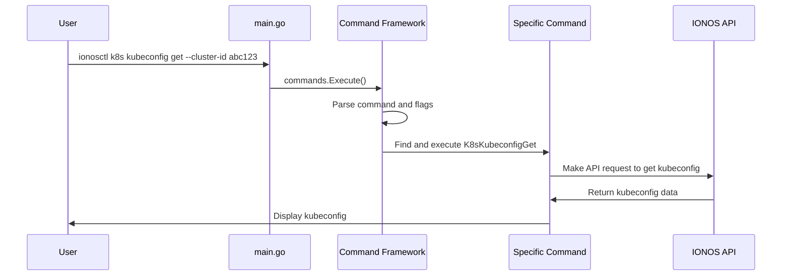

# Chapter 1: Command Framework

Welcome to the ionosctl tutorial series! In this first chapter, we'll explore the Command Framework, which forms the backbone of how you interact with the IONOS Cloud through the command line.

## What is the Command Framework?

Imagine you're exploring a new city. You'd need a map to navigate its streets, landmarks, and districts. Similarly, when working with a command-line tool like `ionosctl`, you need a way to navigate through various commands and options.

The Command Framework is like that map—it organizes all available commands into a logical structure that's easy to navigate. When you type a command like `ionosctl vm-autoscaling group list`, the framework guides your input to the right "destination" (the correct piece of code to execute).

## Understanding the Command Tree

The Command Framework organizes commands into what we call a "command tree". Let's visualize this:



In this tree:
- `ionosctl` is the root command
- `vm-autoscaling`, `k8s`, and `dataplatform` are top-level commands
- Each of these branches into subcommands like `group` or `kubeconfig`
- These can further branch into actions like `list`, `create`, or `get`

When you run a command, you're essentially traversing this tree from the root to a leaf.

## Your First ionosctl Command

Let's start with a simple example. Say you want to get the configuration file for a Kubernetes cluster. The command would look like this:

```bash
ionosctl k8s kubeconfig get --cluster-id your-cluster-id
```

Breaking this down:
1. `ionosctl` - The base command
2. `k8s` - The top-level command for Kubernetes operations
3. `kubeconfig` - The specific resource you want to work with
4. `get` - The action you want to perform
5. `--cluster-id your-cluster-id` - A flag with a value specifying which cluster

The Command Framework takes this input, routes it through the command tree, and executes the right code to fetch your kubeconfig.

## How Commands Are Defined

Now let's peek under the hood. How are these commands actually defined in the code? Here's a simplified example:

```go
func K8sKubeconfigCmd() *core.Command {
    ctx := context.TODO()
    k8sCmd := &core.Command{
        Command: &cobra.Command{
            Use:     "kubeconfig",
            Aliases: []string{"cfg", "config"},
            Short:   "Kubernetes Kubeconfig Operations",
        },
    }
    
    // Add the 'get' subcommand
    get := core.NewCommand(ctx, k8sCmd, core.CommandBuilder{
        Verb:      "get",
        ShortDesc: "Get the kubeconfig file",
        CmdRun:    RunK8sKubeconfigGet,
    })
    
    // Add flags (like --cluster-id)
    get.AddUUIDFlag(constants.FlagClusterId, "", "", "", core.RequiredFlagOption())
    
    return k8sCmd
}
```

This code defines a `kubeconfig` command with a `get` subcommand. It specifies descriptions, aliases, and most importantly, what function to run when the command is executed (`RunK8sKubeconfigGet`).

## The Command Execution Flow

When you run an `ionosctl` command, what happens behind the scenes? Let's walk through it step by step:



1. You enter a command in your terminal
2. The `main.go` file calls `commands.Execute()`
3. The Command Framework parses your input to identify the command, subcommand, and flags
4. It finds the corresponding function to run (like `RunK8sKubeconfigGet`)
5. That function makes the necessary API calls to IONOS Cloud
6. The result is processed and displayed back to you

## The Role of Cobra

The Command Framework in `ionosctl` is built on top of a popular Go library called [Cobra](https://github.com/spf13/cobra). Cobra provides the underlying functionality for:

- Parsing command line arguments
- Generating help text automatically
- Handling flags and their values
- Supporting command completion

This is why you'll see references to `cobra.Command` in the code.

## How to Create Your Own Command

While you won't need to create commands as a user, understanding the structure helps you use the tool better. Here's how a command is typically defined:

```go
// Create a new command
myCmd := core.NewCommand(ctx, parentCmd, core.CommandBuilder{
    Namespace:  "namespace",
    Resource:   "resource",
    Verb:       "action",
    ShortDesc:  "Short description",
    LongDesc:   "Longer description",
    Example:    "Example usage",
    PreCmdRun:  preRunFunction,
    CmdRun:     runFunction,
})

// Add flags to the command
myCmd.AddStringFlag("flag-name", "shorthand", "default", "description")
```

The Command Framework handles the rest, integrating your command into the command tree and ensuring it works consistently with the rest of the tool.

## Conclusion

The Command Framework is the foundation that makes `ionosctl` user-friendly and powerful. It organizes commands logically, handles parsing of your input, and routes execution to the right code.

As you use `ionosctl`, remember that you're navigating through this command tree. The more familiar you become with its structure, the more efficiently you can work with IONOS Cloud resources.

In the next chapter, [Configuration Management](02_configuration_management_.md), we'll explore how `ionosctl` manages your settings and preferences, allowing for a more personalized experience.

---

