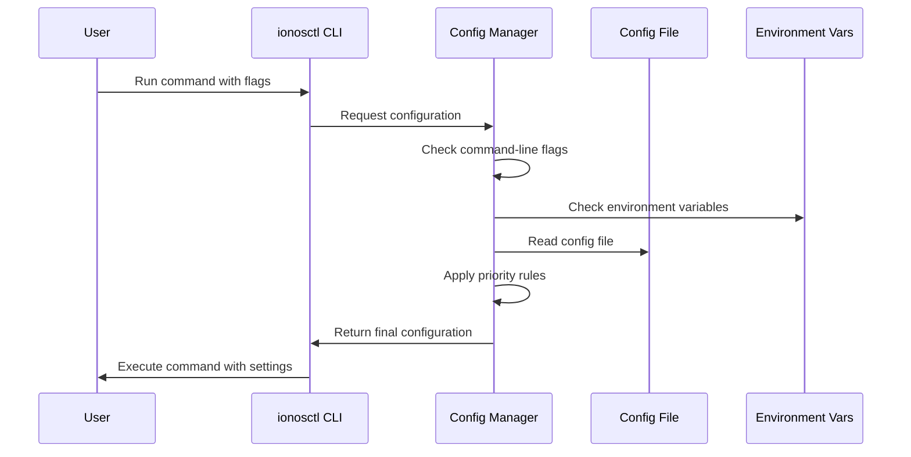

# Chapter 2: Configuration Management

In [Chapter 1: Command Framework](01_command_framework_.md), we explored how `ionosctl` organizes commands into a logical structure. Now, let's look at how the tool remembers your preferences and settings.

## Why Configuration Management Matters

Imagine having to type your username, password, and preferred API endpoint every time you run a command. Tedious, right? This is where Configuration Management comes in.

Just like how your web browser remembers your login information and preferences, `ionosctl` can store your settings so you don't have to repeatedly enter them. This makes the tool much more convenient to use day-to-day.

Let's consider a common scenario: You regularly work with multiple IONOS environments (production and testing) and need to switch between them.

## Understanding Configuration in ionosctl

The Configuration Management system in `ionosctl` handles several key aspects:

1. **What gets stored**: API endpoints, credentials, output formats, etc.
2. **Where it's stored**: In a configuration file on your system
3. **How it's accessed**: Through a priority system that checks multiple sources

Let's explore each of these aspects.

## The Configuration File

`ionosctl` stores your settings in a JSON file. By default, this file is located at:

- Linux/macOS: `$HOME/.config/ionosctl/config.json`
- Windows: `%APPDATA%\ionosctl\config.json`

A typical configuration file might look like this:

```json
{
  "api-url": "https://api.ionos.com",
  "username": "your-username",
  "password": "your-password",
  "output-format": "json"
}
```

This simple JSON structure makes it easy to store and retrieve your preferences.

## Setting Up Your Configuration

You can set up your configuration in three main ways:

### 1. Using the Command Line

The most direct way is to use flags when running commands:

```bash
ionosctl k8s cluster list --username john.doe --password secret --api-url https://api.ionos.com
```

This works, but typing these values every time is cumbersome.

### 2. Using Environment Variables

You can set environment variables that `ionosctl` will recognize:

```bash
export IONOS_USERNAME=john.doe
export IONOS_PASSWORD=secret
export IONOS_API_URL=https://api.ionos.com
```

Now you can run commands without specifying these values every time:

```bash
ionosctl k8s cluster list
```

### 3. Using the Configuration File

For a more permanent solution, you can store your settings in the config file:

```bash
ionosctl config set username john.doe
ionosctl config set api-url https://api.ionos.com
ionosctl config set password
```

Notice that for sensitive information like passwords, the command prompts for input rather than accepting it directly in the command line (where it might be visible in your command history).

## The Priority System

What happens if you have settings in multiple places? `ionosctl` uses a priority system:

1. Command-line flags (highest priority)
2. Environment variables
3. Configuration file (lowest priority)

For example, if you have an API URL in your config file but specify a different one with a flag, the flag value takes precedence.

Let's see how this works in code:

```go
// GetServerUrl returns the server URL with layered fallbacks
func GetServerUrl() string {
    // 1. Check command line flags first
    if val := viper.GetString(constants.ArgServerUrl); val != "" {
        return val
    }
    // 2. Then check environment variables
    if val := viper.GetString(constants.EnvServerUrl); val != "" {
        return val
    }
    // 3. Finally, check the config file
    cfgFields, err := Read()
    if err == nil {
        if val := cfgFields[constants.CfgServerUrl]; val != "" {
            return val
        }
    }
    return ""
}
```

This function shows how `ionosctl` searches for the server URL in multiple places, prioritizing command-line flags over environment variables and config file values.

## Managing Your Configuration

`ionosctl` provides several commands to manage your configuration:

### Viewing Your Configuration

To see your current configuration:

```bash
ionosctl config list
```

This will show all your stored settings, with sensitive data like passwords masked.

### Setting Configuration Values

To set a value:

```bash
ionosctl config set key value
```

For example:

```bash
ionosctl config set output-format json
```

### Removing Configuration Values

To remove a specific value:

```bash
ionosctl config unset output-format
```

### Logging Out (Clearing Credentials)

To remove all sensitive data from your configuration:

```bash
ionosctl config logout
```

This is a convenient way to clear your credentials without deleting other settings.

## How Configuration Management Works Under the Hood

Let's take a closer look at what happens when `ionosctl` handles configuration:



When you run an `ionosctl` command, the tool follows these steps to determine your settings:

1. Parse any command-line flags you've provided
2. Check relevant environment variables
3. Read the configuration file (if it exists)
4. Apply the priority system to determine the final values
5. Use these values when executing your command

## Reading and Writing the Configuration File

Let's look at how `ionosctl` interacts with the configuration file:

### Reading Configuration

```go
func Read() (map[string]string, error) {
    path := GetConfigFilePath()
    
    // Check file permissions for security
    fileInfo, err := os.Stat(path)
    if err != nil {
        return nil, fmt.Errorf("failed getting config file info: %w", err)
    }
    
    // Read the file
    data, err := os.ReadFile(path)
    if err != nil {
        return nil, fmt.Errorf("failed reading config file: %w", err)
    }
    
    // Parse JSON data
    var result map[string]string
    err = json.Unmarshal(data, &result)
    if err != nil {
        return nil, fmt.Errorf("failed unmarshalling config file data: %w", err)
    }
    
    return result, nil
}
```

This function reads the configuration file, checks permissions for security, and parses the JSON data into a map of settings.

### Writing Configuration

```go
func Write(data map[string]string) error {
    // Open or create the config file
    f, err := configFileWriter()
    if err != nil {
        return err
    }
    defer f.Close()
    
    // Convert data to formatted JSON
    b, err := json.MarshalIndent(data, "", "  ")
    if err != nil {
        return errors.New("unable to encode configuration to JSON format")
    }
    
    // Write to the file
    _, err = f.Write(b)
    if err != nil {
        return errors.New("unable to write configuration")
    }
    return nil
}
```

This function converts your settings to JSON and writes them to the configuration file.

## Security Considerations

`ionosctl` takes security seriously, especially for configuration files that may contain sensitive information:

1. **File permissions**: The configuration file is created with restrictive permissions (0600 on Unix systems), meaning only you can read or write to it.

2. **Password handling**: When setting passwords via commands, they're not shown on screen and not stored in command history.

3. **Logout functionality**: The `logout` command lets you easily clear sensitive information without deleting your entire configuration.

## Practical Example: Working with Multiple Environments

Let's work through a common scenario: switching between production and testing environments.

### Step 1: Set up your production environment

```bash
ionosctl config set api-url https://api.ionos.com
ionosctl config set username production-user
ionosctl config set password
# Enter your production password when prompted
```

### Step 2: Create environment variables for your testing environment

```bash
export IONOS_API_URL=https://api-test.ionos.com
export IONOS_USERNAME=test-user
export IONOS_PASSWORD=test-password
```

### Step 3: Use the environments

For production (using config file):
```bash
ionosctl k8s cluster list
```

For testing (using environment variables):
```bash
ionosctl k8s cluster list
```

Notice we used the same command both times! The environment variables override the config file settings when they're set.

### Step 4: Override for a single command

If you need to use a different setting just once, use flags:

```bash
ionosctl k8s cluster list --api-url https://api-special.ionos.com
```

This will use the special API URL just for this command, without changing your configuration.

## Conclusion

Configuration Management in `ionosctl` gives you flexibility in how you store and access your settings. By understanding the priority system and the different ways to manage your configuration, you can streamline your workflow and avoid repeatedly typing the same information.

Whether you're working with multiple environments, sharing a computer, or just want to save time, the Configuration Management system helps make `ionosctl` more convenient and secure to use.

In the next chapter, [Authentication System](03_authentication_system_.md), we'll explore how `ionosctl` uses your credentials to securely access the IONOS Cloud API.

---

