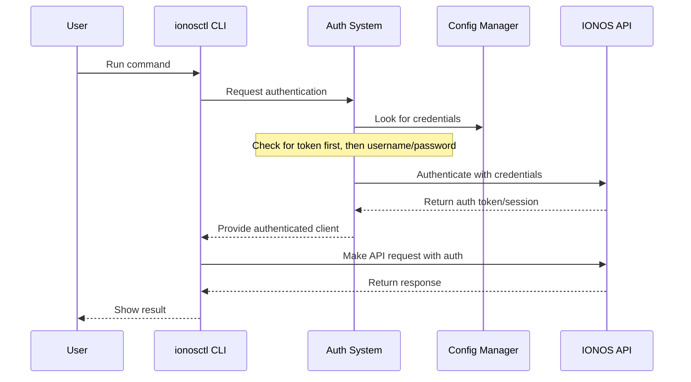

# Chapter 3: Authentication System

In [Chapter 2: Configuration Management](02_configuration_management_.md), we learned how `ionosctl` stores and manages your settings. Now, let's explore how the tool securely connects to IONOS Cloud services using your identity.

## Why Authentication Matters

Imagine you're visiting a secure office building. Before entering, you need to show your ID card at the reception desk. Once verified, you receive a keycard that grants you access to specific areas of the building based on your permissions.

The Authentication System in `ionosctl` works similarly:
- Your credentials (username/password or token) are like your ID card
- The authentication process is like the reception desk verification
- The resulting authenticated session is like your temporary keycard

Without proper authentication, you wouldn't be able to access any IONOS Cloud resources, just as you couldn't enter secured areas without a keycard.

## A Simple Authentication Scenario

Let's consider a common scenario: You need to list your Kubernetes clusters in the IONOS Cloud. Before you can do this, `ionosctl` needs to verify who you are.

```bash
ionosctl k8s cluster list
```

For this command to work, you need to be authenticated. But how does `ionosctl` know who you are?

## Authentication Methods

`ionosctl` supports two primary ways to authenticate:

### 1. Username and Password Authentication

This is the most straightforward method, similar to logging into a website:

```bash
ionosctl k8s cluster list --username john.doe --password my-secret-password
```

While simple, typing your password in the command line has drawbacks:
- Your password might appear in your command history
- You need to enter it for each command
- It's not the most secure approach for automation

### 2. Token-based Authentication

For a more secure and convenient approach, you can use authentication tokens:

```bash
ionosctl k8s cluster list --token eyJhbGciOiJIUzI1NiIsImtpZCI6IjEifQ...
```

Tokens offer several advantages:
- They can expire after a set time (improving security)
- They don't expose your password
- They're ideal for scripts and automation
- They can have specific permissions

## Generating and Using Tokens

Let's look at how to create and use tokens with `ionosctl`:

### Generating a Token

```bash
ionosctl token generate
```

This command will:
1. Prompt for your username and password if not provided
2. Connect to the IONOS API
3. Generate a token for you
4. Display the token

By default, tokens are valid for 1 year, but you can customize this:

```bash
ionosctl token generate --ttl 30d
```

This creates a token valid for 30 days. You can use various time formats:
- `1Y` - 1 year
- `6M` - 6 months
- `30d` - 30 days
- `12h` - 12 hours
- `30m` - 30 minutes

### Using a Token

Once you have a token, you can use it in several ways:

**1. As a command-line flag:**
```bash
ionosctl k8s cluster list --token your-token-here
```

**2. As an environment variable:**
```bash
export IONOS_TOKEN=your-token-here
ionosctl k8s cluster list
```

**3. In your configuration file:**
```bash
ionosctl config set token your-token-here
ionosctl k8s cluster list
```

### Viewing Token Information

To see details about your token:

```bash
ionosctl token parse --token your-token-here
```

This shows information like:
- Token ID
- Creation date
- Expiration date
- User and contract information

To see what permissions the token has:

```bash
ionosctl token parse --token your-token-here --privileges
```

## Storing Authentication Securely

The Authentication System works hand-in-hand with the [Configuration Management](02_configuration_management_.md) system to store your credentials securely.

When you set your username/password or token in the configuration:

```bash
ionosctl config set username john.doe
ionosctl config set password
# You'll be prompted to enter your password securely
```

These credentials are stored in your configuration file with proper permissions to keep them safe.

## Authentication Priority

Similar to configuration, `ionosctl` uses a priority system to determine which authentication method to use:

1. Command-line flags (highest priority)
2. Environment variables
3. Configuration file (lowest priority)

The tool also has a specific order for authentication methods:
1. Token authentication (if a token is available)
2. Username/password authentication (if no token is found)

## How Authentication Works Behind the Scenes

When you run an `ionosctl` command, the authentication process works like this:



Let's look at a simplified version of the code that handles this:

```go
// getAuthenticatedClient returns a client for the API
func getAuthenticatedClient(ctx context.Context) (*sdk.APIClient, error) {
    // Try token auth first
    token := getToken()
    if token != "" {
        return sdk.NewAPIClientWithToken(token), nil
    }
    
    // Fall back to username/password
    username := getUsername()
    password := getPassword()
    if username != "" && password != "" {
        return sdk.NewAPIClient(username, password), nil
    }
    
    return nil, errors.New("no valid authentication found")
}
```

This function first tries to authenticate with a token. If no token is available, it falls back to username and password. If neither method works, it returns an error.

## Security Best Practices

To keep your IONOS Cloud account secure:

1. **Use tokens instead of passwords** when possible, especially in scripts
2. **Set reasonable expiration times** for tokens
3. **Never share your tokens** or include them in public repositories
4. **Use the `logout` command** to clear credentials when done
   ```bash
   ionosctl config logout
   ```
5. **Regularly rotate your tokens**, especially for automation

## Token Management in Detail

Let's explore a bit more about how tokens work in `ionosctl`:

### Token Structure

IONOS tokens are JSON Web Tokens (JWTs), which consist of three parts:
- Header: Contains the token type and algorithm
- Payload: Contains claims (like user ID, expiration time)
- Signature: Verifies the token hasn't been altered

The implementation checks these components to validate the token:

```go
// simplified token validation
func validateToken(token string) bool {
    parts := strings.Split(token, ".")
    if len(parts) != 3 {
        return false
    }
    
    // Decode and check header
    header, err := base64.DecodeString(parts[0])
    if err != nil {
        return false
    }
    
    // Check expiration in payload
    payload, err := base64.DecodeString(parts[1])
    if err != nil {
        return false
    }
    
    // Further validation...
    return true
}
```

### Token Storage

Tokens are stored in the configuration file along with other settings:

```json
{
  "api-url": "https://api.ionos.com",
  "token": "eyJhbGciOiJIUzI1NiIsImtpZCI6IjEifQ..."
}
```

The file permissions (0600 on Unix systems) ensure only you can read this file.

## Practical Examples

Let's walk through some common authentication scenarios:

### Scenario 1: First-time setup with username/password

```bash
# Set your credentials in the config
ionosctl config set username john.doe
ionosctl config set password
# Enter your password when prompted

# Now you can run commands without specifying credentials
ionosctl k8s cluster list
```

### Scenario 2: Switching to token-based authentication

```bash
# Generate a token (uses your stored username/password)
ionosctl token generate --ttl 90d
# Copy the displayed token

# Store it in your configuration
ionosctl config set token your-token-here

# Now you can run commands using the token
ionosctl k8s cluster list
```

### Scenario 3: Temporary override for a single command

```bash
# Use different credentials just for this command
ionosctl k8s cluster list --username temp.user --password temp-password
```

### Scenario 4: Setting up automation with a token

```bash
# Generate a token with limited lifetime
ionosctl token generate --ttl 30d
# Copy the token

# Use it in your automation script
echo "#!/bin/bash
export IONOS_TOKEN=your-token-here
ionosctl k8s cluster list
# More commands..." > my_script.sh
```

## Conclusion

The Authentication System in `ionosctl` provides a secure and flexible way to access IONOS Cloud services. By supporting both username/password and token-based authentication, it accommodates various use cases from quick manual operations to secure automation.

Remember that authentication is the gateway to all other operations in `ionosctl`. Without proper authentication, you won't be able to create, modify, or view any cloud resources.

In the next chapter, [Resource Operations](04_resource_operations_.md), we'll explore how to work with different IONOS Cloud resources once you're authenticated.

---

