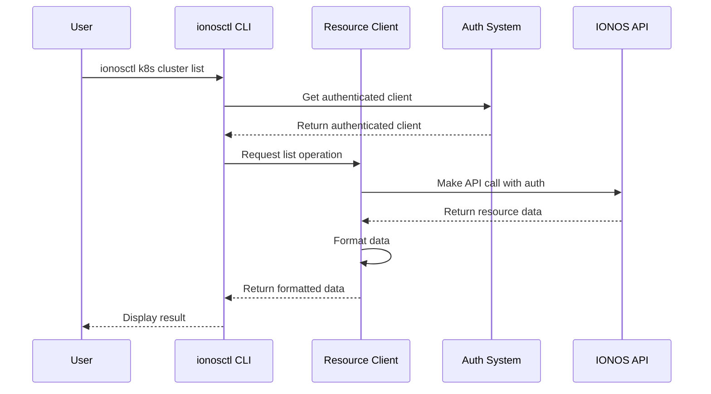

# Chapter 4: Resource Operations

In [Chapter 3: Authentication System](03_authentication_system_.md), we learned how to securely connect to IONOS Cloud services. Now that we're authenticated, let's explore how to actually work with cloud resources using standard operations.

## Why Resource Operations Matter

Imagine you just bought a universal remote control for all your devices at home. Instead of learning different button layouts for your TV, DVD player, and sound system, you learn one consistent set of buttons that work across all devices. That's exactly what Resource Operations provide in `ionosctl`.

Whether you're working with a Kubernetes cluster, a database, or a virtual machine, the commands to manage these resources follow the same patterns:

- **Get**: Retrieve details about a specific resource
- **List**: View all resources of a particular type
- **Create**: Set up a new resource
- **Update**: Modify an existing resource
- **Delete**: Remove a resource

This consistency makes `ionosctl` much easier to learn and use.

## A Practical Example: Managing VM Autoscaling Groups

Let's take a concrete example: managing VM Autoscaling Groups in IONOS Cloud. These groups automatically adjust the number of virtual machines based on demand.

### Listing Resources

The most common operation is listing resources to see what you already have:

```bash
ionosctl vm-autoscaling group list
```

This command returns a table of all your VM Autoscaling Groups, showing key information like IDs, names, and current status.

### Getting a Specific Resource

Once you know which resource you're interested in, you can get more details about it:

```bash
ionosctl vm-autoscaling group get --group-id abc123
```

This retrieves comprehensive information about the specified group. The `--group-id` flag is a common pattern you'll see across different resource types.

### Creating a New Resource

To create a resource, you'll typically provide several parameters:

```bash
ionosctl vm-autoscaling group create \
  --datacenter-id def456 \
  --name "web-servers" \
  --min 2 \
  --max 10
```

This creates a new autoscaling group named "web-servers" in the specified datacenter, with a minimum of 2 and maximum of 10 virtual machines.

### Updating an Existing Resource

To modify a resource, you combine the identifier with the values you want to change:

```bash
ionosctl vm-autoscaling group update \
  --group-id abc123 \
  --name "web-servers-prod"
```

This renames the autoscaling group to "web-servers-prod" while keeping all other settings the same.

### Deleting a Resource

When you no longer need a resource, you can remove it:

```bash
ionosctl vm-autoscaling group delete --group-id abc123
```

This command deletes the specified autoscaling group. Most delete operations will ask for confirmation before proceeding, unless you include the `--force` flag.

## The Common Pattern Across Resources

The beauty of Resource Operations is their consistency. Let's look at a completely different resource type: Kubernetes clusters.

```bash
# List all clusters
ionosctl k8s cluster list

# Get details about a specific cluster
ionosctl k8s cluster get --cluster-id xyz789

# Create a new cluster
ionosctl k8s cluster create --name "app-cluster" --k8s-version 1.24.0

# Update a cluster
ionosctl k8s cluster update --cluster-id xyz789 --name "app-cluster-prod"

# Delete a cluster
ionosctl k8s cluster delete --cluster-id xyz789
```

Notice how the command structure remains consistent? This pattern applies to virtually all resource types in `ionosctl`.

## Common Flags for Resource Operations

Most resource operations accept a standard set of flags:

```bash
ionosctl k8s cluster list \
  --output json \         # Format the output as JSON
  --cols "Name,Status" \  # Show only specific columns
  --no-headers \          # Hide table headers
  --depth 2               # Control how much detail to show
```

These flags work the same way across different resource types, providing a consistent experience.

## How Resource Operations Work Under the Hood

When you run a resource operation command, several things happen behind the scenes:



Let's look at how this is implemented in code. Here's a simplified version of what happens when you list resources:

```go
// RunK8sClusterList is the function called when the command is executed
func RunK8sClusterList(c *core.CommandConfig) error {
    // Get an authenticated API client
    client, err := getClient()
    if err != nil {
        return err
    }
    
    // Make the API call
    clusters, _, err := client.KubernetesApi.ClustersGet()
    if err != nil {
        return err
    }
    
    // Format and display the results
    return c.Printer.Print(clusters)
}
```

This pattern is similar across all resource types. The specific implementation details change, but the overall flow remains consistent.

## Exploring Resources Through Command Discovery

One of the benefits of consistent Resource Operations is that you can discover available commands through patterns:

1. First, identify the resource type you want to work with:
   ```bash
   ionosctl --help
   ```

2. Then explore operations for that resource:
   ```bash
   ionosctl k8s --help
   ```

3. Finally, get help for a specific operation:
   ```bash
   ionosctl k8s cluster create --help
   ```

This hierarchical structure helps you navigate the tool even when you're not familiar with all the commands.

## Resource Operations and Output Formatting

Resource Operations work hand-in-hand with [Output Formatting](05_output_formatting_.md) to give you control over how the results are presented:

```bash
# View results as a table (default)
ionosctl k8s cluster list

# Get the output as JSON
ionosctl k8s cluster list --output json

# Get the raw API response
ionosctl k8s cluster list --output api-json
```

This flexibility lets you choose the format that works best for your needs, whether you're reading it yourself or passing it to another tool.

## Practical Tips for Resource Operations

1. **Use tab completion**: Many shells support tab completion for `ionosctl` commands, making it easier to discover and use resource operations.

2. **Filter output with `--cols`**: When you only need specific information, use the `--cols` flag to show just the columns you care about.

3. **Increase depth for more details**: The `--depth` flag controls how much nested information is returned. Increase it when you need more details.

4. **Use `--force` for scripting**: When automating with scripts, add the `--force` flag to skip confirmation prompts.

5. **Check command examples**: Most commands include examples in their help text, showing common usage patterns.

## Conclusion

Resource Operations provide a consistent, intuitive way to manage cloud resources in `ionosctl`. By following the same patterns across different resource types, the tool becomes more predictable and easier to learn.

Whether you're creating a new Kubernetes cluster, updating a database, or deleting a virtual machine, the commands follow the same structure. This consistency is one of the key factors that makes `ionosctl` user-friendly and powerful.

In the next chapter, [Output Formatting](05_output_formatting_.md), we'll explore how to customize the way results are presented, making it easier to read and process the information you need.

---

