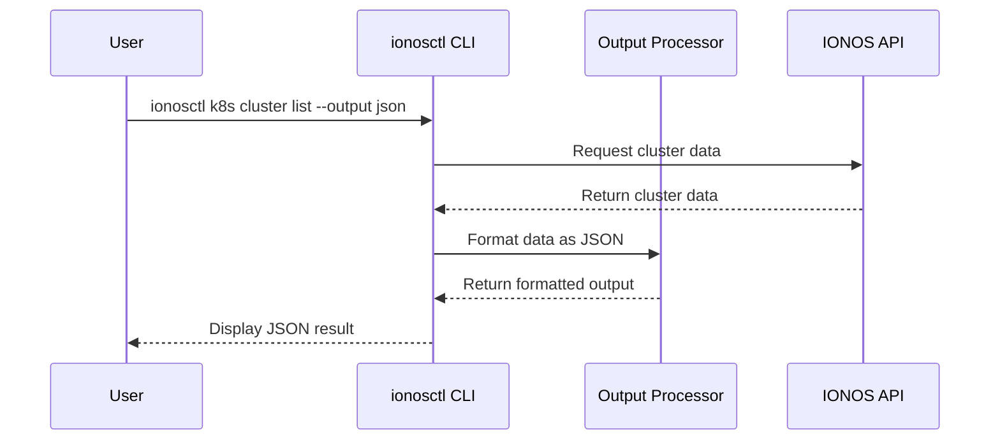

# Chapter 5: Output Formatting

In [Chapter 4: Resource Operations](04_resource_operations_.md), we explored how to work with different cloud resources using consistent command patterns. Now, let's learn how to control the way those results are presented to you.

## Why Output Formatting Matters

Imagine you're at a restaurant looking at a menu. Depending on your needs, you might want to see:
- A brief list of dishes and prices
- Detailed descriptions with ingredients
- Pictures of each dish
- Just the vegetarian options

Similarly, when you use `ionosctl`, you might want to see your cloud resources presented in different ways:
- As an easy-to-read table when exploring interactively
- As structured JSON data when using the results in a script
- With only specific information fields when you need focused details
- Without headers when piping output to other commands

Output formatting is like choosing how your menu is presented, giving you the information you need in the most useful format.

## A Practical Example: Viewing Kubernetes Clusters

Let's consider a concrete example: viewing your Kubernetes clusters. By default, when you run:

```bash
ionosctl k8s cluster list
```

You'll get a nicely formatted table like this:

```
ID                                   NAME         K8S VERSION   STATE
b0953dd2-2ac5-4301-b4f8-c7dba3a430b1 development 1.24.2        ACTIVE
d716c3a8-498f-4668-84d1-9da1fb272a9d production  1.24.2        ACTIVE
```

This table format is great for human readability. But what if you need this information in a script? Or what if you only care about the names and states? That's where output formatting comes in.

## Understanding Output Formats

`ionosctl` supports several output formats controlled by the `--output` flag (or `-o` for short):

### Text Tables (Default)

The default output is a text table, which is easy for humans to read:

```bash
ionosctl k8s cluster list
# or explicitly specify
ionosctl k8s cluster list --output text
```

### JSON Format

For scripting or programmatic use, you can get the output as JSON:

```bash
ionosctl k8s cluster list --output json
```

This produces:

```json
[
  {
    "id": "b0953dd2-2ac5-4301-b4f8-c7dba3a430b1",
    "name": "development",
    "k8sVersion": "1.24.2",
    "state": "ACTIVE"
  },
  {
    "id": "d716c3a8-498f-4668-84d1-9da1fb272a9d",
    "name": "production",
    "k8sVersion": "1.24.2",
    "state": "ACTIVE"
  }
]
```

### API JSON Format

If you need the raw API response (which might contain additional metadata):

```bash
ionosctl k8s cluster list --output api-json
```

## Customizing Table Output

Even when using the default table format, you can customize what information is displayed:

### Selecting Specific Columns

If you only care about certain columns, use the `--cols` flag:

```bash
ionosctl k8s cluster list --cols "Name,State"
```

This produces a simplified table:

```
NAME         STATE
development  ACTIVE
production   ACTIVE
```

### Hiding Headers

For even more compact output, or when piping to other commands:

```bash
ionosctl k8s cluster list --cols "Name" --no-headers
```

Output:

```
development
production
```

This is perfect for use in shell scripts where you want to process each name.

## Output Formatting in Action

Let's see how output formatting can help in real-world scenarios:

### Scenario 1: Creating a script to check cluster statuses

```bash
# Get all cluster names and states in JSON format
ionosctl k8s cluster list --output json > clusters.json

# Process the JSON with jq to find non-active clusters
cat clusters.json | jq '.[] | select(.state != "ACTIVE")'
```

### Scenario 2: Getting just the IDs for further processing

```bash
# Get only the IDs without headers
cluster_ids=$(ionosctl k8s cluster list --cols "ID" --no-headers)

# Now you can loop through them
for id in $cluster_ids; do
  echo "Processing cluster: $id"
  # Do something with each ID
done
```

## How Output Formatting Works Under the Hood

When you run a command with output formatting options, here's what happens behind the scenes:



Let's break down the process:

1. You run a command with output formatting flags
2. The CLI requests data from the IONOS API
3. When the data returns, the CLI passes it to the Output Processor
4. The Output Processor applies your formatting preferences
5. The formatted output is displayed to you

## The Output Formatter Implementation

At the core of output formatting is a component called the Printer. Here's a simplified version of how it works:

```go
// Printer handles different output formats
type Printer struct {
    OutputFormat string  // text, json, or api-json
    Cols         []string
    NoHeaders    bool
}

// Print formats and outputs the data
func (p *Printer) Print(data interface{}) error {
    switch p.OutputFormat {
    case "json":
        return p.printJSON(data)
    case "api-json":
        return p.printAPIJSON(data)
    default:
        return p.printTable(data)
    }
}
```

This code shows how the Printer determines which format to use based on your preferences.

For table output, it has to figure out which columns to display:

```go
func (p *Printer) printTable(data interface{}) error {
    // Create a table writer
    table := tablewriter.NewWriter(os.Stdout)
    
    // Set columns and headers
    if len(p.Cols) > 0 {
        columns = p.Cols
    } else {
        columns = getDefaultColumns(data)
    }
    
    if !p.NoHeaders {
        table.SetHeader(columns)
    }
    
    // Add data rows and render
    addRowsToTable(table, data, columns)
    table.Render()
    return nil
}
```

This creates a formatted table with your specified columns (or defaults if not specified) and controls whether to show headers.

## Setting Default Output Preferences

If you find yourself always using the same output format, you can set it as your default:

```bash
# Set JSON as your default output format
ionosctl config set output-format json

# Now commands will use JSON by default
ionosctl k8s cluster list
```

You can still override this default on any individual command:

```bash
# This will use table format despite the default
ionosctl k8s cluster list --output text
```

## Advanced Formatting Tips

Here are some additional formatting tricks that can make your life easier:

### Combining with grep for filtering

```bash
# Find all clusters with "prod" in their name
ionosctl k8s cluster list | grep prod
```

### Using with jq for advanced JSON processing

```bash
# Get names of all active clusters
ionosctl k8s cluster list --output json | jq -r '.[] | select(.state=="ACTIVE") | .name'
```

### Saving output to a file

```bash
# Save cluster details to a file
ionosctl k8s cluster get --cluster-id abc123 --output json > cluster.json
```

## Conclusion

Output Formatting in `ionosctl` gives you control over how information is presented, making it useful for both interactive exploration and automated scripts. By choosing the right format and customizing the output, you can focus on exactly the information you need in the most useful form.

Whether you're quickly checking the status of resources in a table, processing data programmatically with JSON, or extracting specific fields for a script, the Output Formatting system helps you work more efficiently with your IONOS Cloud resources.

In the next chapter, [Kubernetes Management](06_kubernetes_management_.md), we'll explore how to work with Kubernetes clusters in the IONOS Cloud, putting to use all the concepts we've learned so far, including our newly acquired output formatting skills.

---

