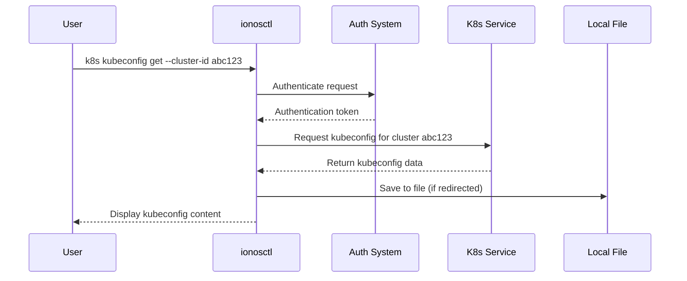

# Chapter 6: Kubernetes Management

In [Chapter 5: Output Formatting](05_output_formatting_.md), we learned how to control the way results are presented. Now let's explore how ionosctl helps you manage Kubernetes clusters in the IONOS Cloud.

## Why Kubernetes Management Matters

Imagine you've built a sophisticated model airplane. While the airplane itself is complex with many intricate parts, you control it with a simple remote. You don't need to understand every internal component to fly it - you just need the right controller.

That's exactly what ionosctl's Kubernetes management commands provide. Kubernetes itself is a powerful but complex system for running containerized applications. The `ionosctl` Kubernetes commands act as your specialized remote control, giving you the exact buttons you need to manage your Kubernetes clusters without having to remember complicated kubectl commands or connection details.

## A Common Kubernetes Scenario

Let's consider a typical scenario: You've created a Kubernetes cluster in IONOS Cloud and now you need to connect to it using kubectl (the standard Kubernetes command-line tool). To do this, you need a special file called a "kubeconfig" that contains all the connection details and credentials.

Without ionosctl, you'd need to navigate through the IONOS Cloud Portal, find the right settings, download the file, and place it in the correct location. With ionosctl, you can do it with a single command!

## Key Kubernetes Management Features

Let's explore the key Kubernetes management features in ionosctl:

### 1. Getting the Kubeconfig File

The most common operation is retrieving the kubeconfig file for your cluster:

```bash
ionosctl k8s kubeconfig get --cluster-id your-cluster-id
```

This command retrieves the kubeconfig file for your specific cluster, allowing you to immediately connect to it with kubectl.

### 2. Checking Kubernetes Versions

Before creating or updating a cluster, you might want to know what Kubernetes versions are available:

```bash
ionosctl k8s version get
```

This shows you the current default Kubernetes version used for new clusters.

### 3. Managing Dataplatform Kubernetes

If you're using IONOS Managed Stackable Data Platform, you can also get the kubeconfig for those specialized Kubernetes clusters:

```bash
ionosctl dataplatform cluster kubeconfig --cluster-id your-cluster-id
```

## How to Connect to Your Kubernetes Cluster

Let's walk through the complete process of connecting to your Kubernetes cluster:

### Step 1: List your clusters

First, let's see what clusters you have:

```bash
ionosctl k8s cluster list
```

This will show a table of all your Kubernetes clusters, including their IDs, names, and status.

### Step 2: Get the kubeconfig file

Now that you know your cluster ID, you can get the kubeconfig:

```bash
ionosctl k8s kubeconfig get --cluster-id abc123 > my-cluster-config.yaml
```

This command:
1. Retrieves the kubeconfig file for your cluster
2. Saves it to a file called `my-cluster-config.yaml`

### Step 3: Use the kubeconfig with kubectl

Now you can use this file with kubectl:

```bash
kubectl --kubeconfig=my-cluster-config.yaml get nodes
```

Alternatively, you can set it as your default kubeconfig:

```bash
export KUBECONFIG=my-cluster-config.yaml
kubectl get nodes
```

Now you're connected to your IONOS Kubernetes cluster and can manage it like any other Kubernetes cluster!

## Streamlining Your Workflow

To make your life even easier, you can combine these commands:

```bash
# Get your first cluster ID
CLUSTER_ID=$(ionosctl k8s cluster list --cols "ID" --no-headers | head -n 1)

# Get and use the kubeconfig
ionosctl k8s kubeconfig get --cluster-id $CLUSTER_ID > kubeconfig.yaml
export KUBECONFIG=kubeconfig.yaml

# Now you can run kubectl commands
kubectl get nodes
```

This script:
1. Lists your clusters and extracts the first cluster ID
2. Gets the kubeconfig for that cluster
3. Sets it as your active kubeconfig
4. Runs a kubectl command to test the connection

## How Kubernetes Management Works Behind the Scenes

When you run a Kubernetes management command, several things happen behind the scenes:



1. You run the command, specifying your cluster ID
2. ionosctl authenticates with the IONOS API using your stored credentials
3. It makes a specific API request to the Kubernetes service
4. The service generates and returns the kubeconfig file
5. ionosctl displays the file or saves it, depending on your command

## The Implementation Details

Let's look at a simplified version of how the kubeconfig command is implemented:

```go
// Function that runs when you execute the kubeconfig get command
func RunK8sKubeconfigGet(c *core.CommandConfig) error {
    // Get the cluster ID from the flag
    clusterId := viper.GetString(constants.FlagClusterId)
    
    // Get an authenticated client
    k8sClient, err := getK8sClient()
    if err != nil {
        return err
    }
    
    // Make the API call to get the kubeconfig
    kubeconfig, _, err := k8sClient.KubernetesApi.K8sKubeconfigGet(clusterId)
    if err != nil {
        return err
    }
    
    // Display the result
    return c.Printer.Print(kubeconfig)
}
```

This function:
1. Retrieves the cluster ID you provided with the `--cluster-id` flag
2. Creates an authenticated Kubernetes client
3. Makes an API call to get the kubeconfig for your specific cluster
4. Prints the result using the printer we learned about in [Output Formatting](05_output_formatting_.md)

## Practical Tips for Kubernetes Management

1. **Save kubeconfigs to files**: Always redirect the output to a file when getting kubeconfig:
   ```bash
   ionosctl k8s kubeconfig get --cluster-id abc123 > kubeconfig.yaml
   ```

2. **Use context switching**: If you work with multiple clusters, consider using kubectl's context feature:
   ```bash
   # Save each cluster's kubeconfig
   ionosctl k8s kubeconfig get --cluster-id cluster1 > cluster1.yaml
   ionosctl k8s kubeconfig get --cluster-id cluster2 > cluster2.yaml
   
   # Merge them into your main kubeconfig
   KUBECONFIG=~/.kube/config:cluster1.yaml:cluster2.yaml kubectl config view --merge --flatten > ~/.kube/config
   ```

3. **Combine with jq for filtering**: You can use jq to extract specific information:
   ```bash
   # Get all cluster names and their k8s versions
   ionosctl k8s cluster list --output json | jq -r '.[] | "\(.name): \(.k8sVersion)"'
   ```

## Security Considerations

The kubeconfig file contains sensitive information that grants access to your Kubernetes cluster. Always handle it securely:

1. Don't share kubeconfig files with unauthorized users
2. Don't commit them to public repositories
3. Consider setting a short expiration time if your cluster supports it
4. Delete kubeconfig files when you no longer need them

## Conclusion

The Kubernetes Management features in ionosctl provide a streamlined way to interact with your IONOS Kubernetes clusters. By simplifying common tasks like retrieving kubeconfig files and checking Kubernetes versions, ionosctl acts as your specialized remote control for Kubernetes operations.

These commands bridge the gap between IONOS Cloud infrastructure and standard Kubernetes tools like kubectl, allowing you to manage your clusters efficiently without having to navigate complex web interfaces or remember detailed connection procedures.

In the next chapter, [Service Clients](07_service_clients_.md), we'll explore how ionosctl interacts with various IONOS Cloud services behind the scenes, giving you a deeper understanding of how the tool works.

---

