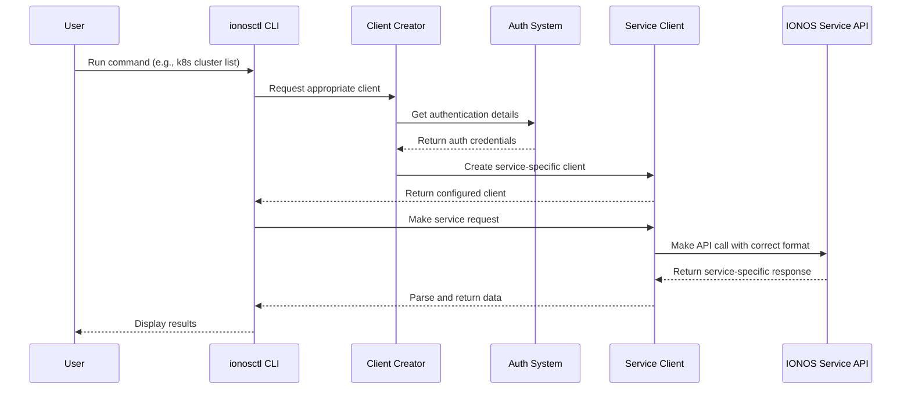

# Chapter 7: Service Clients

In [Chapter 6: Kubernetes Management](06_kubernetes_management_.md), we explored how to work with Kubernetes clusters in the IONOS Cloud. Now, let's dive into the technology that makes this possible behind the scenes: Service Clients.

## Why Service Clients Matter

Imagine you're in a foreign country where multiple languages are spoken. To communicate effectively, you might need different translators - one for each language. Each translator knows the specific vocabulary, grammar, and cultural nuances of their language.

Service Clients in `ionosctl` work in a similar way. They are specialized "translators" that know how to communicate with different IONOS Cloud services. Each service (Kubernetes, Database, VM Autoscaling, etc.) has its own "language" (API), and Service Clients know exactly how to speak it.

## A Practical Example: Working with Multiple IONOS Services

Let's consider a common scenario: You want to create a Kubernetes cluster and then set up a PostgreSQL database to work with it. These are two completely different services in the IONOS Cloud, each with its own API. 

Without Service Clients, you would need to:
1. Learn the specific API details for each service
2. Format your requests differently for each one
3. Handle authentication separately
4. Parse different response formats

Service Clients handle all of this complexity for you, presenting a consistent interface regardless of which service you're using.

## Understanding Different Service Clients

`ionosctl` includes several service clients, each specialized for a different IONOS service:

### 1. Cloud API Client
This is the primary client for core IONOS Cloud resources like virtual machines, storage, and networks.

```go
// Create a Cloud API client
cloudClient := ionoscloud.NewAPIClient(config)

// Use it to list datacenters
datacenters, _, err := cloudClient.DataCentersApi.DatacentersGet()
```

### 2. Kubernetes Client
Specialized for managing Kubernetes clusters and related resources.

```go
// Create a Kubernetes client
k8sClient := k8s.NewAPIClient(config)

// Use it to list clusters
clusters, _, err := k8sClient.KubernetesApi.ClustersGet()
```

### 3. Database as a Service Client
Focused on database services like PostgreSQL.

```go
// Create a DBaaS PostgreSQL client
dbClient := dbaasPostgres.NewAPIClient(config)

// Use it to list clusters
clusters, _, err := dbClient.ClustersApi.ClustersGet()
```

Each client knows the specific endpoints, parameters, and response formats for its service.

## How Service Clients Work Together

The beauty of Service Clients is how they provide a consistent experience while handling different services:

```go
// Function to get a list of resources
func ListResources(resourceType string) {
    switch resourceType {
    case "datacenter":
        client := getCloudAPIClient()
        resources, _ := client.DataCentersApi.DatacentersGet()
        printResults(resources)
    case "k8s":
        client := getK8sClient()
        resources, _ := client.KubernetesApi.ClustersGet()
        printResults(resources)
    case "postgres":
        client := getDBaaSClient()
        resources, _ := client.ClustersApi.ClustersGet()
        printResults(resources)
    }
}
```

This simplified example shows how `ionosctl` can list resources from different services using the appropriate client for each one.

## Behind the Scenes: How Service Clients Are Created

When you run an `ionosctl` command, several things happen to create and use the right Service Client:



Let's break down the code that makes this happen:

```go
// getK8sClient creates a Kubernetes service client
func getK8sClient() (*k8s.APIClient, error) {
    // Get authentication info from configuration
    username := viper.GetString(constants.Username)
    password := viper.GetString(constants.Password)
    token := viper.GetString(constants.Token)
    url := viper.GetString(constants.ApiUrl)
    
    // Create configuration for this specific service
    config := k8s.NewConfiguration(username, password, token, url)
    
    // Return the service-specific client
    return k8s.NewAPIClient(config), nil
}
```

This function creates a Kubernetes service client with the right authentication and endpoint configuration.

## The Service Client Configuration

Each Service Client needs specific configuration to connect to its service. Here's a simplified version of what that looks like:

```go
// Basic configuration for a service client
type Configuration struct {
    // API endpoint information
    Host         string
    BasePath     string
    
    // Authentication details
    Username     string
    Password     string
    Token        string
    
    // Request settings
    UserAgent    string
    DefaultHeader map[string]string
    HTTPClient   *http.Client
}
```

The configuration includes everything the client needs to make proper requests to its specific service.

## Practical Tips for Working with Service Clients

While `ionosctl` handles Service Clients automatically, understanding them can help you:

1. **Understand error messages**: If you see an error like "Failed to create client for X service," you'll know it's related to Service Client initialization.

2. **Use the right commands**: Different commands use different Service Clients. For example, `ionosctl k8s` commands use the Kubernetes client, while `ionosctl vm` commands use the Cloud API client.

3. **Set service-specific configuration**: Some configuration settings like API URLs can be different for each service. You can set them using environment variables:

```bash
# Set the API URL specifically for the Kubernetes service
export IONOS_K8S_API_URL=https://k8s.example.com

# Run a Kubernetes command that will use this URL
ionosctl k8s cluster list
```

## Service Client Implementation Details

Let's look at a more detailed example of how Service Clients are implemented in `ionosctl`:

```go
// ClientFactory creates service clients based on the service type
type ClientFactory struct {
    configs map[string]*ServiceConfig
}

// GetClient returns the appropriate client for a service
func (f *ClientFactory) GetClient(serviceType string) (interface{}, error) {
    config, exists := f.configs[serviceType]
    if !exists {
        return nil, fmt.Errorf("no configuration for service: %s", serviceType)
    }
    
    switch serviceType {
    case "cloud":
        return ionoscloud.NewAPIClient(config.ToCloudConfig()), nil
    case "k8s":
        return k8s.NewAPIClient(config.ToK8sConfig()), nil
    case "dbaas":
        return dbaas.NewAPIClient(config.ToDBaaSConfig()), nil
    default:
        return nil, fmt.Errorf("unknown service type: %s", serviceType)
    }
}
```

This factory pattern allows `ionosctl` to create the right client for each service while handling all the configuration details consistently.

## Conclusion

Service Clients are the specialized translators that allow `ionosctl` to communicate with different IONOS Cloud services. They hide the complexity of working with multiple APIs, letting you focus on what you want to do rather than how to do it.

By providing a consistent interface for different services, Service Clients make the tool more user-friendly and powerful. Whether you're working with Kubernetes clusters, databases, or virtual machines, you can use similar commands and patterns thanks to these behind-the-scenes components.

Understanding Service Clients gives you insight into how `ionosctl` works internally and helps you make better use of the tool in your cloud management tasks.

---

