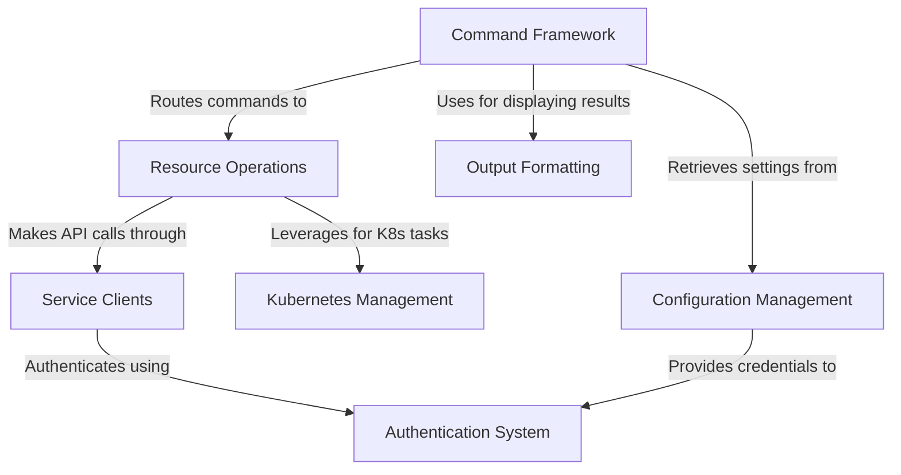

# Tutorial: ionosctl

**ionosctl** is a command-line tool for managing IONOS cloud resources. It provides a **unified interface** for interacting with various IONOS services, from virtual machines to Kubernetes clusters. The tool follows consistent *command patterns* across different resource types, supports multiple authentication methods, and offers flexible output formatting options. ionosctl handles configuration through various sources (config files, environment variables, command-line flags) and simplifies complex API interactions through specialized service clients.

**Source Repository:** [https://github.com/ionos-cloud/ionosctl](https://github.com/ionos-cloud/ionosctl)

## Chapters

1. [Command Framework
](01_command_framework_.md)
2. [Configuration Management
](02_configuration_management_.md)
3. [Authentication System
](03_authentication_system_.md)
4. [Resource Operations
](04_resource_operations_.md)
5. [Output Formatting
](05_output_formatting_.md)
6. [Kubernetes Management
](06_kubernetes_management_.md)
7. [Service Clients
](07_service_clients_.md)

---

