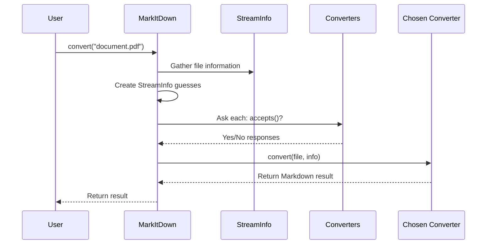

# Chapter 1: MarkItDown Class

## Introduction: Your Document Conversion Conductor

Have you ever needed to convert different types of documents into a simple text format that's easy to work with? That's exactly what the `MarkItDown` class does! Think of it as a conductor in an orchestra - it doesn't play any instruments itself, but it coordinates all the musicians (converters) to create beautiful music (Markdown output).

In this chapter, we'll learn how to use the `MarkItDown` class to convert various document formats (like PDFs, Word documents, webpages, and more) into clean, structured Markdown text. This makes your documents:

- Easily readable by both humans and machines
- Perfect for feeding into Large Language Models (LLMs)
- Consistent across different source formats

## A Simple Example

Let's start with a basic example of how to use the `MarkItDown` class:

```python
from markitdown import MarkItDown

# Create an instance of MarkItDown
converter = MarkItDown()

# Convert a local file to Markdown
result = converter.convert("my_document.pdf")

# Print the converted Markdown content
print(result.text_content)
```

That's it! With just these few lines of code, you can convert a PDF document into Markdown. The `convert()` method automatically determines the file type and uses the appropriate converter.

## Understanding the MarkItDown Class

The `MarkItDown` class is designed to be simple to use while handling complex conversion tasks behind the scenes. Let's look at its key components:

1. **Initialization**: When you create a `MarkItDown` instance, it sets up built-in converters for different file types.

2. **Converters**: These are specialized components that know how to handle specific file formats (like PDF, DOCX, HTML).

3. **Conversion Methods**: Different methods for handling various input sources (files, URLs, streams).

4. **Plugin System**: Allows extending functionality with custom converters.

## Converting Different Types of Sources

The `MarkItDown` class can handle various types of inputs:

### Local Files

```python
# Convert a local file by path string
result = converter.convert("documents/report.docx")

# Or using a Path object
from pathlib import Path
path = Path("documents/report.docx")
result = converter.convert(path)
```

The code above takes a local file and converts it to Markdown. The `convert()` method automatically detects the file type based on its extension and content.

### Web Pages and URLs

```python
# Convert a webpage
result = converter.convert("https://example.com/article")

# Convert a Wikipedia page
result = converter.convert("https://en.wikipedia.org/wiki/Markdown")
```

You can directly pass URLs to the `convert()` method. It will download the content and convert it appropriately based on the content type.

### Binary Streams

```python
# Convert from a binary stream
with open("document.pdf", "rb") as file:
    result = converter.convert(file)
```

This is useful when you're working with file-like objects or streams rather than actual files on disk.

## How MarkItDown Works Under the Hood

When you call `convert()`, here's what happens step by step:

1. The `MarkItDown` class examines the input to determine its type (file path, URL, stream)
2. It gathers information about the content (file extension, MIME type)
3. It creates a list of possible content type guesses
4. It asks each registered converter if it can handle the content
5. It tries converters in order of priority until one succeeds
6. It returns the converted Markdown content

Let's visualize this process:



### The StreamInfo Class

The `MarkItDown` class uses a helper class called [`StreamInfo`](03_streaminfo_.md) to gather and manage information about the content being converted. This includes:

- File extension
- MIME type
- Character encoding
- URL (if from web)
- Local file path (if from disk)

### Converter Registration and Priority

Converters are registered with a priority value that determines the order in which they're tried:

```python
# Register a custom converter with default priority
converter.register_converter(MyCustomConverter())

# Register with specific priority (lower = higher priority)
converter.register_converter(MySpecialConverter(), priority=5.0)
```

Lower priority values are tried first. The built-in converters use two main priority levels:
- `PRIORITY_SPECIFIC_FILE_FORMAT` (0.0): For format-specific converters
- `PRIORITY_GENERIC_FILE_FORMAT` (10.0): For more general converters

## Adding Plugin Support

The `MarkItDown` class can be extended with plugins:

```python
# Create with plugins enabled
converter = MarkItDown(enable_plugins=True)

# Or enable plugins later
converter = MarkItDown()
converter.enable_plugins()
```

Plugins can register their own converters to handle additional file formats or customize the conversion process.

## Internal Code Walkthrough

Let's take a quick look at the initialization code for the `MarkItDown` class:

```python
def __init__(
    self,
    *,
    enable_builtins: Union[None, bool] = None,
    enable_plugins: Union[None, bool] = None,
    **kwargs,
):
    self._builtins_enabled = False
    self._plugins_enabled = False
    self._requests_session = kwargs.get("requests_session") or requests.Session()
    self._magika = magika.Magika()
    self._converters = []
    
    # Enable built-ins by default
    if enable_builtins is None or enable_builtins:
        self.enable_builtins(**kwargs)
    
    # Enable plugins if requested
    if enable_plugins:
        self.enable_plugins(**kwargs)
```

This code initializes the `MarkItDown` class with:
- A requests session for handling web requests
- Magika for content type detection
- An empty list of converters
- Optional configuration for built-ins and plugins

The built-in converters are registered in the `enable_builtins()` method:

```python
def enable_builtins(self, **kwargs) -> None:
    if not self._builtins_enabled:
        # Register converters from most generic to most specific
        self.register_converter(PlainTextConverter(), priority=10.0)
        self.register_converter(ZipConverter(markitdown=self), priority=10.0)
        self.register_converter(HtmlConverter(), priority=10.0)
        self.register_converter(RssConverter())
        # ... more converters ...
        self._builtins_enabled = True
```

This method registers all the built-in converters with appropriate priorities. Generic converters like PlainTextConverter get a higher numerical priority (which means they're tried later), while specialized converters get lower numerical priorities (tried first).

## Conclusion

The `MarkItDown` class is the heart of the markitdown project - it orchestrates the conversion process by managing different converters and intelligently selecting the right one for each document. By using this class, you can easily convert various document formats to clean, consistent Markdown text.

In the next chapter, we'll explore how to use the [Command Line Interface](02_command_line_interface_.md) to perform conversions without writing any code.

