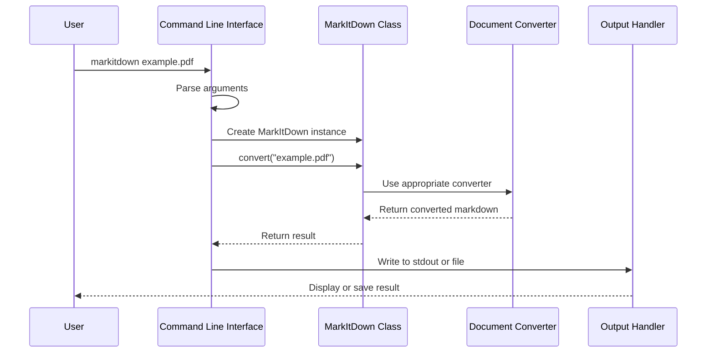

# Chapter 2: Command Line Interface

## Introduction: Using MarkItDown without Writing Code

In [Chapter 1: MarkItDown Class](01_markitdown_class_.md), we learned how to use the `MarkItDown` class in Python code to convert various document formats into Markdown. But what if you want to convert documents without writing any code? That's where the Command Line Interface (CLI) comes in!

The Command Line Interface allows you to use MarkItDown directly from your computer's terminal or command prompt. Think of it like a remote control for MarkItDown - you can press different buttons (commands) to tell it exactly what to do without opening a Python editor.

## What is a Command Line Interface?

If you're new to command lines, here's a simple explanation:

A command line interface is a text-based way to interact with programs on your computer. Instead of clicking buttons in a graphical interface, you type specific commands to tell the program what to do.

For example, instead of:
1. Opening a file browser
2. Navigating to a document
3. Right-clicking and selecting "Convert to Markdown"

You would type something like:
```
markitdown my_document.pdf
```

## Basic Usage: Your First Command

Let's start with the most basic way to use the MarkItDown CLI:

```bash
markitdown example.pdf
```

That's it! This command will:
1. Read the PDF file named "example.pdf"
2. Convert it to Markdown format
3. Display the converted Markdown text in your terminal

If you want to save the output to a file instead of just viewing it, you can:

```bash
markitdown example.pdf > example.md
```

The `>` symbol redirects the output to a file named "example.md" instead of showing it on screen.

## Input Options: Different Ways to Feed Documents

The MarkItDown CLI is flexible about how you provide input. Here are different methods:

### Converting a File by Name

```bash
markitdown report.docx
```

This converts a Word document named "report.docx" in your current directory.

### Reading from Standard Input (stdin)

You can pipe content into MarkItDown:

```bash
cat example.pdf | markitdown
```

Or use input redirection:

```bash
markitdown < example.pdf
```

Both of these commands read the PDF content from the "standard input" stream rather than opening a file directly.

## Output Options: Where to Send the Results

Similarly, there are multiple ways to handle the output:

### Displaying in Terminal

By default, MarkItDown shows the result in your terminal:

```bash
markitdown example.pdf
```

### Saving to a File (Option 1: Redirection)

```bash
markitdown example.pdf > example.md
```

### Saving to a File (Option 2: Output Flag)

```bash
markitdown example.pdf -o example.md
```

The `-o` (or `--output`) flag tells MarkItDown to save the result to the specified file.

## Providing Additional Information with Flags

Sometimes MarkItDown needs extra hints to process your document correctly. You can provide these with flags:

### File Extension Hint

When reading from stdin, MarkItDown can't see the file extension:

```bash
cat mystery_file | markitdown -x pdf
```

The `-x pdf` (or `--extension pdf`) flag tells MarkItDown to treat the input as a PDF.

### MIME Type Hint

```bash
markitdown unknown_file -m application/pdf
```

The `-m` (or `--mime-type`) flag specifies the MIME type of the content.

### Character Encoding Hint

```bash
markitdown document.txt -c UTF-8
```

The `-c` (or `--charset`) flag indicates the character encoding of the text.

## Advanced Features

### Enabling Plugins

If you have third-party plugins installed, you can enable them:

```bash
markitdown document.pdf -p
```

The `-p` (or `--use-plugins`) flag tells MarkItDown to use available plugins.

### Listing Available Plugins

```bash
markitdown --list-plugins
```

This shows all installed plugins without processing any documents.

### Using Document Intelligence

For advanced document processing with Azure's Document Intelligence:

```bash
markitdown document.pdf -d -e https://your-endpoint.com
```

The `-d` flag enables Document Intelligence, and `-e` specifies the endpoint URL.

## How the CLI Works: Under the Hood

When you run a command like `markitdown example.pdf`, several steps happen behind the scenes:



1. The CLI parses your command and arguments
2. It creates an instance of the [MarkItDown Class](01_markitdown_class_.md)
3. It calls the appropriate method based on your input type
4. The MarkItDown class processes the document
5. The CLI handles the output according to your specifications

## The CLI Code: A Look Inside

Let's examine a simplified version of how the CLI is implemented:

```python
def main():
    # Set up the argument parser
    parser = argparse.ArgumentParser(
        description="Convert various file formats to markdown."
    )
    
    # Add argument options
    parser.add_argument("-o", "--output", help="Output file name.")
    parser.add_argument("-x", "--extension", help="File extension hint.")
    # ... more arguments ...
    
    # Parse the filename argument
    parser.add_argument("filename", nargs="?")
    args = parser.parse_args()
```

This code sets up the command-line argument parser, defining all the options you can use.

Once the arguments are parsed, the CLI creates a MarkItDown instance:

```python
# Create MarkItDown instance with plugins if requested
markitdown = MarkItDown(enable_plugins=args.use_plugins)

# Process the input based on source
if args.filename is None:
    # Read from standard input
    result = markitdown.convert_stream(sys.stdin.buffer)
else:
    # Read from file
    result = markitdown.convert(args.filename)
```

This code shows how the CLI creates a MarkItDown instance and then processes either a file or standard input.

Finally, the CLI handles the output:

```python
# Output handling
if args.output:
    # Write to specified file
    with open(args.output, "w", encoding="utf-8") as f:
        f.write(result.markdown)
else:
    # Write to standard output (terminal)
    print(result.markdown)
```

This determines whether to save the result to a file or display it in the terminal.

## Real-World Examples

### Example 1: Converting a Resume

Imagine you have a resume in PDF format and want to convert it to Markdown:

```bash
markitdown resume.pdf -o resume.md
```

This converts your PDF resume to Markdown and saves it as "resume.md".

### Example 2: Processing Multiple Files

You can use shell commands to batch process files:

```bash
for file in *.pdf; do
    markitdown "$file" -o "${file%.pdf}.md"
done
```

This converts all PDF files in the current directory to Markdown files.

### Example 3: Webpage to Markdown

You can also convert webpages by passing a URL (if supported by your installation):

```bash
markitdown https://example.com -o example.md
```

## Troubleshooting Common Issues

### Issue: Unknown File Type

```bash
cat mystery_file | markitdown -x pdf
```

If MarkItDown can't determine the file type, use the `-x` flag to provide a hint.

### Issue: Character Encoding Problems

```bash
markitdown document.txt -c latin-1
```

If you see garbled text in the output, try specifying the character encoding with `-c`.

## Conclusion

The Command Line Interface provides a powerful way to use MarkItDown without writing Python code. It's perfect for:
- Quick one-off document conversions
- Integrating into shell scripts
- Processing files in batch
- Building automation workflows

With just a few simple commands, you can convert virtually any supported document to clean Markdown format, ready for further processing or publication.

In the next chapter, we'll explore the [StreamInfo](03_streaminfo_.md) class, which helps MarkItDown understand and process different types of input streams.

