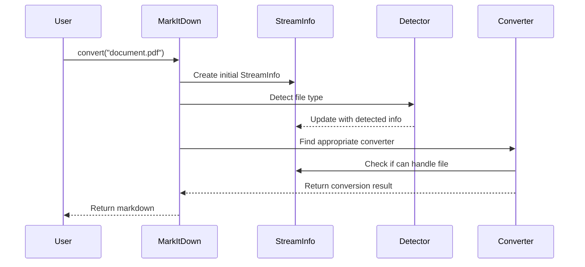

# Chapter 3: StreamInfo

In [Chapter 2: Command Line Interface](02_command_line_interface_.md), we learned how to use MarkItDown without writing any Python code. Now, let's dive into an important but often invisible component that works behind the scenes: the `StreamInfo` class.

## Introduction: The File's ID Card

Imagine you're at an airport. Before you can board a plane, you need to show your ID or passport. Security needs to know who you are, where you're from, and where you're going. In the world of files and documents, the `StreamInfo` class plays a similar role - it's like an ID card for your files!

When MarkItDown receives a file, it needs to answer some basic questions:
- What type of file is this? (PDF, Word document, HTML, etc.)
- What's its file extension?
- What character encoding does it use?
- Where did it come from? (local file, web URL)

All this information is gathered and stored in a `StreamInfo` object, which helps MarkItDown decide how to process the file correctly.

## Why StreamInfo Matters: A Real-World Example

Let's consider a simple use case. Say you have a file called `document.pdf`, and you want to convert it to Markdown. Here's what happens:

1. MarkItDown needs to figure out it's a PDF file
2. It needs to select the appropriate converter (PDF-to-Markdown)
3. It might need special handling based on encoding or other attributes

Without proper information about the file, MarkItDown might choose the wrong converter or process the file incorrectly.

## Understanding the StreamInfo Structure

The `StreamInfo` class is a simple data container with six main pieces of information:

1. **mimetype**: The MIME type (like "application/pdf" for PDFs)
2. **extension**: The file extension (like "pdf", "docx", "html")
3. **charset**: The character encoding (like "UTF-8" or "latin-1")
4. **filename**: The name of the file
5. **local_path**: The path on your computer (if it's a local file)
6. **url**: The web address (if it's from the internet)

All of these fields are optional - they can be `None` if the information isn't available.

## Creating and Using a StreamInfo Object

Let's see how to create a `StreamInfo` object with some basic information:

```python
from markitdown import StreamInfo

# Create a StreamInfo for a local PDF file
info = StreamInfo(
    mimetype="application/pdf",
    extension="pdf",
    filename="report.pdf",
    local_path="/home/user/documents/report.pdf"
)
```

This code creates a StreamInfo object with information about a PDF file stored locally. Now any component in MarkItDown can look at this object to understand what kind of file it's dealing with.

## Updating StreamInfo: Building Information Gradually

Sometimes, you don't have all the information about a file right away. MarkItDown might gather details bit by bit as it processes a file. The `copy_and_update` method makes this easy:

```python
# Start with minimal information
basic_info = StreamInfo(extension="pdf")

# Later, add more details
complete_info = basic_info.copy_and_update(
    mimetype="application/pdf",
    filename="report.pdf"
)
```

This code creates a StreamInfo with just the extension, then creates a new copy with additional information. The original `basic_info` remains unchanged.

## How MarkItDown Uses StreamInfo

When you convert a document using MarkItDown, here's how StreamInfo helps behind the scenes:



1. When you call `convert()`, MarkItDown creates an initial StreamInfo with basic data
2. File type detection adds more information to the StreamInfo
3. Converters check the StreamInfo to decide if they can handle the file
4. The chosen converter uses the StreamInfo to guide the conversion process

## Under the Hood: The StreamInfo Implementation

Let's look at how StreamInfo is implemented:

```python
@dataclass(kw_only=True, frozen=True)
class StreamInfo:
    """Information about a file stream."""
    
    mimetype: Optional[str] = None
    extension: Optional[str] = None
    charset: Optional[str] = None
    filename: Optional[str] = None
    local_path: Optional[str] = None
    url: Optional[str] = None
```

This code defines StreamInfo as a "dataclass" - a Python class specifically designed to store data. The `frozen=True` part means that once created, a StreamInfo object cannot be changed (it's immutable).

Since we can't modify a StreamInfo object directly, the class provides a method to create updated copies:

```python
def copy_and_update(self, *args, **kwargs):
    """Copy and update with new information."""
    new_info = asdict(self)  # Convert to dictionary
    
    # Update from other StreamInfo objects
    for si in args:
        assert isinstance(si, StreamInfo)
        new_info.update({k: v for k, v in asdict(si).items() 
                        if v is not None})
    
    # Update from keyword arguments
    if len(kwargs) > 0:
        new_info.update(kwargs)
        
    return StreamInfo(**new_info)  # Create new StreamInfo
```

This method:
1. Converts the current StreamInfo to a dictionary
2. Updates it with values from other StreamInfo objects
3. Updates it with any keyword arguments
4. Creates and returns a new StreamInfo with the combined data

## StreamInfo in Action: Practical Examples

### Example 1: Converting a Local File

When you convert a local file, MarkItDown creates a StreamInfo like this:

```python
# For a file "document.pdf"
info = StreamInfo(
    filename="document.pdf",
    extension="pdf",
    local_path="/path/to/document.pdf"
)
```

### Example 2: Converting from a URL

When you convert from a URL, the StreamInfo might look like:

```python
# For a webpage
info = StreamInfo(
    url="https://example.com/article",
    mimetype="text/html",
    charset="UTF-8"
)
```

### Example 3: Providing Hints from the CLI

When you use the CLI with hints, like `markitdown file -x pdf -m application/pdf`, it creates:

```python
info = StreamInfo(
    filename="file",
    extension="pdf",
    mimetype="application/pdf"
)
```

## Why Immutability Matters

You might wonder why StreamInfo objects can't be modified directly. This design choice has important benefits:

1. **Predictability**: Once created, a StreamInfo won't change unexpectedly
2. **Thread safety**: Multiple parts of the code can use it without conflicts
3. **Debugging**: It's easier to track the state at different points in time

This is similar to how your ID card works - if you need to update information, you get a new ID card rather than modifying the existing one.

## Common StreamInfo Scenarios

### Scenario 1: Missing Information

Sometimes MarkItDown receives a file with limited information:

```python
# Unknown file with no extension
mystery_info = StreamInfo(filename="mystery_file")

# MarkItDown will need to examine the content to guess the type
updated_info = mystery_info.copy_and_update(
    mimetype="application/pdf",
    extension="pdf"
)
```

### Scenario 2: Conflicting Information

Sometimes files have misleading names or extensions:

```python
# File named as PDF but actually HTML
misleading_info = StreamInfo(
    filename="report.pdf",
    extension="pdf"
)

# After content inspection
corrected_info = misleading_info.copy_and_update(
    mimetype="text/html"
)
```

In this case, MarkItDown might detect that despite the ".pdf" extension, the content is actually HTML.

## Building on StreamInfo: The DocumentConverter Connection

The StreamInfo class works closely with the [DocumentConverter](04_documentconverter_.md) system. When MarkItDown wants to convert a document:

1. It creates a StreamInfo object with all available information
2. It asks each converter if it can handle this StreamInfo
3. The first converter that accepts the StreamInfo is used

```python
# Simplified example of how converters use StreamInfo
def accepts(self, info: StreamInfo) -> bool:
    # Check if this converter can handle the file
    return info.mimetype == "application/pdf" or info.extension == "pdf"
```

## Conclusion

The StreamInfo class may seem simple, but it plays a crucial role in MarkItDown's operation. By acting as an "ID card" for files, it helps the system make intelligent decisions about how to process different types of content.

When you're working with MarkItDown, you may never directly interact with StreamInfo objects, but understanding how they work helps you grasp the entire conversion process better.

In the next chapter, we'll explore the [DocumentConverter](04_documentconverter_.md) system, which uses StreamInfo to determine how to convert different types of documents to Markdown.

