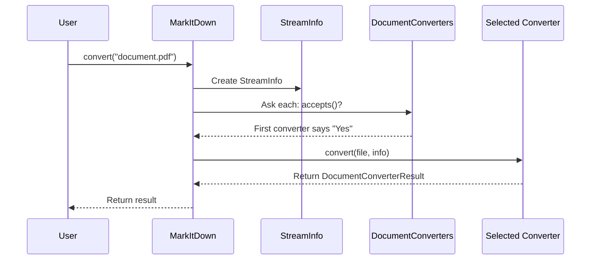

# Chapter 4: DocumentConverter

In [Chapter 3: StreamInfo](03_streaminfo_.md), we learned about how MarkItDown keeps track of information about the files it processes. Now, let's explore the blueprint that makes all document conversions possible: the `DocumentConverter` class.

## Introduction: The Recipe for Conversion

Think of `DocumentConverter` as a cooking recipe template. Just as every recipe has basic sections like "ingredients" and "instructions," every document converter in MarkItDown follows a common pattern. This ensures that no matter what type of document you're converting—whether it's a PDF, Word document, or webpage—the process works in a consistent way.

Imagine you have various types of documents that you want to convert to Markdown:

- A PDF research paper
- A Word document resume
- An HTML webpage

Each of these requires different techniques to convert properly. The `DocumentConverter` class provides a standard blueprint that all specialized converters must follow, making the system organized and extensible.

## Understanding the Role of DocumentConverter

The `DocumentConverter` class is what programmers call an "abstract base class." Don't worry if that sounds technical—it simply means it's a template that defines what all converters must be able to do, but doesn't actually do the conversion itself.

It's like saying "every vehicle must have a way to start, stop, and steer" without specifying whether it's a car, motorcycle, or bicycle. Each specific vehicle implements these functions in its own way.

In MarkItDown, the `DocumentConverter` defines two essential methods that every converter must implement:

1. `accepts()` - Determines if this converter can handle a particular file
2. `convert()` - Actually performs the conversion to Markdown

## The Two Essential Methods

### The accepts() Method: "Can I Handle This?"

When MarkItDown receives a document to convert, it needs to find the right converter for the job. It does this by asking each registered converter: "Can you handle this file?"

Here's what the `accepts()` method looks like:

```python
def accepts(self, file_stream, stream_info, **kwargs) -> bool:
    # Check if this converter can handle the file
    # For example, checking file extension or MIME type
    return stream_info.extension == "txt"
```

This simplified example shows a converter that only accepts text files (with a ".txt" extension). The method returns `True` if it can handle the file, and `False` otherwise.

### The convert() Method: "Let's Transform This!"

Once a converter has been chosen, its `convert()` method is called to actually transform the document into Markdown:

```python
def convert(self, file_stream, stream_info, **kwargs):
    # Read the content
    content = file_stream.read()
    
    # Convert to a string if it's bytes
    if isinstance(content, bytes):
        content = content.decode(stream_info.charset or "utf-8")
        
    # Return the result
    return DocumentConverterResult(markdown=content)
```

This example shows a very simple converter that just reads the content and returns it (useful for text files that are already close to Markdown format).

## The Result of Conversion

When a converter finishes its job, it returns a `DocumentConverterResult` object. This is a simple container that holds:

1. The converted Markdown content
2. Optional metadata like the document title

Here's how it looks:

```python
result = DocumentConverterResult(
    markdown="# My Document\n\nThis is the content.",
    title="My Document"
)
```

The `markdown` parameter contains the actual converted text, while `title` is optional and can store the document's title if available.

## Creating Your Own Converter: A Simple Example

Let's see how to create a very simple converter for plain text files. This will help you understand how the `DocumentConverter` class is used in practice:

```python
from markitdown import DocumentConverter, StreamInfo, DocumentConverterResult

class SimpleTextConverter(DocumentConverter):
    def accepts(self, file_stream, stream_info, **kwargs):
        # Accept .txt files or text/plain MIME type
        return (stream_info.extension == "txt" or 
                stream_info.mimetype == "text/plain")
```

First, we create a class that inherits from `DocumentConverter`. Then we implement the `accepts()` method to check if the file is a text file based on its extension or MIME type.

Next, let's implement the conversion logic:

```python
    def convert(self, file_stream, stream_info, **kwargs):
        # Read the content as bytes
        content = file_stream.read()
        
        # Convert bytes to string if needed
        if isinstance(content, bytes):
            content = content.decode(stream_info.charset or "utf-8")
            
        # Return the content as Markdown
        return DocumentConverterResult(markdown=content)
```

This method reads the content from the file stream, converts it from bytes to a string if necessary, and returns it as Markdown. For plain text files, minimal conversion is needed since text is already close to Markdown format.

## How DocumentConverter Works in the System

To understand how `DocumentConverter` fits into the larger picture, let's visualize what happens when you convert a document using MarkItDown:



1. You ask MarkItDown to convert a document
2. MarkItDown creates a [StreamInfo](03_streaminfo_.md) object with details about the file
3. MarkItDown asks each registered converter if it can handle the file
4. The first converter that returns `True` from its `accepts()` method is selected
5. The selected converter's `convert()` method is called to transform the document
6. The result is returned to you

## Inside the DocumentConverter Code

Let's take a closer look at the `DocumentConverter` class definition:

```python
class DocumentConverter:
    """Abstract superclass of all DocumentConverters."""

    def accepts(self, file_stream, stream_info, **kwargs) -> bool:
        raise NotImplementedError("Subclasses must implement this method")
```

This code defines the `accepts()` method, but instead of providing an implementation, it raises a `NotImplementedError`. This means any class that inherits from `DocumentConverter` must provide its own implementation of this method.

Similarly for the `convert()` method:

```python
    def convert(self, file_stream, stream_info, **kwargs):
        raise NotImplementedError("Subclasses must implement this method")
```

Again, this requires that any subclass must implement its own version of `convert()`.

The `DocumentConverterResult` class is simpler:

```python
class DocumentConverterResult:
    def __init__(self, markdown, *, title=None):
        self.markdown = markdown
        self.title = title
        
    def __str__(self):
        return self.markdown
```

This class stores the converted Markdown text and an optional title. The `__str__` method allows you to use the result directly as a string.

## The Importance of the Abstract Base Class Pattern

Using an abstract base class like `DocumentConverter` provides several benefits:

1. **Consistency**: All converters follow the same pattern, making the code more organized
2. **Extensibility**: New converters can be added without changing existing code
3. **Modularity**: Each converter focuses on just one file type
4. **Testability**: Converters can be tested independently

It's like having a standard electrical outlet in your home. Any device with the right plug can be used, regardless of whether it's a lamp, phone charger, or toaster. The standard interface makes everything work together smoothly.

## Converter Priority and Selection

When multiple converters could potentially handle a file, MarkItDown needs to decide which one to use. This is where converter priority comes in:

```python
# In MarkItDown class
def register_converter(self, converter, priority=0.0):
    self._converters.append((priority, converter))
    self._converters.sort()  # Sort by priority
```

Converters with lower priority values are tried first. For example:

- PDF converter: priority 0.0 (specific format)
- Text converter: priority 10.0 (generic format)

If both could handle a file, the PDF converter would be chosen because of its lower priority value.

## Advanced Converter Techniques

Some converters need to examine the file content to determine if they can handle it:

```python
def accepts(self, file_stream, stream_info, **kwargs):
    # Save current position
    current_position = file_stream.tell()
    
    # Peek at the first few bytes
    header = file_stream.read(4)
    
    # Reset position
    file_stream.seek(current_position)
    
    # Check if file starts with PDF header (%PDF)
    return header == b'%PDF'
```

This converter checks if the file starts with the PDF header signature. Note how it carefully resets the file position after reading, so the `convert()` method will start reading from the beginning.

## Conclusion

The `DocumentConverter` class serves as the backbone of MarkItDown's conversion system. By providing a standard interface that all converters must follow, it enables a flexible and extensible architecture where various document types can be handled consistently.

When you use MarkItDown to convert a document, behind the scenes it's using this system to select the right converter and transform your content into well-formatted Markdown.

In the next chapter, we'll explore the [Format-specific Converters](05_format_specific_converters_.md) that inherit from `DocumentConverter` and provide specialized conversion logic for different file types like PDF, HTML, and Word documents.

