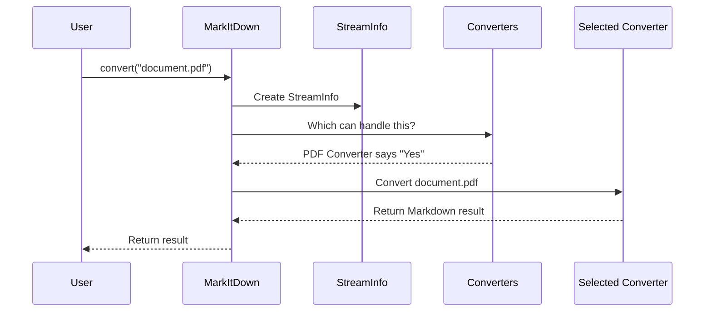

# Chapter 5: Format-specific Converters

In [Chapter 4: DocumentConverter](04_documentconverter_.md), we learned about the blueprint that all document converters follow. Now, let's explore the specialized converters that inherit from this blueprint, each designed to handle a specific file format.

## Introduction: The Specialized Translators

Imagine you're at the United Nations, where delegates speak many different languages. You would need different translators for different languages - one for French, another for Spanish, another for Mandarin, and so on. Each translator is specialized in converting a specific language to English.

Format-specific converters work the same way! Each converter is a specialist in transforming a particular file format into Markdown:

- The PDF converter knows how to extract text from PDF documents
- The DOCX converter understands Microsoft Word document structure
- The HTML converter can process web pages
- And so on...

When you try to convert a document using MarkItDown, the system finds the right "translator" for your file format.

## The Family of Format-specific Converters

Let's meet some of the most commonly used format-specific converters in the MarkItDown family:

1. **PlainTextConverter** - For simple text files (.txt)
2. **HtmlConverter** - For web pages and HTML files (.html, .htm)
3. **PdfConverter** - For PDF documents (.pdf)
4. **DocxConverter** - For Microsoft Word documents (.docx)
5. **XlsxConverter** - For Microsoft Excel spreadsheets (.xlsx)
6. **PptxConverter** - For Microsoft PowerPoint presentations (.pptx)
7. **ImageConverter** - For images with text (.png, .jpg)
8. **EpubConverter** - For e-books (.epub)

Each of these converters knows exactly how to handle its specific format, extracting content and converting it to clean Markdown.

## How Converters Know When to Step In

Every format-specific converter implements two key methods that we learned about in [Chapter 4: DocumentConverter](04_documentconverter_.md):

1. `accepts()` - Decides if this converter can handle a given file
2. `convert()` - Does the actual conversion work

Let's look at how the `accepts()` method works for a PDF converter:

```python
def accepts(self, file_stream, stream_info, **kwargs):
    mimetype = (stream_info.mimetype or "").lower()
    extension = (stream_info.extension or "").lower()
    
    # Accept files with .pdf extension
    if extension == ".pdf":
        return True
        
    # Accept files with PDF mime type
    if mimetype.startswith("application/pdf"):
        return True
        
    return False
```

This code checks if the file has a PDF extension or MIME type. If either condition is met, the converter says "Yes, I can handle this!"

## A Closer Look at Some Format-specific Converters

Let's examine a few converters to see how they work:

### 1. Plain Text Converter - The Simplest Case

The Plain Text Converter is the simplest, as text files are already close to Markdown format:

```python
class PlainTextConverter(DocumentConverter):
    def accepts(self, file_stream, stream_info, **kwargs):
        mimetype = (stream_info.mimetype or "").lower()
        extension = (stream_info.extension or "").lower()
        
        return extension == ".txt" or mimetype == "text/plain"
```

This converter accepts files with .txt extension or text/plain MIME type.

For the conversion itself:

```python
def convert(self, file_stream, stream_info, **kwargs):
    # Read content as bytes
    content = file_stream.read()
    
    # Convert to string if needed
    if isinstance(content, bytes):
        charset = stream_info.charset or "utf-8"
        content = content.decode(charset)
        
    return DocumentConverterResult(markdown=content)
```

This simply reads the text and returns it as Markdown, with minimal processing needed.

### 2. HTML Converter - A More Complex Example

The HTML Converter is more complex because it needs to understand HTML structure:

```python
def convert(self, file_stream, stream_info, **kwargs):
    # Parse HTML using BeautifulSoup
    charset = stream_info.charset or "utf-8"
    soup = BeautifulSoup(file_stream, "html.parser", 
                         from_encoding=charset)
    
    # Remove script and style elements
    for script in soup(["script", "style"]):
        script.extract()
```

This code uses a library called BeautifulSoup to parse the HTML and remove JavaScript and CSS code that shouldn't be part of the Markdown output.

Then it converts the HTML structure to Markdown:

```python
    # Convert body content to Markdown
    body = soup.find("body")
    if body:
        markdown_text = _CustomMarkdownify().convert_soup(body)
    else:
        markdown_text = _CustomMarkdownify().convert_soup(soup)
        
    return DocumentConverterResult(
        markdown=markdown_text.strip(),
        title=None if soup.title is None else soup.title.string
    )
```

This extracts the main content and converts HTML tags to Markdown formatting using a helper class called `_CustomMarkdownify`.

### 3. PDF Converter - Extracting Text from PDFs

The PDF Converter uses a specialized library to extract text:

```python
def convert(self, file_stream, stream_info, **kwargs):
    # Check if required library is available
    if _dependency_exc_info is not None:
        raise MissingDependencyException(
            "PDF conversion requires pdfminer.six package"
        )
        
    # Extract text from PDF
    text = pdfminer.high_level.extract_text(file_stream)
    
    return DocumentConverterResult(markdown=text)
```

This converter uses the `pdfminer.six` library to extract text content from PDF files. It also checks if the library is available before attempting conversion.

## How Converters Work Together in the System

When you use MarkItDown to convert a document, here's what happens behind the scenes:



1. You ask MarkItDown to convert a document
2. MarkItDown creates a [StreamInfo](03_streaminfo_.md) with details about the file
3. MarkItDown asks each format-specific converter if it can handle this file
4. The first converter that says "Yes" (through its `accepts()` method) is chosen
5. The selected converter's `convert()` method is called to do the actual work
6. The result is returned to you as clean Markdown

## Creating Your Own Format-specific Converter

Want to create a converter for a special file format? Here's how you can make one:

```python
from markitdown import DocumentConverter, StreamInfo, DocumentConverterResult

class MySpecialFormatConverter(DocumentConverter):
    def accepts(self, file_stream, stream_info, **kwargs):
        # Check if this is our special format
        extension = (stream_info.extension or "").lower()
        return extension == ".special"
```

First, create a class that inherits from `DocumentConverter` and implement the `accepts()` method to recognize your file format.

Then implement the conversion logic:

```python
    def convert(self, file_stream, stream_info, **kwargs):
        # Read the file content
        content = file_stream.read()
        
        # Process the content (replace with your logic)
        markdown_text = self._process_special_format(content)
        
        return DocumentConverterResult(markdown=markdown_text)
```

Finally, register your converter with MarkItDown:

```python
from markitdown import MarkItDown

# Create MarkItDown instance
mid = MarkItDown()

# Register your custom converter
mid.register_converter(MySpecialFormatConverter())

# Now you can convert your special format
result = mid.convert("document.special")
```

## Common Challenges and Solutions

### 1. Handling Complex Formatting

Some formats like Word documents contain rich formatting that's challenging to convert to Markdown:

```python
# In DocxConverter
def convert(self, file_stream, stream_info, **kwargs):
    # Convert DOCX to HTML first using mammoth
    html = mammoth.convert_to_html(file_stream).value
    
    # Then convert HTML to Markdown
    return self._html_converter.convert_string(html, **kwargs)
```

Many converters use a two-step process: first convert to HTML (which preserves formatting), then convert HTML to Markdown.

### 2. Detecting File Types Without Extensions

Sometimes files come without extensions or with incorrect ones:

```python
# Peek at file content to identify PDF
def accepts(self, file_stream, stream_info, **kwargs):
    # Save current position
    position = file_stream.tell()
    
    # Read first few bytes
    header = file_stream.read(4)
    
    # Reset position
    file_stream.seek(position)
    
    # Check for PDF signature
    return header == b'%PDF'
```

This code examines the file's content rather than relying on extension or MIME type.

## Under the Hood: How Converters Are Registered

In the MarkItDown class, converters are registered and sorted by priority:

```python
def enable_builtins(self, **kwargs):
    if not self._builtins_enabled:
        # Register converters with appropriate priorities
        self.register_converter(PlainTextConverter(), priority=10.0)
        self.register_converter(HtmlConverter(), priority=10.0)
        self.register_converter(PdfConverter(), priority=0.0)
        self.register_converter(DocxConverter(), priority=0.0)
        # ... more converters ...
```

Format-specific converters get lower priority values (0.0) so they're tried before generic converters (10.0). This ensures that specialized converters handle files they're designed for.

## Conclusion

Format-specific converters are the specialized translators that make MarkItDown so versatile. Each converter knows exactly how to handle a particular file format, extracting content and converting it to clean, consistent Markdown.

By understanding how these converters work, you can:
- Better utilize MarkItDown for different file formats
- Troubleshoot conversion issues
- Create your own converters for special formats

In the next chapter, we'll explore the [Plugin System](06_plugin_system_.md), which allows you to extend MarkItDown's capabilities even further by adding new converters and features without modifying the core code.

