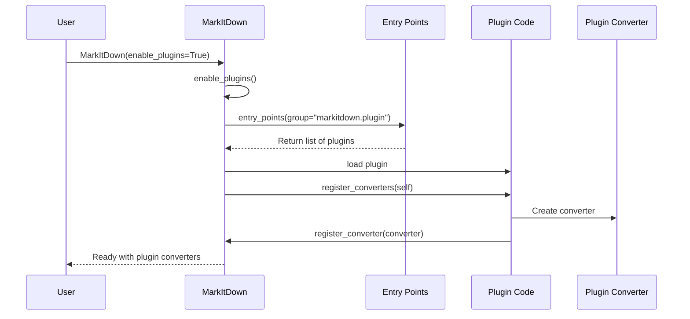

# Chapter 6: Plugin System

In [Chapter 5: Format-specific Converters](05_format_specific_converters_.md), we explored the specialized converters that handle different file formats. Now, let's discover how you can extend MarkItDown's capabilities without changing its core code, through the Plugin System.

## Introduction: Extending MarkItDown's Powers

Imagine your favorite smartphone. It comes with built-in apps, but what makes it truly powerful is the ability to download new apps from an app store. These apps add new features without requiring changes to the phone's operating system.

MarkItDown's Plugin System works the same way! While MarkItDown comes with built-in converters for common file formats like PDF, DOCX, and HTML, you might want to:

- Convert additional file formats not supported by default
- Customize how certain formats are converted
- Add entirely new features to the conversion process

The Plugin System makes this possible by allowing anyone to create and share extensions that enhance MarkItDown's capabilities.

## A Real-World Example: Converting RTF Files

Let's say you work with Rich Text Format (RTF) files, but MarkItDown doesn't support this format out of the box. Instead of waiting for the core development team to add this feature, you could:

1. Find a community-created RTF plugin
2. Install it alongside MarkItDown
3. Enable plugins when using MarkItDown
4. Convert RTF files just like any other supported format!

```python
from markitdown import MarkItDown

# Create MarkItDown with plugins enabled
converter = MarkItDown(enable_plugins=True)

# Now you can convert RTF files!
result = converter.convert("document.rtf")
```

With just one additional parameter (`enable_plugins=True`), you've extended MarkItDown to support a new file format!

## How the Plugin System Works

The Plugin System uses Python's "entry points" mechanism to discover and load plugins. Here's what happens behind the scenes:

1. When you install a MarkItDown plugin, it registers itself as an "entry point" in the `markitdown.plugin` group
2. When you enable plugins in MarkItDown, it searches for all entry points in this group
3. Each plugin is loaded and given a chance to register its converters
4. These new converters become available for MarkItDown to use

It's like a restaurant where:
- The menu (built-in converters) offers standard dishes
- Guest chefs (plugins) can visit and add their special recipes
- Customers (users) can enjoy both standard and special dishes

## Enabling Plugins in Your Code

Using plugins is simple. You have two ways to enable them:

### Option 1: Enable During Initialization

```python
# Create MarkItDown with plugins enabled
converter = MarkItDown(enable_plugins=True)

# Now use it normally
result = converter.convert("special_format.xyz")
```

This tells MarkItDown to load and enable all available plugins when it starts up.

### Option 2: Enable Later

```python
# Create MarkItDown without plugins initially
converter = MarkItDown()

# Enable plugins when needed
converter.enable_plugins()

# Now use it with plugin support
result = converter.convert("special_format.xyz")
```

This approach lets you start without plugins and enable them only when needed.

## Using Plugins from the Command Line

If you're using the [Command Line Interface](02_command_line_interface_.md), you can enable plugins with the `-p` or `--use-plugins` flag:

```bash
markitdown document.rtf -p
```

This will convert the RTF document using any available plugin that can handle this format.

## Finding and Installing Plugins

Plugins for MarkItDown are distributed as regular Python packages. You can install them using pip:

```bash
pip install markitdown-rtf-plugin
```

To find available plugins, you can:
- Check the MarkItDown documentation
- Search for "markitdown plugin" on PyPI (Python Package Index)
- Check the project's GitHub repository for a list of community plugins

Once installed, plugins will be automatically discovered when you enable plugin support.

## Listing Available Plugins

To see what plugins are installed and available, you can use the command line:

```bash
markitdown --list-plugins
```

This command shows all installed plugins without processing any documents.

## Creating Your Own Plugin

One of the most powerful features of the Plugin System is that you can create your own plugins! Let's walk through a simple example of creating a plugin for RTF files.

### Step 1: Set Up the Plugin Structure

First, create a basic Python package structure:

```
markitdown-rtf-plugin/
├── pyproject.toml
└── src/
    └── markitdown_rtf_plugin/
        ├── __init__.py
        └── _plugin.py
```

### Step 2: Define Your Plugin Interface

In `_plugin.py`, create a converter that inherits from [DocumentConverter](04_documentconverter_.md):

```python
from markitdown import DocumentConverter, StreamInfo, DocumentConverterResult

class RtfConverter(DocumentConverter):
    def accepts(self, file_stream, stream_info, **kwargs):
        # Check if this is an RTF file
        extension = (stream_info.extension or "").lower()
        return extension == ".rtf"
```

This code defines a converter that accepts files with the `.rtf` extension.

### Step 3: Implement the Conversion Logic

Next, add the `convert` method to actually transform RTF to Markdown:

```python
def convert(self, file_stream, stream_info, **kwargs):
    # Read the file content
    content = file_stream.read()
    
    # Convert bytes to string with proper encoding
    text = content.decode(stream_info.charset or "utf-8")
    
    # Convert RTF to plain text (simplified)
    markdown = self._rtf_to_markdown(text)
    
    return DocumentConverterResult(markdown=markdown)
```

This method reads the RTF content, decodes it, and converts it to Markdown.

### Step 4: Register Your Converter

Add a function that MarkItDown will call to register your converter:

```python
def register_converters(markitdown, **kwargs):
    """Called by MarkItDown to register converters from this plugin."""
    markitdown.register_converter(RtfConverter())
```

When MarkItDown loads your plugin, it will call this function to register your converter.

### Step 5: Make Your Plugin Discoverable

In `pyproject.toml`, define your package and entry point:

```toml
[build-system]
requires = ["setuptools>=42", "wheel"]
build-backend = "setuptools.build_meta"

[project]
name = "markitdown-rtf-plugin"
version = "0.1.0"
description = "RTF converter plugin for MarkItDown"

[project.entry-points."markitdown.plugin"]
rtf = "markitdown_rtf_plugin:_plugin"
```

The entry point definition tells Python where to find your plugin when MarkItDown looks for it.

## Under the Hood: How Plugins Are Loaded

Let's look at how MarkItDown discovers and loads plugins:



1. When you create a MarkItDown instance with plugins enabled
2. MarkItDown searches for all entry points in the "markitdown.plugin" group
3. Each plugin is loaded
4. The `register_converters` function of each plugin is called
5. Plugins create and register their converters with MarkItDown
6. MarkItDown can now use these converters to handle additional formats

Let's look at how this works in code. Here's the plugin loading mechanism:

```python
def _load_plugins():
    global _plugins
    
    # Skip if already loaded
    if _plugins is not None:
        return _plugins
        
    # Load plugins
    _plugins = []
    for entry_point in entry_points(group="markitdown.plugin"):
        try:
            _plugins.append(entry_point.load())
        except Exception:
            warn(f"Plugin '{entry_point.name}' failed to load")
    
    return _plugins
```

This function discovers plugins using Python's entry points system and loads them into memory.

And here's how MarkItDown enables these plugins:

```python
def enable_plugins(self, **kwargs):
    if not self._plugins_enabled:
        # Load plugins
        plugins = _load_plugins()
        for plugin in plugins:
            try:
                plugin.register_converters(self, **kwargs)
            except Exception:
                warn(f"Plugin '{plugin}' failed to register converters")
        self._plugins_enabled = True
```

This method loads all plugins and calls their `register_converters` function, passing the MarkItDown instance so the plugin can register its converters.

## Plugin Priority System

Not all converters are created equal! MarkItDown uses a priority system to determine which converter to try first for a given file. When registering a converter from a plugin, you can specify its priority:

```python
def register_converters(markitdown, **kwargs):
    # Register with default priority (0.0)
    markitdown.register_converter(RtfConverter())
    
    # Or with a specific priority
    markitdown.register_converter(SpecialConverter(), priority=5.0)
```

Lower priority values are tried first. The built-in converters use two main levels:
- `0.0` - Format-specific converters (tried first)
- `10.0` - Generic converters (tried later)

This priority system ensures that more specialized converters get the first chance to handle a file.

## Practical Tips for Using Plugins

Here are some helpful tips for working with plugins:

1. **Enable plugins only when needed** - If you don't need any plugins, it's slightly faster to keep them disabled.

2. **Check compatibility** - Make sure plugins are compatible with your version of MarkItDown.

3. **Debug plugin issues** - If a plugin isn't working, try the `--list-plugins` command to verify it's being found.

4. **Create simple plugins first** - If you're writing your own plugin, start with a simple converter and expand from there.

## Conclusion

The Plugin System is what makes MarkItDown truly extensible, allowing it to grow beyond its built-in capabilities. By enabling community contributions, MarkItDown can support an ever-expanding range of file formats and processing options without becoming bloated.

Whether you're using plugins created by others or building your own, the Plugin System opens up possibilities for customizing MarkItDown to fit your exact needs.

In the next chapter, we'll explore [URI Processing](07_uri_processing_.md), which helps MarkItDown handle different types of resource identifiers like web URLs and local file paths.

