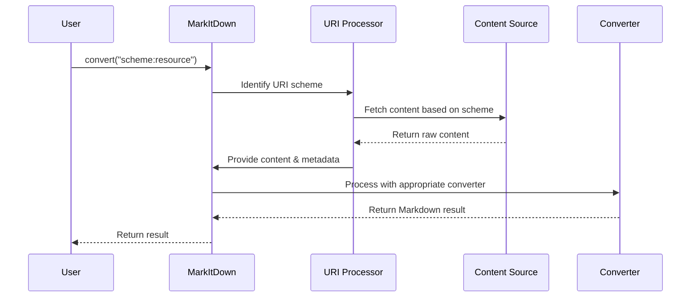

# Chapter 7: URI Processing

In [Chapter 6: Plugin System](06_plugin_system_.md), we explored how to extend MarkItDown's capabilities through plugins. Now, let's dive into another powerful feature: URI Processing.

## Introduction: The Universal Content Adapter

Imagine you're a chef who needs ingredients for your recipes. These ingredients might come from different places:
- Your kitchen cabinet (local files)
- The grocery store (web URLs)
- A package someone handed to you (embedded data)

No matter where they come from, you need a way to unwrap and prepare them for cooking.

URI Processing in MarkItDown works the same way! It's a universal adapter that helps MarkItDown handle content from different sources using a consistent approach. Whether your content is:
- A file on your computer
- A webpage on the internet
- Raw data embedded in a URI

MarkItDown can process it all through a unified system.

## Understanding URIs: Addresses for Resources

Before we dive in, let's understand what URIs are. URI stands for "Uniform Resource Identifier" - it's a string of characters that identifies a resource. You're probably familiar with URLs (like `https://example.com`), which are a type of URI specifically for web resources.

URIs follow a standard format:
```
scheme:scheme-specific-part
```

The `scheme` tells us what type of resource we're dealing with and how to access it. Common schemes include:

- `file:` - Local files on your computer
- `http:` or `https:` - Web resources
- `data:` - Embedded data

## Using URI Processing in MarkItDown

Let's see how to use URI Processing with some simple examples:

### Converting a Local File with a File URI

```python
from markitdown import MarkItDown

converter = MarkItDown()
result = converter.convert("file:///home/user/documents/report.pdf")
print(result.text_content)
```

This code converts a local PDF file referenced by a file URI. The URI starts with `file:///` followed by the absolute path to the file.

### Converting a Web Page

```python
converter = MarkItDown()
result = converter.convert("https://example.com")
print(result.text_content)
```

In this example, we're fetching and converting content from a website. MarkItDown handles the HTTP request, downloads the content, and converts it to Markdown.

### Converting Embedded Data (Data URI)

```python
# A data URI containing plain text
data_uri = "data:text/plain;charset=UTF-8,Hello%20World"
result = converter.convert(data_uri)
print(result.text_content)
```

This code processes a data URI that contains plain text. The content "Hello World" is URL-encoded within the URI itself, and MarkItDown extracts and converts it.

## The URI Processing Workflow

When you provide a URI to MarkItDown, here's what happens:



1. MarkItDown identifies the URI scheme
2. It uses the appropriate method to fetch the content
3. The content is processed with metadata about its source
4. The result is returned as Markdown

## Different Types of URIs in Detail

Let's look at each URI type in more detail:

### File URIs

File URIs point to files on your local system:

```
file:///path/to/file.pdf
```

The three slashes are important:
- The first two are part of the URI syntax (`scheme://`)
- The third one starts the absolute path

MarkItDown converts these to local file paths and processes them accordingly:

```python
# These two lines do the same thing
result = converter.convert("file:///home/user/document.pdf")
result = converter.convert("/home/user/document.pdf")
```

### HTTP and HTTPS URIs

These point to resources on the web:

```
https://example.com/article.html
```

MarkItDown uses the requests library to fetch these resources, then processes the response:

```python
# Explicitly converting a web page
result = converter.convert("https://example.com")

# This actually uses convert_uri internally
```

### Data URIs

Data URIs embed the actual content directly in the URI itself:

```
data:[<media type>][;charset=<character set>][;base64],<data>
```

For example:

```
data:text/plain;charset=UTF-8,Hello%20World
```

These are useful for small pieces of content without needing a separate file.

## Under the Hood: How URI Processing Works

Let's look at how MarkItDown handles different URIs internally:

### The `convert_uri` Method

The main entry point for URI processing is the `convert_uri` method:

```python
def convert_uri(self, uri, *, stream_info=None, **kwargs):
    uri = uri.strip()
    
    if uri.startswith("file:"):
        # Handle file URIs
        netloc, path = file_uri_to_path(uri)
        return self.convert_local(path, stream_info=stream_info, **kwargs)
```

This code checks if the URI starts with "file:" and handles it accordingly. Similar checks exist for other URI types.

### Converting File URIs to Paths

MarkItDown uses a helper function to convert file URIs to local paths:

```python
def file_uri_to_path(file_uri):
    parsed = urlparse(file_uri)
    if parsed.scheme != "file":
        raise ValueError("Not a file URL")
        
    path = os.path.abspath(url2pathname(parsed.path))
    return parsed.netloc, path
```

This function parses the URI, extracts the path component, and converts it to a local file path.

### Processing Data URIs

Data URIs contain the content embedded within the URI itself. Here's how they're processed:

```python
def parse_data_uri(uri):
    if not uri.startswith("data:"):
        raise ValueError("Not a data URI")
        
    header, _, data = uri.partition(",")
    meta = header[5:]  # Strip 'data:'
    
    # Extract MIME type, encoding, and data
    # ...
    
    return mime_type, attributes, content
```

This function parses the data URI format, extracts the MIME type and other attributes, and decodes the actual content.

### Handling HTTP(S) URIs

For web resources, MarkItDown uses the requests library:

```python
# In convert_uri method
elif uri.startswith("http:") or uri.startswith("https:"):
    response = self._requests_session.get(uri, stream=True)
    response.raise_for_status()
    return self.convert_response(response, **kwargs)
```

This fetches the web resource and passes it to `convert_response` for processing.

## The `convert` Method: The Central Hub

The main `convert` method serves as a central hub that routes content to the appropriate processor based on its type:

```python
def convert(self, source, **kwargs):
    if isinstance(source, str):
        if source.startswith(("http:", "https:", "file:", "data:")):
            return self.convert_uri(source, **kwargs)
        else:
            return self.convert_local(source, **kwargs)
    # Handle other source types...
```

This method examines the source and calls the appropriate specialized method for handling that type.

## Practical Use Cases for URI Processing

Let's look at some practical ways to use URI processing:

### Case 1: Converting Multiple Sources in One Go

```python
sources = [
    "file:///home/user/document.pdf",
    "https://example.com/article.html",
    "data:text/plain,Hello%20World"
]

for source in sources:
    result = converter.convert(source)
    print(f"Converted {source}: {len(result.text_content)} chars")
```

This code processes content from three different types of sources using a consistent interface.

### Case 2: Creating a Data URI on the Fly

```python
import base64

# Create a data URI with base64-encoded content
content = "# Markdown Title\n\nSome content."
encoded = base64.b64encode(content.encode()).decode()
data_uri = f"data:text/markdown;base64,{encoded}"

result = converter.convert(data_uri)
print(result.text_content)
```

This is useful when you want to process content without saving it to a file first.

### Case 3: Processing Local Files with Special Characters

```python
# Files with spaces or special characters
path = "/path/with spaces/document.pdf"
uri = f"file:///{path.replace(' ', '%20')}"

result = converter.convert(uri)
```

Using a file URI can help with paths that contain spaces or special characters.

## Connecting with Other MarkItDown Components

URI Processing works closely with other parts of MarkItDown:

1. It uses [StreamInfo](03_streaminfo_.md) to track information about the content
2. It passes content to appropriate [Format-specific Converters](05_format_specific_converters_.md)
3. It works with the [MarkItDown Class](01_markitdown_class_.md) as the central coordinator

The beauty of this system is that once content is retrieved from any URI, it flows through the same conversion pipeline, ensuring consistent results regardless of source.

## Advanced URI Processing Features

### Custom Request Headers for Web URIs

```python
from markitdown import MarkItDown
import requests

# Create a custom session with headers
session = requests.Session()
session.headers.update({"User-Agent": "MarkItDown/1.0"})

converter = MarkItDown(requests_session=session)
result = converter.convert("https://example.com")
```

This allows you to customize how web requests are made.

### Handling Authentication

```python
# Create a session with authentication
session = requests.Session()
session.auth = ("username", "password")

converter = MarkItDown(requests_session=session)
result = converter.convert("https://api.example.com/document")
```

This enables accessing resources that require authentication.

## Conclusion

URI Processing is a powerful feature that allows MarkItDown to handle content from various sources using a consistent approach. Whether you're working with local files, web resources, or embedded data, the same simple interface works for all.

This unified approach simplifies your code and makes your applications more flexible, allowing them to work with content regardless of where it comes from.

In the next chapter, we'll explore [LLM Integration](08_llm_integration_.md), which shows how to use Large Language Models to enhance MarkItDown's capabilities.

