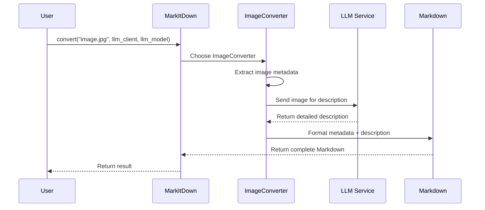

# Chapter 8: LLM Integration

In [Chapter 7: URI Processing](07_uri_processing_.md), we learned how MarkItDown can handle content from various sources. Now, let's explore an exciting feature that brings artificial intelligence into our document conversions: LLM Integration.

## Introduction: Adding AI Eyes to Your Documents

Have you ever needed to describe an image for someone who can't see it? Maybe for a visually impaired friend, or for a text-only document? It's not always easy to capture all the details accurately!

LLM Integration in MarkItDown is like giving your converter a pair of AI eyes. It uses Large Language Models (LLMs) like GPT-4 Vision to "see" images in your documents and automatically generate detailed descriptions. This makes your content:

- More accessible to people using screen readers
- Richer in searchable text content
- More informative when images can't be displayed

## A Real-World Example: Describing an Infographic

Imagine you have a complex infographic about climate change that you want to include in a Markdown document. Without LLM Integration, the image would be included as is, with maybe a brief caption you write yourself:

```markdown

```

But with LLM Integration enabled, MarkItDown can automatically generate a comprehensive description:

```markdown


# Description:
This detailed infographic illustrates global temperature trends from 1880-2023, 
showing a sharp upward curve after 1980. It includes four key sections: carbon 
emissions by country (with China and US leading), rising sea levels (showing 
a 3.4mm annual increase), extreme weather events (highlighting a 46% increase 
in category 4-5 hurricanes), and potential solutions including renewable energy 
adoption rates across different countries.
```

This description makes your document more accessible and provides valuable text content that can be searched or indexed.

## Understanding How LLM Integration Works

Let's break down the key components of LLM Integration:

### 1. What are LLMs?

LLM stands for "Large Language Model." These are powerful AI systems trained on vast amounts of text and, in some cases like GPT-4 Vision, images too. They can understand and generate human-like text based on what they've learned.

### 2. The Image Conversion Process

When you convert a document with images using LLM integration:

1. MarkItDown identifies images in your document
2. Each image is sent to the LLM along with a prompt
3. The LLM "looks" at the image and generates a description
4. The description is added to your Markdown output

### 3. Required Components

To use LLM integration, you need:

- An API client for an LLM service (like OpenAI)
- A model that supports image understanding (like GPT-4 Vision)
- API keys or credentials for the service

## Getting Started with LLM Integration

Let's see how to use LLM integration in your projects:

### Setting Up the LLM Client

First, you'll need to set up an API client. Here's an example using OpenAI:

```python
from openai import OpenAI
from markitdown import MarkItDown

# Create an OpenAI client
client = OpenAI(api_key="your-api-key-here")

# Create MarkItDown with LLM support
converter = MarkItDown()
```

This code imports the necessary libraries and creates an OpenAI client with your API key.

### Converting an Image with LLM Description

Now, let's convert an image file to Markdown with an AI-generated description:

```python
# Convert an image file with LLM description
result = converter.convert(
    "sunset_photo.jpg",
    llm_client=client,
    llm_model="gpt-4-vision-preview"
)

# Print the result
print(result.text_content)
```

This code converts a JPEG image and uses GPT-4 Vision to generate a description. The `llm_client` and `llm_model` parameters tell MarkItDown to use LLM integration.

### Customizing the Description Prompt

You can customize what kind of description you want by changing the prompt:

```python
# Using a custom prompt
result = converter.convert(
    "product_image.png",
    llm_client=client,
    llm_model="gpt-4-vision-preview",
    llm_prompt="Describe this product's key features and colors"
)
```

The `llm_prompt` parameter allows you to guide the LLM on what aspects of the image to focus on. Without this, a default prompt will be used.

## Using LLM Integration from the Command Line

If you prefer using the [Command Line Interface](02_command_line_interface_.md), you can use LLM integration as well:

```bash
export OPENAI_API_KEY=your-api-key-here
markitdown image.jpg --llm-model gpt-4-vision-preview
```

This command processes the image and adds an AI-generated description to the Markdown output.

## Behind the Scenes: How Image Description Works

Let's look at what happens when you convert an image with LLM integration:



1. You call `convert()` with an image and LLM parameters
2. MarkItDown selects the `ImageConverter` for this file type
3. The converter extracts any available metadata (like title, date, etc.)
4. The image is encoded and sent to the LLM service
5. The LLM analyzes the image and returns a description
6. The converter combines metadata and description into Markdown
7. The final Markdown is returned to you

## The Code Behind LLM Integration

Let's look at the key components that make LLM integration work:

### The Image Converter

The `ImageConverter` class handles processing of image files and includes LLM integration:

```python
class ImageConverter(DocumentConverter):
    def convert(self, file_stream, stream_info, **kwargs):
        md_content = ""
        
        # Add metadata from the image if available
        metadata = exiftool_metadata(file_stream)
        if metadata:
            # Add image metadata to markdown
            # ...
            
        # Try describing the image with LLM
        llm_client = kwargs.get("llm_client")
        llm_model = kwargs.get("llm_model")
        if llm_client is not None and llm_model is not None:
            # Call LLM for description
            # ...
```

This snippet shows how the `ImageConverter` first extracts any available metadata from the image, then checks if LLM integration is enabled before requesting a description.

### Getting the LLM Description

Here's how MarkItDown sends an image to an LLM and gets a description:

```python
def _get_llm_description(self, file_stream, stream_info, **kwargs):
    # Use custom prompt or default
    prompt = kwargs.get("llm_prompt") or "Write a detailed caption"
    
    # Convert image to base64 for API
    base64_image = base64.b64encode(file_stream.read()).decode()
    
    # Create data URI
    data_uri = f"data:{content_type};base64,{base64_image}"
    
    # Send to LLM and return description
    # ...
```

This function prepares the image for sending to the LLM by encoding it as a base64 string, which can be included in the API request.

### Calling the OpenAI API

Here's how MarkItDown communicates with the OpenAI API:

```python
# Prepare the OpenAI API request
messages = [
    {
        "role": "user",
        "content": [
            {"type": "text", "text": prompt},
            {
                "type": "image_url",
                "image_url": {"url": data_uri},
            },
        ],
    }
]

# Call the API
response = client.chat.completions.create(
    model=model, 
    messages=messages
)
```

This code creates a request with both text (the prompt) and image content, then sends it to the OpenAI API. The response contains the description generated by the LLM.

## Practical Applications of LLM Integration

Let's look at some real-world use cases for LLM integration:

### Making Research Papers Accessible

```python
# Convert a research paper with figures
converter = MarkItDown()
result = converter.convert(
    "research_paper.pdf",
    llm_client=client,
    llm_model="gpt-4-vision-preview",
    llm_prompt="Explain this scientific figure in simple terms"
)
```

This makes complex scientific figures more understandable by providing plain-language descriptions.

### Cataloging Image Collections

```python
# Process a folder of images
import os

converter = MarkItDown()
for filename in os.listdir("photos"):
    if filename.endswith((".jpg", ".png")):
        result = converter.convert(
            f"photos/{filename}",
            llm_client=client,
            llm_model="gpt-4-vision-preview"
        )
        # Save the description to a file
        with open(f"descriptions/{filename}.md", "w") as f:
            f.write(result.text_content)
```

This code processes a folder of images and creates a separate markdown file for each with metadata and description.

## Tips for Effective LLM Integration

Here are some tips to get the most out of LLM integration:

1. **Customize prompts** - Different prompts yield different types of descriptions. Be specific about what you want.

2. **Consider costs** - LLM API calls usually cost money. Process images in batches to manage expenses.

3. **Handle failures gracefully** - Network issues or API limits can cause failures. Always have error handling.

4. **Use appropriate models** - Some models are better at certain types of images than others.

## Challenges and Limitations

While powerful, LLM integration has some limitations to be aware of:

1. **Accuracy** - LLMs may occasionally misinterpret images or miss details.

2. **API dependency** - You need an internet connection and valid API credentials.

3. **Processing time** - Adding LLM description increases processing time.

4. **Language biases** - LLMs may describe images with certain cultural biases.

## Conclusion

LLM Integration transforms MarkItDown from a simple document converter into an intelligent assistant that can "see" and describe visual content. By leveraging powerful AI models, you can make your documents more accessible, searchable, and informative.

Whether you're creating accessible content, cataloging images, or enhancing research papers, LLM integration opens up new possibilities for working with visual information in your documents.

In the next chapter, we'll explore the [MCP Server](09_mcp_server_.md), which provides a network service interface to MarkItDown's conversion capabilities.

