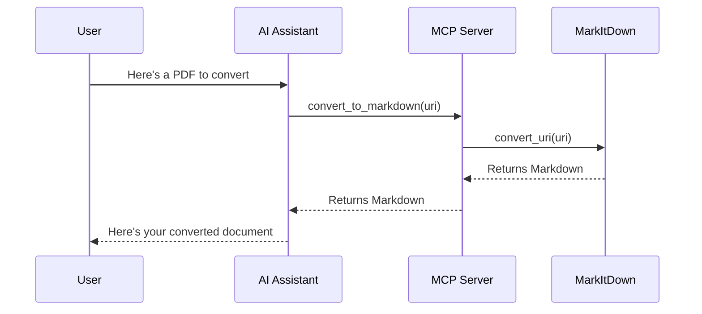

# Chapter 9: MCP Server

In [Chapter 8: LLM Integration](08_llm_integration_.md), we learned how to enhance MarkItDown with AI to describe images. Now, let's explore how we can make MarkItDown's powers available to AI assistants like Claude Desktop through the MCP Server.

## Introduction: The Bridge Between AI and MarkItDown

Imagine you're chatting with an AI assistant, and you share a PDF document. Wouldn't it be amazing if the AI could immediately convert that PDF to Markdown and work with its contents? That's exactly what the MCP Server makes possible!

The MCP Server acts like a friendly translator between AI assistants and MarkItDown. It allows AIs to directly use MarkItDown's document conversion capabilities without any human intervention.

## What is MCP? Understanding the Basics

MCP stands for "Model Context Protocol." It's a standard way for AI models to access tools and functions outside of their normal capabilities. Think of it like giving an AI extra "superpowers" through special tools.

For example, while an AI might be great at understanding and generating text, it might not have built-in abilities to:
- Convert a PDF document to Markdown
- Extract text from a Word document
- Process a spreadsheet

The MCP Server provides these tools to the AI, expanding what it can do for you.

## A Real-World Example: Claude Using MarkItDown

Imagine this conversation with Claude:

**You**: I have this research paper in PDF format, but I need it in Markdown for my notes.

**Claude**: I can help with that! Let me convert it for you.
[Claude uses the MarkItDown MCP Server to convert the PDF]

**Claude**: Here's your paper in Markdown format:
```markdown
# Research on Climate Change Effects
## Abstract
This paper examines the relationship between...
```

Behind the scenes, Claude used the MCP Server to access MarkItDown's conversion capabilities. The AI didn't need to manually extract the text - it just used the tool you provided!

## Setting Up Your MCP Server

Let's set up a simple MCP Server that provides MarkItDown's conversion capabilities:

```python
from mcp.server.fastmcp import FastMCP
from markitdown import MarkItDown

# Create an MCP server
mcp = FastMCP("markitdown")

# Register a conversion tool
@mcp.tool()
async def convert_to_markdown(uri: str) -> str:
    """Convert a resource to markdown"""
    return MarkItDown().convert_uri(uri).markdown
```

This code creates an MCP server named "markitdown" and registers a tool called "convert_to_markdown" that takes a URI (like a file path or URL) and returns the converted Markdown content.

## Running Your MCP Server

There are two main ways to run your MCP Server:

### 1. Command Line (Simple Mode)

```bash
python -m markitdown_mcp
```

This runs the server in standard input/output (stdio) mode, which is useful when integrating with applications that launch tools directly.

### 2. HTTP Server Mode

```bash
python -m markitdown_mcp --http --port 3001
```

This starts a web server on port 3001, allowing AI applications to connect over HTTP. This mode is more flexible as it lets multiple clients connect to your server.

## Enabling Plugin Support

If you want your MCP Server to support MarkItDown plugins:

```bash
export MARKITDOWN_ENABLE_PLUGINS=true
python -m markitdown_mcp --http
```

This environment variable tells the server to load and use any installed MarkItDown plugins, extending what file formats it can handle.

## How AIs Use Your MCP Server

When an AI assistant wants to use your MCP Server:

1. The AI sends a request specifying which tool it wants to use (convert_to_markdown)
2. It provides the necessary parameters (the URI of the document)
3. The MCP Server processes the request using MarkItDown
4. The server returns the converted Markdown to the AI
5. The AI can now work with the converted content

Let's visualize this flow:



## Under the Hood: How the MCP Server Works

Let's look at what happens when the MCP Server receives a request:

```python
@mcp.tool()
async def convert_to_markdown(uri: str) -> str:
    """Convert a resource to markdown"""
    # Create a MarkItDown instance with plugins if enabled
    markitdown = MarkItDown(enable_plugins=check_plugins_enabled())
    
    # Convert the document at the given URI
    result = markitdown.convert_uri(uri)
    
    # Return just the markdown content
    return result.markdown
```

When the AI calls this tool:
1. The server receives the URI parameter
2. It creates a [MarkItDown Class](01_markitdown_class_.md) instance
3. It calls the [URI Processing](07_uri_processing_.md) functionality to fetch and convert the document
4. It returns the converted Markdown back to the AI

## Different Transport Methods

The MCP Server supports different ways of communicating (transport methods):

### Standard Input/Output (stdio)

This is the simplest method where the server reads requests and writes responses directly to the console. It's used when you run the server without the `--http` flag.

### Server-Sent Events (SSE)

SSE allows for real-time communication over HTTP:

```python
# SSE transport setup
sse = SseServerTransport("/messages/")

async def handle_sse(request: Request) -> None:
    async with sse.connect_sse(...) as (read_stream, write_stream):
        await mcp_server.run(read_stream, write_stream, ...)
```

This method is useful for web applications that need real-time updates.

### Streamable HTTP

This provides a standard HTTP API for tools:

```python
# HTTP session manager
session_manager = StreamableHTTPSessionManager(
    app=mcp_server,
    json_response=True,
    stateless=True,
)
```

Most AI applications will connect to your MCP Server using this method.

## Practical Tips for Using the MCP Server

### 1. Choose the Right Transport

- Use stdio mode for simple integrations or testing
- Use HTTP mode for more flexible, multi-client setups

### 2. Handling Large Documents

When converting large documents:

```python
@mcp.tool()
async def convert_to_markdown(uri: str) -> str:
    # For large documents, consider adding timeout handling
    try:
        return MarkItDown().convert_uri(uri).markdown
    except Exception as e:
        return f"Error converting document: {str(e)}"
```

Always include error handling to prevent the server from crashing on problematic documents.

### 3. Securing Your Server

If you're exposing your MCP Server publicly:

```bash
# Only listen on localhost for security
python -m markitdown_mcp --http --host 127.0.0.1
```

By default, the server only listens on localhost (127.0.0.1), which prevents access from other computers.

## Conclusion

The MCP Server transforms MarkItDown from a tool that only humans can use into a capability that AI assistants can access directly. This bridge between document conversion and AI opens up exciting possibilities for automated document processing and more interactive AI experiences.

By setting up an MCP Server, you're creating a powerful integration point that allows AI assistants to handle various document formats without human intervention.

In the next chapter, we'll explore [Exception Handling](10_exception_handling_.md), which helps make your MarkItDown applications more robust by properly handling errors and edge cases.

