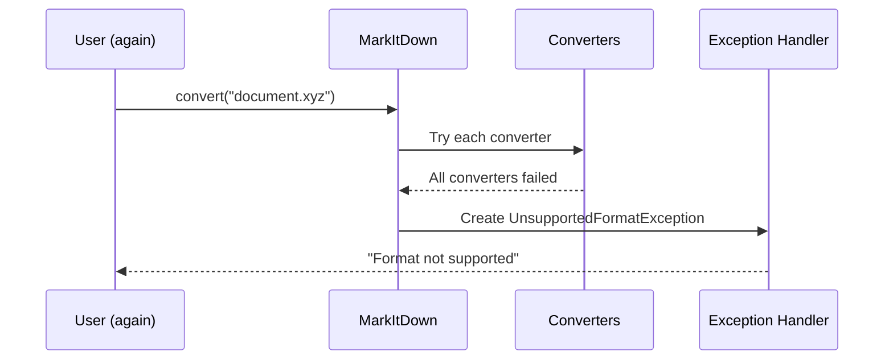

# Chapter 10: Exception Handling

In [Chapter 9: MCP Server](09_mcp_server_.md), we learned how to make MarkItDown's powers available to AI assistants. Now, let's explore a crucial aspect of any robust application: Exception Handling.

## Introduction: The Safety Net for Your Code

Imagine you're walking on a tightrope. Even the most skilled tightrope walkers have safety nets underneath them, just in case something goes wrong. In programming, exception handling works the same way - it's a safety net that catches problems when they occur.

When converting documents, many things could go wrong:
- The file might be corrupted
- A required library might be missing
- The format might be unsupported
- The conversion process might fail

Without proper exception handling, these issues would cause your program to crash abruptly. With good exception handling, your program can gracefully detect these problems, provide helpful messages, and even try alternative approaches.

## The Family of MarkItDown Exceptions

MarkItDown has a carefully designed system of exception classes to handle different types of errors. Think of these as different types of safety nets, each designed to catch specific problems:

### 1. The Base Exception: MarkItDownException

```python
class MarkItDownException(Exception):
    """Base exception class for MarkItDown."""
    pass
```

This is the parent of all MarkItDown exceptions. It's like the general category "transportation problem" before we get into specifics like "flat tire" or "out of gas."

### 2. Missing Dependencies: When Tools Are Missing

```python
class MissingDependencyException(MarkItDownException):
    """Thrown when a required dependency is not installed."""
    pass
```

This exception occurs when MarkItDown recognizes your file format but is missing the necessary library to process it. For example, if you try to convert a PDF but the PDF processing library isn't installed.

### 3. Unsupported Formats: When MarkItDown Doesn't Recognize the File

```python
class UnsupportedFormatException(MarkItDownException):
    """Thrown when no suitable converter was found."""
    pass
```

This occurs when MarkItDown doesn't have any converter that can handle your file type. It's like trying to use a key that doesn't fit any lock.

### 4. Failed Conversions: When Processing Goes Wrong

```python
class FileConversionException(MarkItDownException):
    """Thrown when conversion fails for any reason."""
    # Implementation details...
```

This happens when MarkItDown recognizes your file and has the right tools, but something still goes wrong during conversion - perhaps the file is corrupted or has unexpected content.

## Handling Exceptions: Catching Problems Gracefully

Let's see how to use these exceptions in your code:

```python
from markitdown import MarkItDown
from markitdown import MissingDependencyException, UnsupportedFormatException

try:
    converter = MarkItDown()
    result = converter.convert("document.xyz")
    print(result.text_content)
except UnsupportedFormatException:
    print("Sorry, the .xyz format isn't supported.")
except MissingDependencyException as e:
    print(f"Missing library: {e}")
```

This code tries to convert a document but has safety nets for two possible problems:
1. If the format is unsupported, it shows a friendly message
2. If a dependency is missing, it tells you which one

## Helpful Error Messages: Making Problems Understandable

MarkItDown's exceptions are designed to provide clear, actionable information. For example, when a dependency is missing:

```python
try:
    converter = MarkItDown()
    result = converter.convert("report.pdf")
except MissingDependencyException as e:
    print(e)
    # Output might be:
    # PdfConverter recognized the input as a potential pdf file, but the 
    # dependencies needed to read pdf files have not been installed. 
    # To resolve this error, include the optional dependency [pdf] or [all]
    # when installing MarkItDown. For example:
    # * pip install markitdown[pdf]
    # * pip install markitdown[all]
```

This error message not only tells you what went wrong but also exactly how to fix it!

## Detailed Conversion Failures: Learning from Multiple Attempts

When MarkItDown tries to convert a file, it might attempt several converters before giving up. The `FileConversionException` captures all these attempts:

```python
try:
    result = converter.convert("strange_file.doc")
except FileConversionException as e:
    print(f"Conversion failed after {len(e.attempts)} attempts:")
    for attempt in e.attempts:
        converter_name = type(attempt.converter).__name__
        print(f" - {converter_name} failed")
```

This code shows all the converters that were tried and why each one failed, which is incredibly helpful for debugging.

## How Exception Handling Works Inside MarkItDown

Let's see what happens inside MarkItDown when an exception occurs:



1. You ask MarkItDown to convert a document
2. MarkItDown tries each registered converter
3. If all converters reject the file, an `UnsupportedFormatException` is created
4. This exception is passed back to your code to handle

## Under the Hood: Converting Documents with Safety Nets

Let's look at a simplified version of how MarkItDown handles exceptions internally:

```python
def convert(self, source, **kwargs):
    # Step 1: Try to get appropriate stream info
    try:
        stream_info = self._get_stream_info(source)
    except Exception as e:
        # Something went wrong getting basic file info
        raise FileConversionException(f"Failed to process source: {e}")
```

This first part tries to gather information about the file. If something goes wrong even at this early stage, it wraps the error in a `FileConversionException`.

Next, it tries to find and use converters:

```python
    # Step 2: Try each converter
    attempts = []
    for priority, converter in sorted(self._converters):
        try:
            # See if this converter accepts the file
            if converter.accepts(stream, stream_info):
                # Try to convert
                return converter.convert(stream, stream_info)
        except Exception as e:
            # Record this failed attempt
            attempts.append(FailedConversionAttempt(converter, sys.exc_info()))
```

This code tries each converter and keeps track of any failures. If a converter throws an exception, it's recorded but doesn't stop the process - MarkItDown will try the next converter.

Finally, if nothing worked:

```python
    # Step 3: Handle the case where no converter worked
    if not attempts:
        raise UnsupportedFormatException(f"No converter for {stream_info}")
    else:
        raise FileConversionException(attempts=attempts)
```

If no converter even accepted the file, it throws an `UnsupportedFormatException`. If some converters accepted it but failed during conversion, it throws a `FileConversionException` with details about all the attempts.

## Using Exception Handling in Your Applications

Let's see how to use exception handling in a real application:

```python
def convert_document(filepath, output=None):
    try:
        # Try to convert the document
        converter = MarkItDown(enable_plugins=True)
        result = converter.convert(filepath)
        
        # Handle successful conversion
        if output:
            with open(output, 'w') as f:
                f.write(result.text_content)
        return True
            
    except MissingDependencyException as e:
        print(f"Missing library: {e}")
    except UnsupportedFormatException:
        print(f"Sorry, the format of {filepath} isn't supported.")
    except FileConversionException as e:
        print(f"Conversion failed: {e}")
    except Exception as e:
        print(f"Unexpected error: {e}")
    
    return False
```

This function tries to convert a document and handles all the possible MarkItDown exceptions, plus a catch-all for any unexpected errors. It returns `True` if successful and `False` otherwise.

## Command Line Interface and Exceptions

The [Command Line Interface](02_command_line_interface_.md) also uses exception handling to provide clear messages to users:

```python
def main():
    # Parse arguments and setup
    args = parser.parse_args()
    
    try:
        # Process the input
        result = process_input(args)
        # Output the result
        output_result(result, args)
    except MarkItDownException as e:
        print(f"Error: {e}", file=sys.stderr)
        sys.exit(1)
```

This code captures any MarkItDown exception, displays a clear error message, and exits with a non-zero status code to indicate failure.

## Best Practices for Exception Handling

Here are some tips for effective exception handling with MarkItDown:

1. **Be specific with exceptions**: Catch the most specific exception type possible. For example, catch `MissingDependencyException` rather than just `Exception`.

2. **Provide helpful messages**: When an error occurs, tell users what happened and how to fix it.

3. **Log detailed information**: For debugging, log the full exception details including traceback.

4. **Have fallback options**: When possible, provide alternatives when the primary approach fails.

```python
try:
    result = converter.convert("document.pdf")
except MissingDependencyException:
    # Try an alternative approach
    result = converter.convert_uri("https://pdf-to-text-api.example.com?file=document.pdf")
```

This code tries to convert a PDF locally, but if the PDF library is missing, it falls back to using a web service instead.

## Conclusion

Exception handling in MarkItDown works like a sophisticated safety net system, catching different types of problems and providing clear, actionable information about what went wrong. By understanding and properly handling these exceptions, you can create robust applications that gracefully handle errors rather than crashing unexpectedly.

Good exception handling is the difference between an application that fails mysteriously and one that provides helpful guidance when problems occur. It's an essential part of creating a positive user experience, especially when dealing with complex processes like document conversion.

By implementing proper exception handling in your MarkItDown applications, you'll create more reliable, user-friendly tools that gracefully handle the unexpected challenges of real-world documents.

