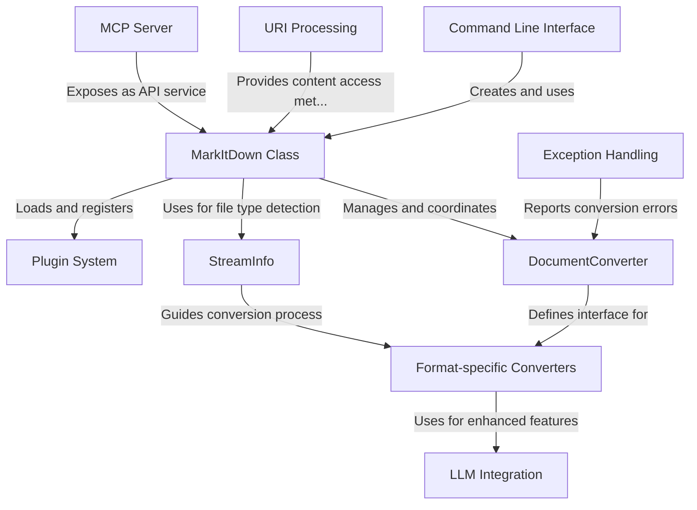

# Tutorial: markitdown

**MarkItDown** is a versatile document conversion tool that transforms various file formats (PDF, DOCX, HTML, images, etc.) into clean **Markdown** text. It features an *extensible architecture* with plugins that support additional formats and a powerful detection system that automatically identifies file types. The tool can be used via a **command-line interface**, as a Python library, or through an **MCP server** that integrates with AI applications like Claude Desktop. MarkItDown can even leverage **Large Language Models** to enhance conversions, particularly for describing image content.

**Source Repository:** [https://github.com/microsoft/markitdown](https://github.com/microsoft/markitdown)

## Chapters

1. [MarkItDown Class
](01_markitdown_class_.md)
2. [Command Line Interface
](02_command_line_interface_.md)
3. [StreamInfo
](03_streaminfo_.md)
4. [DocumentConverter
](04_documentconverter_.md)
5. [Format-specific Converters
](05_format_specific_converters_.md)
6. [Plugin System
](06_plugin_system_.md)
7. [URI Processing
](07_uri_processing_.md)
8. [LLM Integration
](08_llm_integration_.md)
9. [MCP Server
](09_mcp_server_.md)
10. [Exception Handling
](10_exception_handling_.md)
