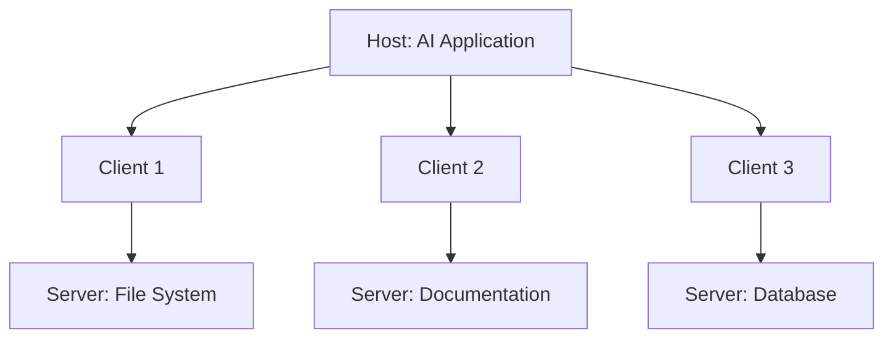
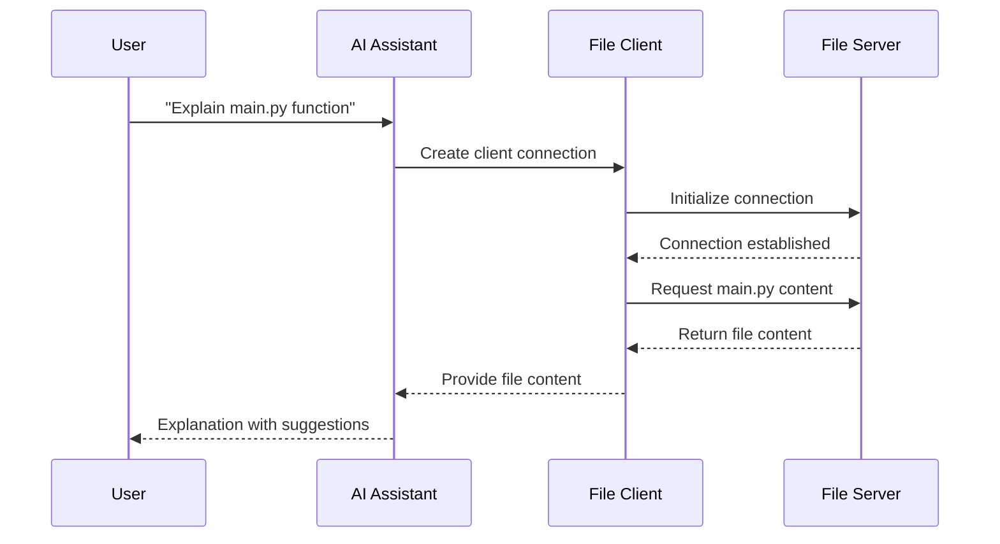
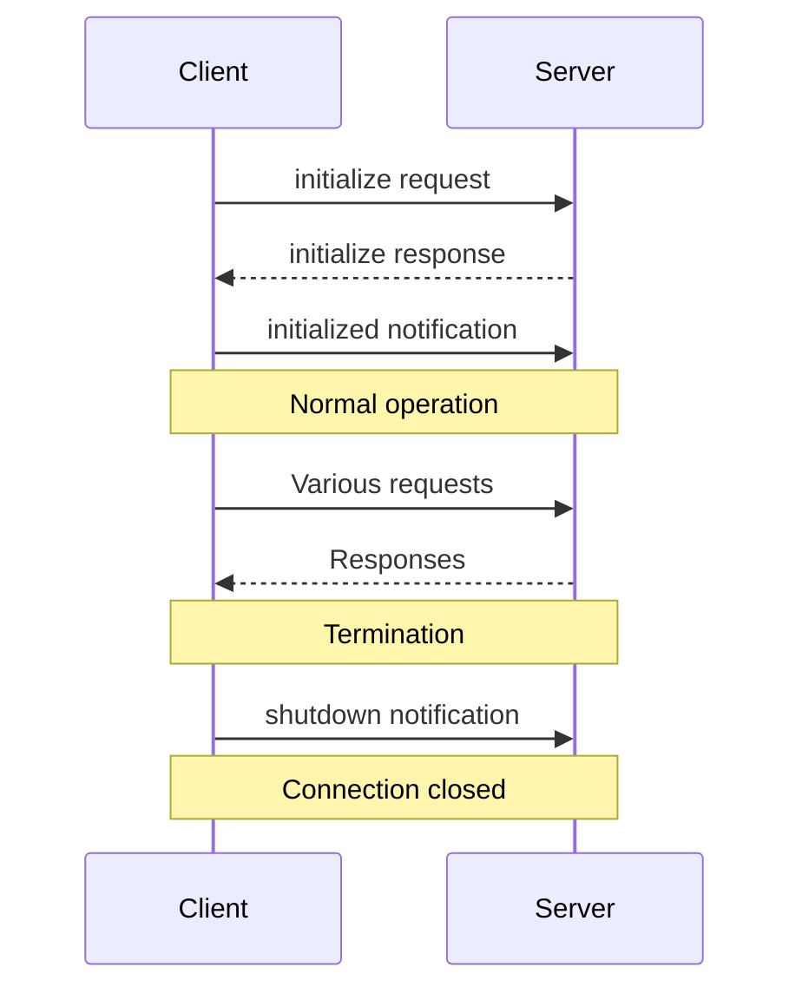

# Chapter 1: Protocol Architecture

## Introduction

Have you ever wondered how AI applications like chatbots or code assistants access the information they need? How does your AI assistant know about your files, or access your database, while keeping everything secure? The Model Context Protocol (MCP) solves this problem through its thoughtfully designed architecture.

Think of MCP's architecture like a city's infrastructure. Just as a city has roads, power lines, and water systems to connect buildings and services, MCP provides the infrastructure that allows AI applications to connect to various data sources safely and efficiently.

## A Real-World Example

Let's imagine you're building an AI-powered coding assistant that needs to:
- Access files in your code repository
- Look up documentation from the internet
- Run database queries when needed

Instead of building custom connections to each data source, MCP gives you a standardized way to connect your AI application to these different sources while keeping everything secure and organized.

## Key Components of MCP Architecture

MCP has three main components, each with a specific role:

### 1. Hosts

A **host** is the main AI application, like an AI coding assistant or a chatbot application. The host is responsible for:
- Creating and managing client connections
- Coordinating AI model interactions
- Handling user permissions and security
- Aggregating information from different sources

Think of the host as the city hall in our city analogy - it oversees everything and makes sure all parts work together properly.

### 2. Clients

**Clients** are created by the host to maintain individual connections with servers. Each client:
- Maintains exactly one connection to one server
- Handles communication back and forth
- Keeps server connections isolated from each other

Clients are like the dedicated roads connecting city hall to different services around the city. Each road is separate and leads to only one destination.

### 3. Servers

**Servers** provide specialized information or capabilities:
- A file server might provide access to your code files
- A database server might allow running queries
- A documentation server might provide access to API documentation

Servers are like the various services in a city - the water plant, power station, or transportation hub. Each provides a specific service and doesn't need to know about the others.



## How It Works Together

Let's walk through a simple example of how this architecture works in practice:

1. You ask your AI coding assistant: "Can you explain the function in main.py and suggest improvements?"

2. The host (AI application) needs to:
   - Access your file system to read main.py
   - Potentially access documentation to help with suggestions

3. The host creates separate clients for each task:
   - Client 1 connects to a file system server
   - Client 2 connects to a documentation server

4. Each client establishes a connection with its server:



## Communication Flow

All communication in MCP happens through a standardized message system. Here's a simplified view of how clients and servers talk to each other:

1. **Initialization**: When a client connects to a server, they exchange information about what features they support

```javascript
// Client sending initialization request (simplified)
client.initialize({
  protocolVersion: "2024-11-05",
  capabilities: {
    sampling: true,
    resources: true
  }
});
```

This code tells the server which version of the protocol the client is using and what capabilities it supports.

2. **Message Exchange**: After initialization, clients and servers exchange requests and responses

```javascript
// Client requesting a resource from server (simplified)
const response = await client.request("getResource", {
  uri: "file:///projects/main.py"
});
```

This code asks the server for a specific resource (in this case, a file) identified by its URI.

## Security Benefits

One major advantage of MCP's architecture is security through isolation:

- Each server only sees what it needs to - a file server doesn't access your database
- Servers can't see the full conversation history with the AI
- The host controls what information is shared with each server

This is like how in a city, the water department doesn't have access to the electrical grid's systems, even though both provide essential services.

## How Connections Are Managed

When a client connects to a server, they go through a simple lifecycle:



The initialization phase is where clients and servers negotiate what features they support, ensuring they can work together properly.

## Implementation Example

Let's look at a simple implementation of an MCP server in TypeScript:

```typescript
// Create a new server
const server = new Server({
  name: "file-server",
  version: "1.0.0"
}, {
  capabilities: {
    resources: {}
  }
});

// Handle resource requests
server.setRequestHandler(GetResourceRequestSchema, async (request) => {
  const { uri } = request;
  // Read file content based on URI
  const content = await readFile(uri);
  return { content };
});
```

This code creates a simple file server that can respond to resource requests. When a client asks for a file, the server reads it and returns the content.

Similarly, a client implementation might look like:

```typescript
// Create a client
const client = new Client({
  name: "my-ai-app",
  version: "1.0.0"
});

// Connect to a server
await client.connect(transport);

// Request a resource
const result = await client.request({
  method: "getResource",
  params: { uri: "file:///main.py" }
});
```

This client connects to a server and requests a specific file resource.

## Conclusion

The Model Context Protocol's architecture provides a flexible, secure way for AI applications to connect with various data sources and services. By organizing communication through hosts, clients, and servers, MCP enables:

- Clean separation of concerns
- Secure information sharing
- Standardized communication
- Flexible integration of multiple data sources

This architecture is the foundation that makes all other MCP features possible. In the next chapter, we'll explore how messages are structured and exchanged between these components in the [Message System](02_message_system_.md).

