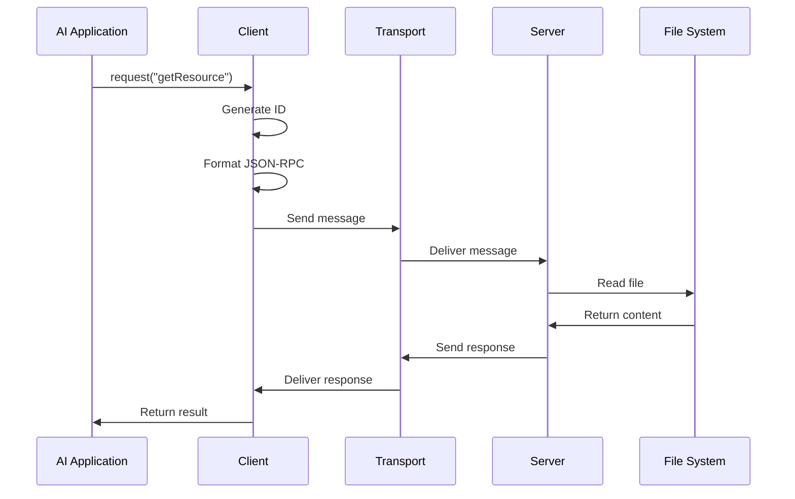

# Chapter 2: Message System

In [Protocol Architecture](01_protocol_architecture_.md), we learned how hosts, clients, and servers work together in the Model Context Protocol. Now, let's explore how these components actually communicate with each other using MCP's Message System.

## What is the Message System?

Imagine you're building an AI assistant that needs to access files on your computer. For this to work, your AI application needs a reliable way to ask for files and receive them. This is exactly what the Message System solves!

Think of the Message System like a postal service for AI applications:
- It defines standard formats for sending messages
- It ensures messages get delivered correctly
- It provides ways to handle errors when things go wrong

## A Real-World Example

Let's say you're building a coding assistant that needs to read a Python file to give you code suggestions. Your application needs to:

1. Request the file content from the file system
2. Receive the file content
3. Process it and provide suggestions

The Message System makes this communication possible through standardized messages.

## Key Concepts: The Three Types of Messages

MCP's Message System is based on JSON-RPC 2.0, a lightweight protocol for sending messages between applications. There are three types of messages:

### 1. Requests

Requests are messages that ask for something and expect a response. They're like sending a letter that says "Please send me this information" and including a return address.

```javascript
{
  "jsonrpc": "2.0",
  "id": "request-123",
  "method": "getResource",
  "params": {
    "uri": "file:///projects/main.py"
  }
}
```

This request is asking for the content of a file called "main.py". The `id` field is like a tracking number - it helps match responses to their requests.

### 2. Responses

Responses are sent back to answer requests. They always include the same ID as the request they're answering.

```javascript
{
  "jsonrpc": "2.0",
  "id": "request-123",
  "result": {
    "content": "def hello():\n    print('Hello, world!')"
  }
}
```

This response is returning the content of the requested file. Notice it has the same `id` as our request.

### 3. Notifications

Notifications are one-way messages that don't expect any response. They're like dropping a postcard in a mailbox without needing anything back.

```javascript
{
  "jsonrpc": "2.0",
  "method": "initialized",
  "params": {
    "clientInfo": {
      "name": "my-ai-app",
      "version": "1.0.0"
    }
  }
}
```

This notification is telling the server that the client has successfully initialized. Notice there's no `id` field since no response is expected.

## Using the Message System

Let's see how to use the Message System in a simple application:

```typescript
// Create a client
const client = new Client();

// Send a request to get a file
const response = await client.request({
  method: "getResource",
  params: { uri: "file:///projects/main.py" }
});

// Use the response
console.log("File content:", response.result.content);
```

This code creates a client, sends a request to get a file, and then logs the file content when it receives the response. The client handles all the details of formatting the JSON-RPC message correctly.

## Error Handling

Sometimes things go wrong. The Message System has a standard way to handle errors:

```typescript
try {
  const response = await client.request({
    method: "getResource",
    params: { uri: "file:///non-existent.py" }
  });
} catch (error) {
  console.error("Error code:", error.code);
  console.error("Error message:", error.message);
}
```

If the file doesn't exist, the server would respond with an error object instead of a result. The client converts this into an exception that your code can catch and handle.

## Under the Hood: How Messages Flow

Let's walk through what happens when your application sends a message:



1. Your application calls the `request` method on a client
2. The client generates a unique ID for the request
3. The client formats the request as a JSON-RPC message
4. The message travels through a transport layer (like HTTP or WebSockets)
5. The server receives the message and processes it
6. The server sends back a response
7. Your application receives the result

## Message System Implementation

Here's a simplified look at how the client formats requests:

```typescript
class Client {
  private nextId = 1;
  
  async request(method, params) {
    // Format as JSON-RPC request
    const request = {
      jsonrpc: "2.0",
      id: String(this.nextId++),
      method,
      params
    };
    
    // Send and wait for response
    const response = await this.transport.sendMessage(request);
    
    // Check for errors
    if (response.error) {
      throw new Error(response.error.message);
    }
    
    return response.result;
  }
}
```

This code shows how a client creates a properly formatted JSON-RPC request and handles the response. The client generates a unique ID for each request and increments a counter to ensure IDs don't repeat.

On the server side, message handling looks like this:

```typescript
class Server {
  handleMessage(message) {
    // Check if it's a request (has an ID)
    if (message.id) {
      try {
        const result = this.processMethod(message.method, message.params);
        return {
          jsonrpc: "2.0",
          id: message.id,
          result
        };
      } catch (error) {
        return {
          jsonrpc: "2.0",
          id: message.id,
          error: {
            code: error.code || -32603,
            message: error.message
          }
        };
      }
    } else {
      // It's a notification
      this.processNotification(message.method, message.params);
      // No response needed
    }
  }
}
```

This code shows how a server processes incoming messages. It checks if the message is a request or a notification by looking for an ID. For requests, it processes the method and returns a response. For notifications, it processes the method but doesn't return anything.

## When to Use Each Message Type

- **Requests**: Use when you need information back or need to confirm an action was completed
- **Responses**: These are automatic responses to requests
- **Notifications**: Use when you just need to inform the other side about something without needing confirmation

For example:
- Use a request to ask for a file's content
- Use a notification to tell the server you're shutting down the connection

## How the Message System Connects to Other MCP Components

The Message System is the foundation for all other MCP features:

- [Lifecycle Management](03_lifecycle_management_.md) uses specific messages to initialize connections and negotiate capabilities
- [Resources](05_resources_.md) are accessed through standardized resource request messages
- [Tools](06_tools_.md) are invoked using tool request messages

Each of these components builds on the basic message types we've explored in this chapter.

## Conclusion

The Message System is like the postal service that keeps all MCP components talking to each other. By standardizing communication into requests, responses, and notifications, MCP ensures that clients and servers can reliably exchange information no matter how they're connected.

In the next chapter, [Lifecycle Management](03_lifecycle_management_.md), we'll learn how connections are established, maintained, and terminated using these message types.

