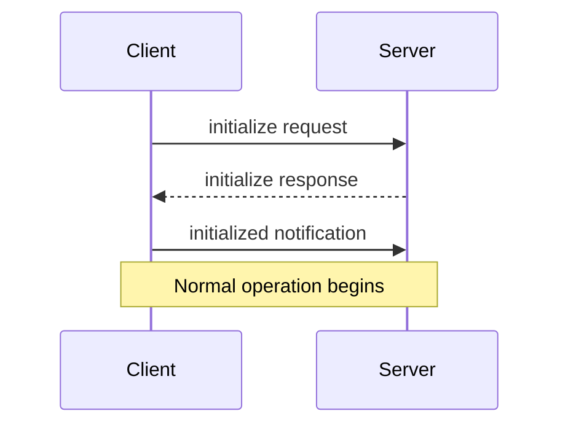
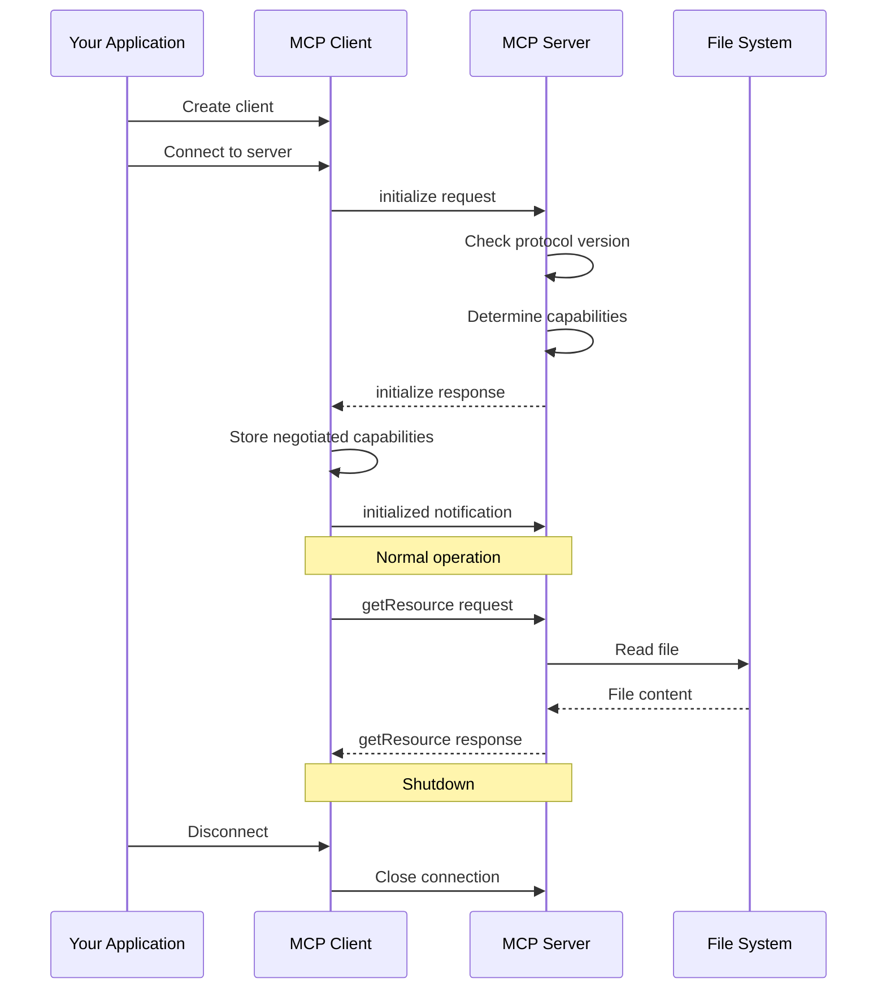

# Chapter 3: Lifecycle Management

In the [Message System](02_message_system_.md) chapter, we learned how clients and servers exchange information using requests, responses, and notifications. Now, let's explore how these connections are established, maintained, and eventually closed through Lifecycle Management.

## What is Lifecycle Management?

Think about a phone call. It has clear stages:
- **Beginning**: You dial, the other person answers, and you greet each other
- **Middle**: You have your conversation
- **End**: You say goodbye and hang up

MCP connections work the same way! Lifecycle Management provides a structured approach to handling these stages, ensuring both sides know what's happening throughout the connection.

## Why is Lifecycle Management Important?

Without proper Lifecycle Management:
- How would a client know which features a server supports?
- How would a server know which protocol version to use?
- What if a connection ends suddenly without cleaning up?

Let's see a real example of why this matters.

## A Real-World Example

Imagine you're building an AI assistant that needs to access files on your computer. Here's how lifecycle management helps:

1. **Connection Setup**: Your assistant needs to know if the file server supports features like "watch for file changes" before trying to use them
2. **Working Together**: During normal operation, they need to follow the agreed-upon rules
3. **Clean Ending**: When done, your assistant should close the connection properly instead of just disappearing

## The Three Phases of a Connection

Every MCP connection goes through three distinct phases:

### 1. Initialization Phase
This is when the client and server:
- Introduce themselves
- Agree on a protocol version
- Negotiate which capabilities they support
- Establish the ground rules for their conversation

### 2. Operation Phase
During this phase:
- Normal communication occurs
- Requests and responses are exchanged
- The negotiated capabilities are used

### 3. Shutdown Phase
Finally, when the work is done:
- The connection is terminated gracefully
- Resources are freed up
- Both sides know the conversation is over

Let's look at each phase in more detail.

## The Initialization Dance

The initialization phase follows a specific pattern:



Let's break down each step:

### Step 1: Client Sends Initialize Request

```javascript
client.request({
  method: "initialize",
  params: {
    protocolVersion: "2024-11-05",
    capabilities: {
      sampling: {},
      roots: { listChanged: true }
    },
    clientInfo: {
      name: "MyAssistant",
      version: "1.0.0"
    }
  }
});
```

This request tells the server:
- Which protocol version the client wants to use
- Which capabilities the client supports (like "sampling" for AI model requests)
- Information about the client software

### Step 2: Server Responds with Its Capabilities

```javascript
// Server's response
{
  "protocolVersion": "2024-11-05",
  "capabilities": {
    "resources": { "subscribe": true },
    "tools": { "listChanged": true }
  },
  "serverInfo": {
    "name": "FileServer",
    "version": "2.1.0"
  }
}
```

The server responds with:
- The protocol version it will use
- Its own capabilities (like "resources" for file access)
- Information about the server software

### Step 3: Client Confirms Initialization

```javascript
client.notify({
  method: "notifications/initialized"
});
```

This notification tells the server that the client is ready to begin normal operation. It's like saying "I'm ready to start our conversation now!"

## Capability Negotiation

During initialization, the client and server negotiate which features they'll use. This is like friends deciding which game to play based on what games they both own.

For example:
- Client capabilities might include: `sampling`, `roots`
- Server capabilities might include: `resources`, `tools`, `logging`

Only capabilities that both sides understand will be available during the connection.

## Normal Operation Phase

After initialization is complete, the client and server enter normal operation:

```javascript
// Client requests a file
const response = await client.request({
  method: "getResource",
  params: { uri: "file:///projects/main.py" }
});

// Use the file content
console.log(response.content);
```

During this phase, all messages follow the rules established during initialization. The client only uses capabilities the server supports, and vice versa.

## Graceful Shutdown

When the work is done, the connection should be closed properly:

```javascript
// Client initiates shutdown
await client.disconnect();
```

Depending on the transport mechanism (HTTP, WebSockets, direct process), shutdown works differently, but the goal is always to close the connection cleanly.

## Under the Hood: How Lifecycle Management Works

Let's see what happens behind the scenes during a connection's lifecycle:



This diagram shows the complete lifecycle of an MCP connection from beginning to end.

## Client Implementation

Here's a simplified look at how a client implements lifecycle management:

```typescript
class Client {
  async connect() {
    // Step 1: Send initialize request
    const response = await this.request({
      method: "initialize",
      params: {
        protocolVersion: "2024-11-05",
        capabilities: this.supportedCapabilities,
        clientInfo: this.clientInfo
      }
    });
    
    // Step 2: Process server response
    this.negotiatedCapabilities = this.calculateCompatible(
      response.capabilities
    );
    
    // Step 3: Send initialized notification
    await this.notify({
      method: "notifications/initialized"
    });
  }
}
```

This code shows how a client handles the three steps of initialization. First, it sends the initialize request with its capabilities. Then, it processes the server's response to determine which capabilities are available. Finally, it sends the initialized notification.

## Server Implementation

On the server side, lifecycle management looks like this:

```typescript
class Server {
  handleInitializeRequest(request) {
    // Check protocol version compatibility
    const version = this.selectProtocolVersion(
      request.params.protocolVersion
    );
    
    // Determine our capabilities
    const capabilities = this.getCapabilities();
    
    // Return our response
    return {
      protocolVersion: version,
      capabilities: capabilities,
      serverInfo: this.serverInfo
    };
  }
}
```

The server checks if it supports the requested protocol version and determines which capabilities it can offer. Then it sends back this information in its response.

## Handling Version Differences

What happens if the client and server support different protocol versions? The server responds with a version it does support:

```javascript
// Client requests newer version
client.request({
  method: "initialize",
  params: {
    protocolVersion: "2025-01-01",  // Newer version
    // other params...
  }
});

// Server responds with version it supports
{
  "protocolVersion": "2024-11-05",  // Older version
  // other response fields...
}
```

If the client doesn't support the server's version, it should disconnect, like hanging up a phone call if you can't understand each other's language.

## Common Lifecycle Errors

Initialization can sometimes fail. Here are common errors and how to handle them:

```javascript
try {
  await client.connect();
} catch (error) {
  console.error("Failed to initialize:", error.message);
  // Handle the error gracefully
}
```

Common errors include:
- Protocol version mismatches
- Connection timeouts
- Server rejecting the connection

## Conclusion

Lifecycle Management ensures that MCP connections have a clear beginning, middle, and end - just like a good conversation. This structure helps clients and servers establish what features they can use, operate according to agreed-upon rules, and close connections properly when they're done.

In the next chapter, [Roots](04_roots_.md), we'll explore how MCP provides access to file systems and other hierarchical resources.

