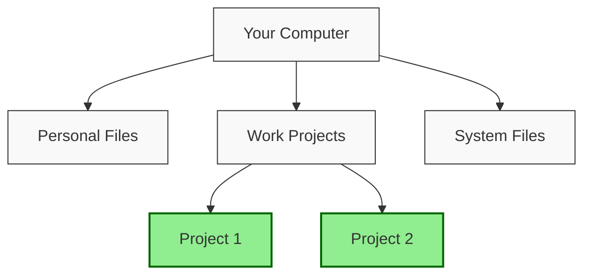
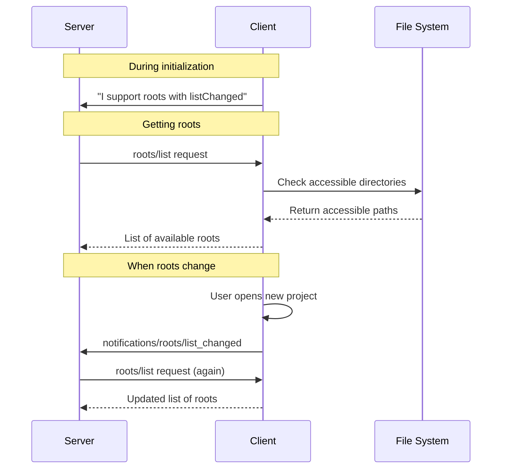

# Chapter 4: Roots

In the previous chapter on [Lifecycle Management](03_lifecycle_management_.md), we learned how MCP connections are established and maintained. Now, let's explore how we define the boundaries of where servers can operate within our filesystem using **Roots**.

## What Are Roots and Why Do We Need Them?

Imagine you're hiring a personal assistant to help organize your files. You wouldn't give them free access to your entire computer - instead, you'd tell them: "You can work with files in these specific folders."

This is exactly what **roots** do in MCP! They define the boundaries where servers can operate, like giving someone a map with certain areas highlighted.



In this diagram, you're giving access only to Project 1 and Project 2 folders (the highlighted ones), not your personal files or system files.

## A Real-World Example

Let's say you're building an AI coding assistant that helps you with your programming projects. You want the assistant to:

1. Access your current project files to provide code suggestions
2. Not have access to sensitive files elsewhere on your computer

Here, roots help define exactly which project folders the AI assistant can access.

## Defining Roots

A root is simply a URI (Uniform Resource Identifier) that points to a location where a server can operate. Most commonly, it's a file path, but it could also be a web URL or other resource.

A typical root definition looks like this:

```json
{
  "uri": "file:///home/user/projects/myapp",
  "name": "My Application"
}
```

This root tells the server:
- It can access files within the `/home/user/projects/myapp` directory
- For display purposes, this location is called "My Application"

## How Roots Work in MCP

To use roots in MCP, there are three main steps:

### 1. Declare Root Capability

When a client connects to a server, it needs to declare that it supports roots during initialization:

```javascript
// During client initialization
const capabilities = {
  roots: {
    listChanged: true  // We'll notify if roots change
  }
};
```

This tells the server that the client supports roots and will send notifications when the root list changes.

### 2. Server Requests Roots

Once connected, the server can request the list of roots:

```javascript
// Server requests roots
const response = await server.request({
  method: "roots/list"
});

// Server can now use the roots
const roots = response.result.roots;
```

This code sends a request asking for all available roots, then stores the response for later use.

### 3. Handle Root Changes

If the roots change (like when a user opens a new project), the client notifies the server:

```javascript
// Client notifies server when roots change
client.notify({
  method: "notifications/roots/list_changed"
});
```

When the server receives this notification, it knows it should request the updated list of roots.

## Multiple Roots Example

You can define multiple roots to give access to different locations:

```javascript
// Example of multiple roots
const roots = [
  {
    uri: "file:///home/user/projects/frontend",
    name: "Frontend Code"
  },
  {
    uri: "file:///home/user/projects/backend",
    name: "Backend Code"
  }
];
```

This example gives access to two separate project folders, keeping them logically separated.

## Under the Hood: How Roots Are Managed

Let's see what happens when a server interacts with a client that supports roots:



This diagram shows the complete flow of root management between a client and server.

## Implementation Details

Here's how a client might implement root support:

```typescript
class Client {
  private roots = [];
  
  // Add method to update roots
  updateRoots(newRoots) {
    this.roots = newRoots;
    
    // Notify server if roots changed
    if (this.hasRootsCapability) {
      this.notify({
        method: "notifications/roots/list_changed"
      });
    }
  }
  
  // Handle roots/list request
  handleRootsList() {
    return {
      roots: this.roots
    };
  }
}
```

This simplified code shows how a client manages roots and notifies the server when they change.

On the server side, roots might be handled like this:

```typescript
class Server {
  private roots = [];
  
  async fetchRoots() {
    if (!this.clientSupportsRoots) {
      return; // Client doesn't support roots
    }
    
    try {
      const response = await this.request({
        method: "roots/list"
      });
      
      this.roots = response.result.roots;
    } catch (error) {
      console.error("Failed to fetch roots:", error);
    }
  }
  
  // Handle root change notification
  handleRootsChanged() {
    this.fetchRoots(); // Refetch the updated roots
  }
}
```

This code shows how a server requests roots and handles root change notifications.

## Security Considerations

Roots are important for security. Here are key considerations:

1. **Validation**: Always validate paths against roots to prevent unauthorized access
2. **Permission checks**: Ensure the user has permission to access the roots they define
3. **Path traversal protection**: Be careful with relative paths that might try to escape root boundaries

For example, if a root is `/home/user/projects`, a server shouldn't be able to access `/home/user/personal` using relative paths like `../personal`.

## Best Practices for Using Roots

1. **Be specific**: Only give access to the directories that are actually needed
2. **Use descriptive names**: Give roots clear names that describe what they contain
3. **Handle changes gracefully**: Be prepared for roots to change as users switch projects
4. **Check accessibility**: Verify roots are accessible before trying to use them

## Conclusion

Roots provide a simple but powerful way to define boundaries for where servers can operate. By clearly specifying which directories and resources are available, roots help maintain security and organization in MCP applications.

Think of roots as giving your AI assistant a map with highlighted areas where it's allowed to work - no more wandering into places it shouldn't be!

In the next chapter, [Resources](05_resources_.md), we'll explore how to actually access and manipulate files and other resources within these root boundaries.

