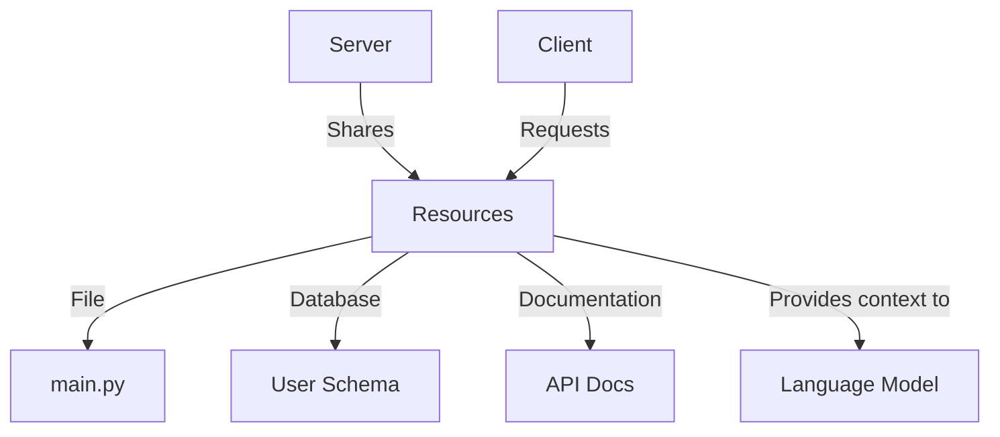
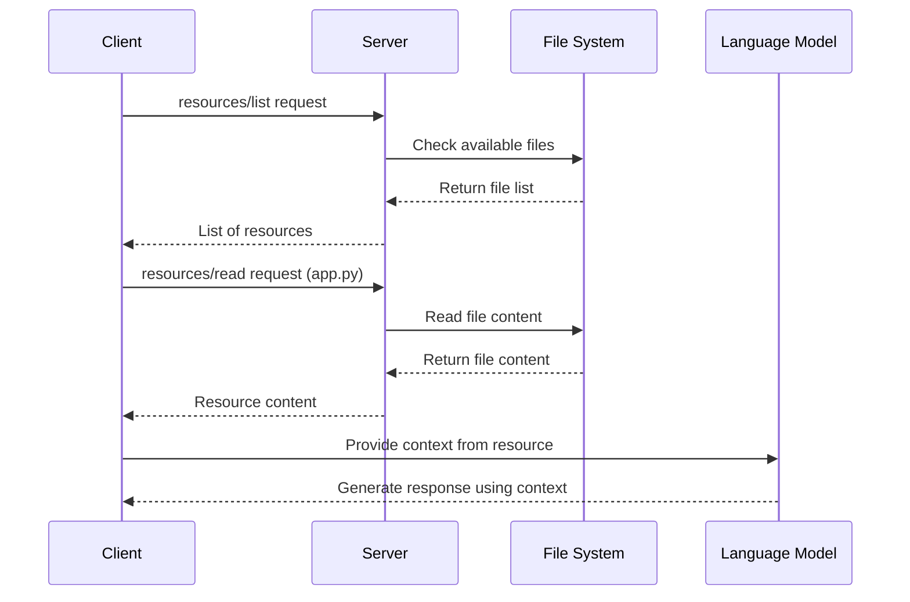

# Chapter 5: Resources

In the previous chapter on [Roots](04_roots_.md), we learned how to define boundaries for where servers can operate. Now, let's explore how servers can share information with clients through **Resources**.

## What Are Resources?

Imagine you're working with an AI assistant that's helping you write code. For the assistant to give you useful suggestions, it needs to understand your project - the files you're working with, your database structure, documentation, and more.

**Resources** are how MCP makes this possible! They're like a library of reference materials that servers can share with clients, providing context to language models. Each resource is uniquely identified by a URI (Uniform Resource Identifier), similar to how each book in a library has its own catalog number.



## A Real-World Example

Let's say you're building a coding assistant that helps you improve your Python code. For it to give good suggestions, it needs to:

1. Read your existing code files
2. Access your project's documentation
3. Understand your database schema

Resources allow your assistant to access all these different types of information in a standardized way.

## How Resources Work in MCP

To use resources in MCP, there are a few key concepts to understand:

### 1. Resource URIs

Every resource is identified by a URI, which follows this format:

```
[protocol]://[host]/[path]
```

For example:
- `file:///home/user/projects/app.py` (a Python file)
- `postgres://database/users/schema` (a database schema)
- `docs://api/reference` (API documentation)

These URIs help the client find and request specific resources from the server.

### 2. Resource Types

Resources can contain two types of content:

**Text resources**: These contain plain text, like code files, configuration files, or documentation.

**Binary resources**: These contain non-text data like images or PDFs, encoded in base64.

### 3. Resource Discovery

For a client to use resources, it first needs to discover what's available. This happens through a simple request:

```javascript
// Client requests available resources
const response = await client.request({
  method: "resources/list"
});

// Now we can see what resources are available
const resources = response.result.resources;
```

This code sends a request to the server asking "What resources do you have?" The server responds with a list of available resources, including their URIs, names, and descriptions.

### 4. Reading Resources

Once the client knows what resources are available, it can request the content of specific resources:

```javascript
// Client requests a specific resource
const response = await client.request({
  method: "resources/read",
  params: { uri: "file:///projects/app.py" }
});

// Use the resource content
const content = response.result.contents[0].text;
```

This code asks the server, "Please give me the content of app.py." The server responds with the file's content, which the client can then use to provide context to the language model.

## Under the Hood: How Resources Are Exchanged

Let's walk through what happens when a client requests a resource:



1. The client asks the server for a list of available resources
2. The server checks what resources it can provide and returns the list
3. The client requests a specific resource (like a file)
4. The server retrieves the content and sends it back
5. The client uses this content to provide context to the language model

## Implementation Example

Let's look at how you might implement resource support in an MCP server:

```typescript
// Create a server with resource capability
const server = new Server({
  name: "file-server",
  version: "1.0.0"
}, {
  capabilities: {
    resources: {}
  }
});
```

This code creates a server that supports resources. The empty object `{}` means it supports basic resource functionality without additional features like subscriptions.

Now, let's implement handlers for resource requests:

```typescript
// Handle resources/list requests
server.setRequestHandler("resources/list", async () => {
  return {
    resources: [
      {
        uri: "file:///projects/app.py",
        name: "Main Application",
        mimeType: "text/x-python"
      }
    ]
  };
});
```

This handler responds to list requests by returning information about available resources.

```typescript
// Handle resources/read requests
server.setRequestHandler("resources/read", async (request) => {
  const { uri } = request.params;
  
  // Read the file content
  const content = await readFile(uri);
  
  return {
    contents: [
      {
        uri: uri,
        mimeType: "text/x-python",
        text: content
      }
    ]
  };
});
```

This handler responds to read requests by fetching the content of the requested resource and returning it.

## Resource Templates for Dynamic Content

Sometimes, you might want to offer resources that are generated on-demand. Resource templates let you define patterns for resources:

```javascript
// Server defines a resource template
{
  "uriTemplate": "file:///{path}",
  "name": "Project Files",
  "description": "Access any file in the project"
}
```

This template allows clients to request any file by specifying the path parameter. For example, a client could request `file:///src/utils/helpers.js`.

## Keeping Resources Up-to-Date

Resources can change over time. MCP provides two ways to handle this:

**List Changes**: The server can notify clients when the list of available resources changes:

```javascript
// Server notifies client that resources have changed
client.notify({
  method: "notifications/resources/list_changed"
});
```

When a client receives this notification, it knows it should request an updated resource list.

**Subscriptions**: Clients can subscribe to specific resources to be notified when they change:

```javascript
// Client subscribes to a resource
await client.request({
  method: "resources/subscribe",
  params: { uri: "file:///projects/app.py" }
});
```

When the resource changes, the server sends a notification:

```javascript
// Server notifies client that a resource changed
client.notify({
  method: "notifications/resources/updated",
  params: { uri: "file:///projects/app.py" }
});
```

## Best Practices for Using Resources

1. **Use clear naming**: Give your resources descriptive names and URIs
2. **Provide context**: Include helpful descriptions to guide the language model's understanding
3. **Set MIME types**: When possible, specify the correct MIME type for each resource
4. **Handle errors gracefully**: Be prepared for resources that might not exist or are inaccessible
5. **Consider security**: Only expose resources that should be accessible to the client

## Security Considerations

When implementing resource support, keep these security points in mind:

1. **Validate URIs**: Always check that resource URIs are valid before accessing them
2. **Implement access controls**: Ensure users can only access resources they should have permission for
3. **Sanitize file paths**: Prevent directory traversal attacks (like `../../../sensitive-file`)
4. **Handle binary data carefully**: Properly encode and decode binary content
5. **Consider rate limiting**: Prevent abuse by limiting how many resources can be requested

## Conclusion

Resources provide a powerful way for servers to share information with clients, giving language models the context they need to provide useful responses. By standardizing how this information is discovered, accessed, and updated, MCP makes it easy for AI applications to work with a wide variety of data sources.

In the next chapter, [Tools](06_tools_.md), we'll explore how MCP enables language models to not just read information but also take actions in the world by calling functions provided by servers.

