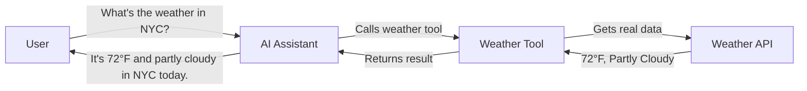
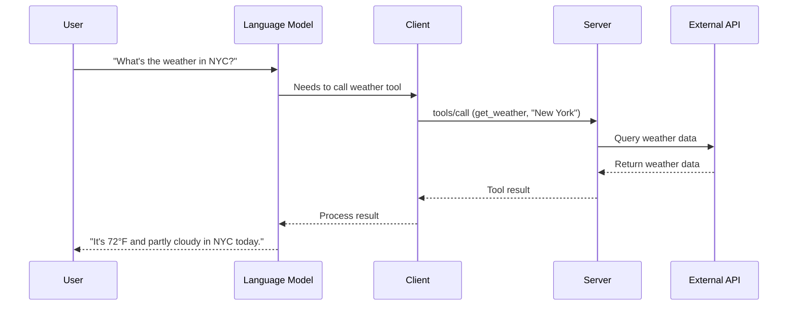

# Chapter 6: Tools

In [Resources](05_resources_.md), we learned how servers can share information with clients. Now, let's explore how language models can take action in the world through **Tools**.

## What Are Tools and Why Do We Need Them?

Imagine you're talking with an AI assistant about the weather. You ask, "What's the weather like in New York today?" Without tools, the AI can only give you general information based on what it learned during training.

But what if the AI could check today's actual weather? That's what tools make possible!

**Tools** in MCP are functions that servers expose to language models, allowing them to perform specific actions like:
- Searching the web
- Checking the weather
- Calculating mathematical expressions
- Querying databases
- Sending emails

Think of tools as special abilities you give to an AI assistant - like giving someone a calculator when they need to solve math problems.



## A Real-World Example

Let's say you're building an AI assistant for a travel planning application. Your users might ask questions like:

- "What's the weather like in Paris next week?"
- "How much does a flight from New York to London cost?"
- "What's the exchange rate between dollars and euros?"

To answer these questions accurately, your AI needs access to real-time data. Tools make this possible by connecting your AI to external services.

## Key Concepts of Tools

### 1. Tool Definitions

Each tool has:
- A unique **name** (like "get_weather")
- A **description** explaining what it does
- An **input schema** that defines what parameters it needs

Here's an example of a tool definition:

```json
{
  "name": "get_weather",
  "description": "Get current weather for a location",
  "inputSchema": {
    "type": "object",
    "properties": {
      "location": {
        "type": "string",
        "description": "City name"
      }
    },
    "required": ["location"]
  }
}
```

This definition tells the AI: "There's a tool called 'get_weather' that needs a location parameter."

### 2. Tool Results

When a tool is called, it returns results that can include:
- Text information
- Images
- Audio
- References to resources

## How to Use Tools in MCP

Let's implement our weather tool example:

### Step 1: Server - Declare Tool Support

First, the server needs to declare that it supports tools:

```typescript
// Create a server with tools capability
const server = new Server({
  capabilities: {
    tools: {
      listChanged: true  // We'll notify if tools change
    }
  }
});
```

This code creates a server that supports tools and will notify clients when the list of available tools changes.

### Step 2: Server - Define Tools

Next, the server defines what tools are available:

```typescript
// Define a weather tool
server.setRequestHandler("tools/list", async () => {
  return {
    tools: [
      {
        name: "get_weather",
        description: "Get current weather for a location",
        inputSchema: {
          type: "object",
          properties: {
            location: { type: "string", description: "City name" }
          },
          required: ["location"]
        }
      }
    ]
  };
});
```

This handler responds to tool list requests by returning information about the weather tool.

### Step 3: Server - Implement Tool Functionality

Now, implement what happens when the tool is called:

```typescript
// Implement the weather tool
server.setRequestHandler("tools/call", async (request) => {
  const { name, arguments: args } = request.params;
  
  if (name === "get_weather") {
    // Call weather API with args.location
    const weather = await getWeatherData(args.location);
    
    return {
      content: [
        {
          type: "text",
          text: `Current weather in ${args.location}: ${weather.temp}°F, ${weather.conditions}`
        }
      ],
      isError: false
    };
  }
});
```

This handler processes tool calls. When the "get_weather" tool is called, it fetches weather data and returns the results.

### Step 4: Client - Discover Available Tools

The client needs to find out what tools are available:

```typescript
// Client discovers available tools
const response = await client.request({
  method: "tools/list"
});

const availableTools = response.result.tools;
console.log("Available tools:", availableTools);
```

This code sends a request to get the list of available tools.

### Step 5: Client - Call a Tool

Finally, the client can call a tool:

```typescript
// Client calls the weather tool
const result = await client.request({
  method: "tools/call",
  params: {
    name: "get_weather",
    arguments: {
      location: "New York"
    }
  }
});

// Display the result
console.log(result.result.content[0].text);
// Output: "Current weather in New York: 72°F, Partly cloudy"
```

This code calls the "get_weather" tool with "New York" as the location parameter.

## Under the Hood: How Tools Work

When a client calls a tool, here's what happens behind the scenes:



1. The user asks a question about the weather
2. The language model recognizes it needs weather data
3. The client sends a tool call request to the server
4. The server calls an external weather API
5. The API returns weather data
6. The server formats the data and sends it back to the client
7. The client provides the result to the language model
8. The language model uses this information to answer the user

## Tool Result Types

Tools can return different types of content:

### Text Results

Most common - simple text information:

```json
{
  "content": [
    {
      "type": "text",
      "text": "Current weather in New York: 72°F, Partly cloudy"
    }
  ]
}
```

### Image Results

Tools can also return images:

```json
{
  "content": [
    {
      "type": "image",
      "data": "base64-encoded-image-data",
      "mimeType": "image/png"
    }
  ]
}
```

This allows tools to return weather maps, charts, or other visual information.

## Error Handling

Tools can report errors in two ways:

### 1. Protocol Errors

For issues like unknown tools or invalid arguments:

```json
{
  "jsonrpc": "2.0",
  "id": 3,
  "error": {
    "code": -32602,
    "message": "Unknown tool: invalid_tool_name"
  }
}
```

### 2. Tool Execution Errors

For errors that happen while the tool is running:

```json
{
  "result": {
    "content": [
      {
        "type": "text",
        "text": "Failed to fetch weather: API rate limit exceeded"
      }
    ],
    "isError": true
  }
}
```

The `isError: true` field tells the client this is an error message.

## Security Considerations

When implementing tools, keep these security points in mind:

1. **Validate inputs**: Always check that tool arguments are valid
2. **Limit access**: Only expose tools that should be available to the client
3. **User confirmation**: Consider requiring user approval before executing sensitive actions
4. **Rate limiting**: Prevent abuse by limiting how often tools can be called
5. **Sanitize outputs**: Make sure tool results don't contain sensitive information

## Best Practices for Using Tools

1. **Clear descriptions**: Write clear tool descriptions so the AI knows when to use them
2. **Specific tools**: Create focused tools that do one thing well
3. **Handle errors gracefully**: Provide helpful error messages
4. **Use appropriate schemas**: Define input schemas carefully to guide the AI
5. **Update tools when needed**: Use the notification system to keep the tool list current

## Conclusion

Tools transform AI assistants from passive information providers into active helpers that can interact with the world. By enabling language models to check the weather, search databases, or calculate values, tools make AI significantly more useful and accurate.

In the next chapter, [Prompts](07_prompts_.md), we'll explore how to effectively communicate with language models to get the best results from their capabilities.

