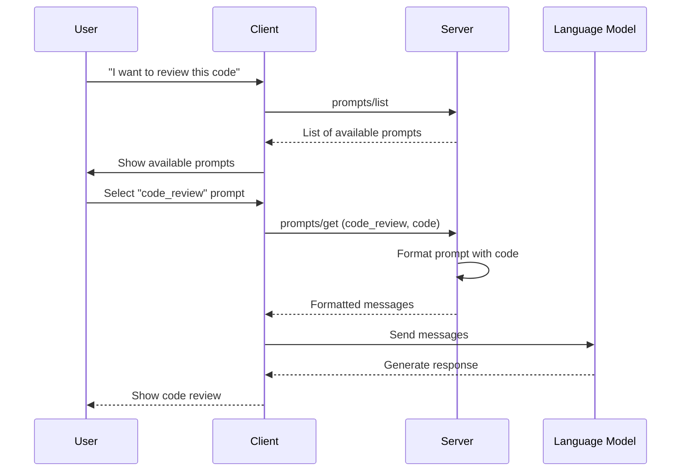

# Chapter 7: Prompts

In the previous chapter on [Tools](06_tools_.md), we learned how language models can take actions in the world. Now, let's explore how servers can provide structured templates called **Prompts** to help guide interactions with language models.

## What Are Prompts and Why Do We Need Them?

Have you ever followed a recipe card when cooking? A recipe provides clear instructions, a list of ingredients, and steps to follow. Similarly, **prompts** in MCP are like recipe cards for language models - they provide structured templates that help models generate more relevant and useful responses.

Without prompts, developers would need to craft instructions for language models from scratch every time. Prompts solve this by providing reusable templates that can be customized with arguments, just like how you might adjust a recipe based on how many people you're cooking for.

## A Real-World Example

Let's say you're building a coding assistant that helps developers review their code. You want users to be able to easily ask for code reviews without having to write detailed instructions each time.

With prompts, you can create a reusable "code review" template that users can invoke with a simple command, providing just the code they want reviewed.

## Key Concepts of Prompts

### 1. Prompt Structure

Each prompt has:
- A **name** that uniquely identifies it (like "code_review")
- A **description** that explains what it does
- **Arguments** that users can customize (like the code to review)

Think of it like a recipe card with a title, description, and ingredients that can be adjusted.

### 2. Messages

Prompts contain messages that will be sent to the language model. Each message has:
- A **role** (either "user" or "assistant")
- **Content** that can include text, images, or references to resources

These messages form the conversation that will be sent to the language model.

## How to Use Prompts in MCP

Let's implement our code review example:

### Step 1: Server - Declare Prompt Support

First, the server needs to declare that it supports prompts:

```typescript
// Create a server with prompts capability
const server = new Server({
  capabilities: {
    prompts: {
      listChanged: true  // We'll notify if prompts change
    }
  }
});
```

This tells clients that this server offers prompt templates and will notify them if the list of available prompts changes.

### Step 2: Server - Define Available Prompts

Next, the server defines what prompts are available:

```typescript
// Handle prompts/list requests
server.setRequestHandler("prompts/list", async () => {
  return {
    prompts: [
      {
        name: "code_review",
        description: "Get AI feedback on your code",
        arguments: [
          {
            name: "code",
            description: "The code to review",
            required: true
          }
        ]
      }
    ]
  };
});
```

This handler responds to list requests by returning information about the available prompts - in this case, a single "code_review" prompt that requires a "code" argument.

### Step 3: Server - Implement Prompt Content

Now, implement what happens when a prompt is requested:

```typescript
// Handle prompts/get requests
server.setRequestHandler("prompts/get", async (request) => {
  const { name, arguments: args } = request.params;
  
  if (name === "code_review") {
    return {
      description: "Code review prompt",
      messages: [
        {
          role: "user",
          content: {
            type: "text",
            text: `Please review this code and suggest improvements:
                  
${args.code}`
          }
        }
      ]
    };
  }
});
```

This handler builds the prompt content when requested. For the "code_review" prompt, it creates a user message that includes the provided code.

### Step 4: Client - Discover Available Prompts

The client needs to find out what prompts are available:

```typescript
// Client discovers available prompts
const response = await client.request({
  method: "prompts/list"
});

const availablePrompts = response.result.prompts;
console.log("Available prompts:", availablePrompts);
```

This code sends a request to get the list of available prompts that the server offers.

### Step 5: Client - Use a Prompt

Finally, the client can use a prompt:

```typescript
// Client uses the code review prompt
const result = await client.request({
  method: "prompts/get",
  params: {
    name: "code_review",
    arguments: {
      code: "function add(a, b) { return a + b; }"
    }
  }
});

// Get the prompt messages
const messages = result.result.messages;
// Send these messages to the language model
```

This code requests the "code_review" prompt with a specific piece of code. The server returns the formatted messages that can then be sent to a language model.

## Under the Hood: How Prompts Work

When a client uses a prompt, here's what happens behind the scenes:



1. The user wants to review some code
2. The client requests a list of available prompts
3. The server returns the list of prompts it offers
4. The user selects the "code_review" prompt
5. The client requests the prompt with the user's code
6. The server formats the prompt with the provided code
7. The client sends the formatted messages to the language model
8. The language model generates a response based on the prompt
9. The response is shown to the user

## Prompt Content Types

Prompts can include different types of content:

### Text Content

The most common type - simple text instructions:

```json
{
  "type": "text",
  "text": "Please review this code: function add(a, b) { return a + b; }"
}
```

### Image Content

Prompts can include images:

```json
{
  "type": "image",
  "data": "base64-encoded-image-data",
  "mimeType": "image/png"
}
```

This is useful for visual tasks like "describe this image" or "analyze this chart."

### Embedded Resources

Prompts can reference server-side resources:

```json
{
  "type": "resource",
  "resource": {
    "uri": "file:///projects/docs/guidelines.md",
    "mimeType": "text/markdown",
    "text": "# Coding Guidelines\n1. Use meaningful variable names..."
  }
}
```

This allows prompts to include reference materials like documentation or examples.

## Handling Prompt Changes

If prompts change (like when new templates are added), the server notifies clients:

```typescript
// Server notifies clients that prompts have changed
server.notify({
  method: "notifications/prompts/list_changed"
});
```

When a client receives this notification, it knows it should request an updated prompt list.

## Best Practices for Creating Prompts

1. **Clear descriptions**: Write clear descriptions so users know what each prompt does
2. **Thoughtful arguments**: Only ask for necessary information as arguments
3. **Descriptive names**: Use names that clearly indicate what the prompt is for
4. **Minimal but sufficient context**: Include enough context for the model to understand the task
5. **Handle errors gracefully**: Provide helpful error messages for missing arguments

## Security Considerations

When implementing prompts, keep these security points in mind:

1. **Validate arguments**: Always check that prompt arguments are valid
2. **Sanitize inputs**: Prevent injection attacks by sanitizing user inputs
3. **Limit exposure**: Only expose prompts that should be available to users
4. **Respect privacy**: Be careful not to include sensitive information in prompt templates

## Conclusion

Prompts provide a powerful way for servers to offer reusable templates that help language models generate more relevant and useful responses. Like recipe cards, they give structure and guidance that leads to better results.

By standardizing how these templates are defined, discovered, and used, MCP makes it easy for AI applications to provide consistent and helpful interactions to users.

In the next chapter, [Sampling](08_sampling_.md), we'll explore how MCP handles controlling the way language models generate text, allowing for different levels of creativity and predictability in responses.

