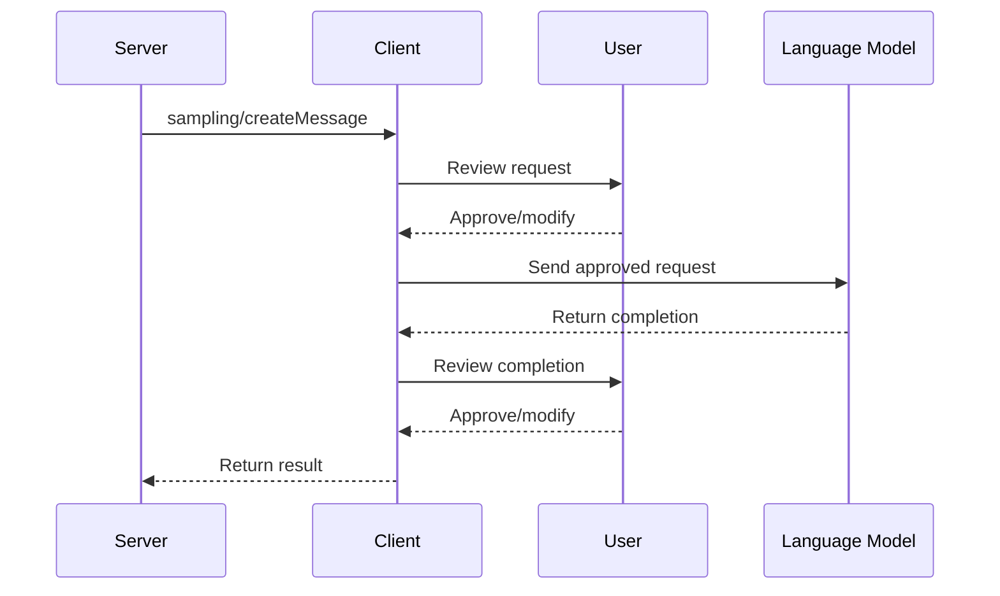

# Chapter 8: Sampling

In the previous chapter on [Prompts](07_prompts_.md), we learned how servers can provide templates to guide interactions with language models. Now, let's explore how servers can directly request completions from language models through **Sampling**.

## What is Sampling and Why Do We Need It?

Imagine you have a smart friend who's an expert at many things - coding, writing, problem-solving. Whenever you need help, you ask this friend questions. In the Model Context Protocol, **sampling** works like this: it lets servers "ask questions" to language models through the client, without needing direct access to the models themselves.

This is powerful because:
- Servers don't need their own API keys for language models
- Clients maintain control over which models are used
- Users can review and approve interactions
- Servers can leverage AI capabilities for more advanced features

Think of sampling as allowing servers to "phone a friend" (the language model) when they need expert help.

## A Real-World Example

Let's say you're building a coding assistant that helps developers fix bugs. Your server knows about code files and can identify where bugs might be, but it needs AI help to generate solutions.

With sampling, your server can:
1. Detect a bug in the code
2. Request a language model completion (through the client) to suggest a fix
3. Present the suggested fix to the user

This all happens without your server needing direct access to language model APIs!

## Key Concepts of Sampling

### 1. Request Flow

The sampling process follows these steps:
1. Server creates a sampling request
2. Client receives and may modify the request
3. Client sends the request to a language model
4. Client receives and may review the completion
5. Client returns the result to the server

This "human-in-the-loop" design ensures users maintain control over AI interactions.

### 2. Message Format

Sampling requests use a standardized format that includes:
- The conversation messages to send to the model
- Model preferences (like which model to use)
- System prompt (instructions for the model)
- Sampling parameters (like temperature and max tokens)

### 3. Model Preferences

Since different clients might have access to different language models, MCP uses a flexible preference system:
- Servers can provide hints about which models they prefer
- Servers can indicate priorities (like speed vs intelligence)
- Clients make the final decision about which model to use

## How to Use Sampling in MCP

Let's implement a simple example of our bug-fixing assistant:

### Step 1: Server - Declare Sampling Support

First, the server needs to check if sampling is supported:

```typescript
// During initialization, check for sampling capability
const clientCapabilities = initializeResponse.capabilities;
const samplingSupported = !!clientCapabilities.sampling;
```

This code checks if the client supports sampling during the initialization handshake.

### Step 2: Server - Create a Sampling Request

When a bug is detected, the server can request a fix:

```typescript
// Create a sampling request for bug fix
const response = await client.request({
  method: "sampling/createMessage",
  params: {
    messages: [
      {
        role: "user",
        content: {
          type: "text",
          text: `Fix this bug: ${buggyCode}`
        }
      }
    ],
    maxTokens: 500
  }
});
```

This code sends a request to the client asking for a language model to fix the buggy code. The `maxTokens` parameter limits the length of the response.

### Step 3: Handle the Response

Once the client returns the language model's response:

```typescript
// Process the language model's response
const fixSuggestion = response.result.content.text;
console.log("Suggested fix:", fixSuggestion);
```

This code extracts the suggested fix from the response and can then present it to the user.

## Under the Hood: How Sampling Works

When a server requests sampling, here's what happens behind the scenes:



1. The server sends a sampling request to the client
2. The client may show the request to the user for review
3. The user can approve or modify the request
4. The client sends the request to a language model
5. The language model returns a completion
6. The client may show the completion to the user for review
7. The user can approve or modify the completion
8. The client sends the final result back to the server

This workflow ensures that users remain in control of AI interactions.

## More Advanced Sampling Features

### Model Preferences

To request a specific type of model:

```typescript
// Request a model with specific characteristics
const params = {
  messages: [...],
  modelPreferences: {
    hints: [{ name: "claude-3-sonnet" }],
    intelligencePriority: 0.8,
    speedPriority: 0.5,
    costPriority: 0.3
  }
};
```

This code suggests using a Claude 3 Sonnet model, but also provides priorities in case that specific model isn't available. Higher values (0-1) indicate higher priority.

### Including Context

You can include context from the server in your request:

```typescript
// Include context from the current server
const params = {
  messages: [...],
  includeContext: "thisServer",
  maxTokens: 500
};
```

The `includeContext` parameter can be:
- `"none"`: No additional context
- `"thisServer"`: Include context from the requesting server
- `"allServers"`: Include context from all connected MCP servers

### System Prompt

To provide specific instructions to the model:

```typescript
// Add a system prompt to guide the model
const params = {
  messages: [...],
  systemPrompt: "You are a coding assistant focused on fixing bugs.",
  maxTokens: 500
};
```

The system prompt helps set the tone and role for the language model's response.

## Best Practices for Sampling

1. **Clear Prompts**: Provide clear, well-structured prompts in your requests
2. **Reasonable Limits**: Set appropriate token limits to avoid excessive responses
3. **Error Handling**: Always handle potential errors in sampling requests
4. **User Control**: Design your application to give users control over AI interactions
5. **Context Management**: Only include relevant context to avoid overwhelming the model

## Security Considerations

When implementing sampling, keep these security points in mind:

1. **User Approval**: Allow users to review and approve both requests and completions
2. **Content Validation**: Validate all message content before processing
3. **Rate Limiting**: Implement appropriate rate limits to prevent abuse
4. **Sensitive Data**: Be careful not to include sensitive information in requests
5. **Error Handling**: Gracefully handle rejected requests and other errors

## Conclusion

Sampling is a powerful feature that allows servers to leverage language models without needing direct API access. By following the human-in-the-loop approach, MCP ensures that users maintain control over AI interactions while still enabling advanced AI capabilities in applications.

Think of sampling as giving your servers the ability to consult an AI expert whenever they need help, but always with the user's permission and oversight.

In the next chapter, [Elicitation](09_elicitation_.md), we'll explore how MCP can gather specific information from users through structured interactions.

