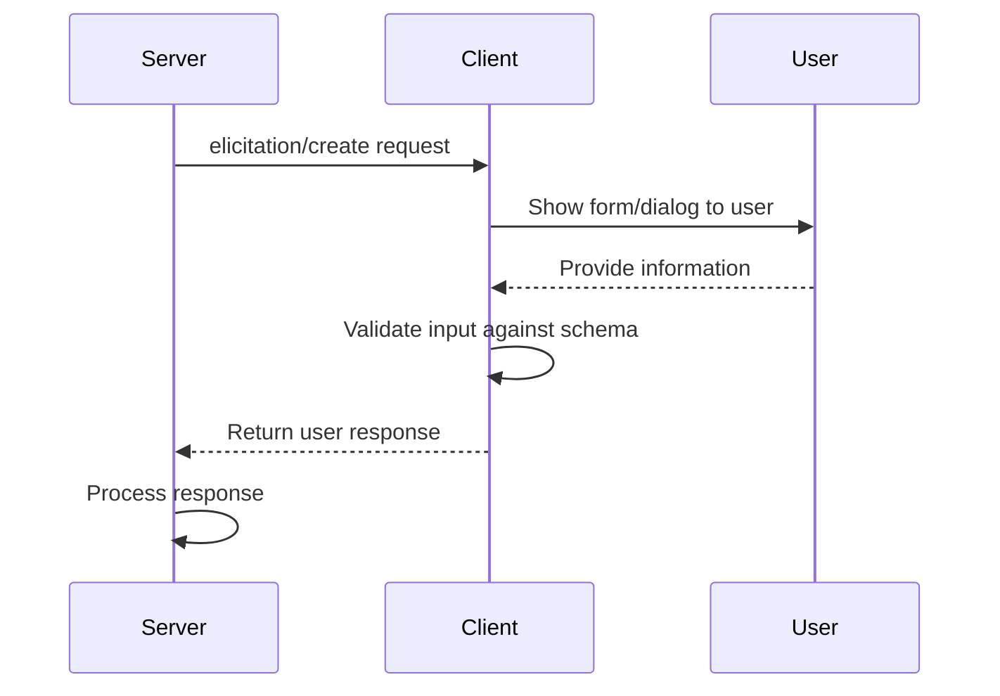

# Chapter 9: Elicitation

In the previous chapter on [Sampling](08_sampling_.md), we learned how servers can request completions from language models. Now, let's explore how servers can request information directly from users through **Elicitation**.

## What is Elicitation and Why Do We Need It?

Have you ever filled out a form while talking to customer service? Maybe they needed your account number or shipping address to help you better. That's exactly what elicitation does in MCP!

**Elicitation** is a way for servers to ask users for specific information during a conversation. Instead of asking for everything upfront, servers can request just what they need, exactly when they need it.

Think of elicitation like a helpful assistant who occasionally asks clarifying questions:

"I can help you set up that new project! What would you like to name it?"

This makes interactions more natural and focused on what's relevant at the moment.

## A Real-World Example

Imagine you're building an AI coding assistant that helps users create new projects. When a user says "Create a new web app project," your assistant needs specific details:

- What should the project be named?
- Which framework should it use (React, Vue, Angular)?
- Should it include TypeScript support?

Instead of asking for all this information upfront, elicitation lets your assistant ask for each piece of information exactly when needed, creating a more conversational experience.

## Key Concepts of Elicitation

### 1. The Request

An elicitation request has two main parts:

- **Message**: A clear explanation of what information is needed and why
- **Schema**: A structure that defines what data format is expected

### 2. User Response Actions

Users can respond to elicitation requests in three ways:

- **Accept**: User provides the requested information
- **Decline**: User explicitly refuses to provide information
- **Cancel**: User dismisses without making a choice (e.g., closes dialog)

### 3. Supported Data Types

Elicitation supports simple data types to keep things straightforward:

- Text inputs (strings)
- Numbers (integers and decimals)
- Yes/No choices (booleans)
- Selection lists (enums)

## How to Use Elicitation in MCP

Let's implement our project creation example:

### Step 1: Check for Elicitation Support

First, we need to make sure the client supports elicitation:

```typescript
// During initialization, check for elicitation capability
const clientCapabilities = initializeResponse.capabilities;
const elicitationSupported = !!clientCapabilities.elicitation;
```

This code checks if the client supports elicitation during the initialization handshake.

### Step 2: Create an Elicitation Request

When we need project details, we can send an elicitation request:

```typescript
// Request project information
const response = await client.request({
  method: "elicitation/create",
  params: {
    message: "Let's set up your new project",
    requestedSchema: {
      type: "object",
      properties: {
        name: {
          type: "string",
          title: "Project Name"
        }
      },
      required: ["name"]
    }
  }
});
```

This code sends a request asking for a project name. The `message` explains what we're asking for, and the `requestedSchema` defines what data format we expect.

### Step 3: Handle the Response

After the user responds, we need to handle their response:

```typescript
// Check how the user responded
if (response.result.action === "accept") {
  // User provided information
  const projectName = response.result.content.name;
  console.log(`Creating project: ${projectName}`);
} else if (response.result.action === "decline") {
  // User declined
  console.log("User declined to provide a project name");
} else {
  // User cancelled
  console.log("User cancelled the request");
}
```

This code checks whether the user accepted (provided information), declined, or cancelled the request, and responds accordingly.

## More Complex Requests

For more detailed information, we can request multiple fields:

```typescript
// Request detailed project information
const response = await client.request({
  method: "elicitation/create",
  params: {
    message: "Please provide project details",
    requestedSchema: {
      type: "object",
      properties: {
        name: {
          type: "string",
          title: "Project Name"
        },
        framework: {
          type: "string",
          title: "Framework",
          enum: ["react", "vue", "angular"],
          enumNames: ["React", "Vue", "Angular"]
        }
      },
      required: ["name", "framework"]
    }
  }
});
```

This code requests both a project name and a framework selection from a predefined list.

## Under the Hood: How Elicitation Works

When a server requests information from a user, here's what happens behind the scenes:



1. The server sends an elicitation request to the client
2. The client displays a form or dialog to the user
3. The user provides the requested information (or declines/cancels)
4. The client validates the input against the schema
5. The client sends the response back to the server
6. The server processes the response and continues

## Implementation Example

Let's look at a simplified example of how a server might implement elicitation for a project creation workflow:

```typescript
class ProjectCreator {
  async createProject(client) {
    try {
      // Request project name
      const nameResponse = await client.request({
        method: "elicitation/create",
        params: {
          message: "What would you like to name your project?",
          requestedSchema: {
            type: "object",
            properties: {
              name: { type: "string", title: "Project Name" }
            },
            required: ["name"]
          }
        }
      });
      
      // Handle user response
      if (nameResponse.result.action !== "accept") {
        return "Project creation cancelled";
      }
      
      const projectName = nameResponse.result.content.name;
      
      // Continue with more details...
      return `Created project: ${projectName}`;
    } catch (error) {
      return `Error: ${error.message}`;
    }
  }
}
```

This code shows a class that handles project creation using elicitation to request a project name from the user.

## Different Types of Input Fields

Elicitation supports various types of input fields:

### Text Input

```typescript
// Text input with validation
{
  type: "string",
  title: "Username",
  description: "Your GitHub username",
  minLength: 3,
  maxLength: 39
}
```

This defines a text field with minimum and maximum length constraints.

### Number Input

```typescript
// Number input with range
{
  type: "number",
  title: "Port",
  description: "Server port number",
  minimum: 1024,
  maximum: 65535
}
```

This defines a number field with minimum and maximum value constraints.

### Boolean Toggle

```typescript
// Yes/No choice
{
  type: "boolean",
  title: "Use TypeScript",
  description: "Add TypeScript support to project",
  default: true
}
```

This defines a yes/no choice with a default value.

### Selection List

```typescript
// Selection from a list
{
  type: "string",
  title: "Environment",
  enum: ["dev", "staging", "prod"],
  enumNames: ["Development", "Staging", "Production"]
}
```

This defines a dropdown selection with predefined options.

## Security Best Practices

When using elicitation, keep these security considerations in mind:

1. **Never request sensitive information**: Passwords, API keys, and tokens should never be requested through elicitation
2. **Be transparent**: Clearly show which server is requesting information
3. **Validate inputs**: Always validate responses against the schema
4. **Respect privacy**: Give users clear options to decline or cancel
5. **Implement rate limiting**: Prevent servers from spamming elicitation requests

## Real-World Use Cases

Elicitation is perfect for many scenarios:

- **Configuration**: Gathering setup preferences
- **Progressive disclosure**: Asking for information only when needed
- **Clarification**: Getting more details about ambiguous requests
- **Personalization**: Collecting user preferences
- **Account setup**: Gathering non-sensitive account information

## Conclusion

Elicitation provides a powerful way for servers to gather information from users exactly when needed, creating more natural and conversational interactions. Like a helpful assistant who asks clarifying questions, elicitation allows for dynamic workflows that adapt to user inputs while maintaining user control and privacy.

By supporting various input types and handling different user responses, elicitation balances flexibility with structure, making it easier to create interactive experiences in MCP applications.

With this, we've completed our exploration of the core concepts in the Model Context Protocol. You now have a comprehensive understanding of how MCP enables secure, flexible, and powerful interactions between hosts, clients, and servers in AI applications.

