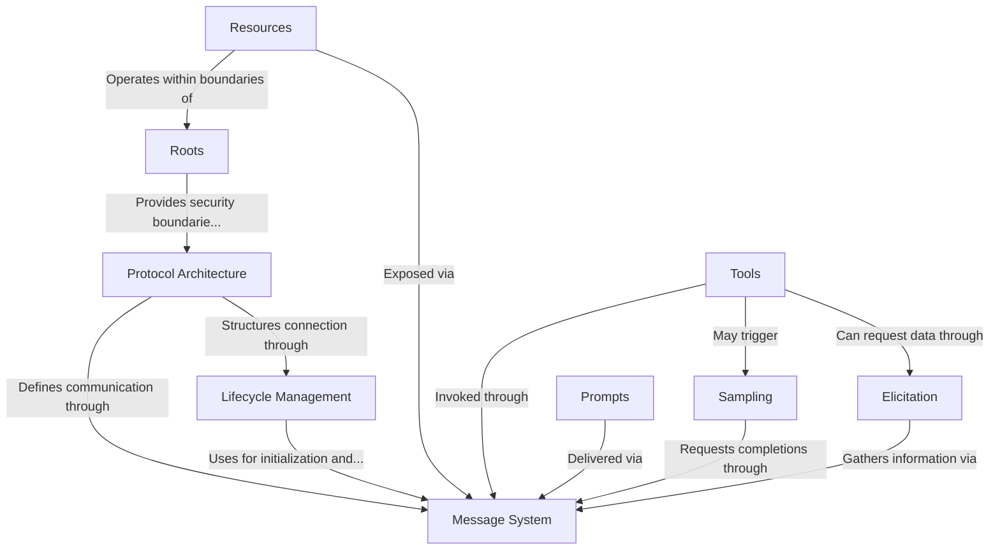

# Tutorial: modelcontextprotocol

The **Model Context Protocol** (MCP) is a standardized communication framework that enables **AI language models** to interact with applications and services through a *client-server* architecture. It allows servers to expose *resources* (like files or databases), *tools* (callable functions), and *prompts* (templates for model interaction) to client applications hosting language models. The protocol maintains security boundaries while enabling AI capabilities through features like *sampling* (model completions), *elicitation* (user information requests), and *roots* (filesystem boundaries).

**Source Repository:** [https://github.com/modelcontextprotocol/modelcontextprotocol](https://github.com/modelcontextprotocol/modelcontextprotocol)

## Chapters

1. [Protocol Architecture
](01_protocol_architecture_.md)
2. [Message System
](02_message_system_.md)
3. [Lifecycle Management
](03_lifecycle_management_.md)
4. [Roots
](04_roots_.md)
5. [Resources
](05_resources_.md)
6. [Tools
](06_tools_.md)
7. [Prompts
](07_prompts_.md)
8. [Sampling
](08_sampling_.md)
9. [Elicitation
](09_elicitation_.md)
