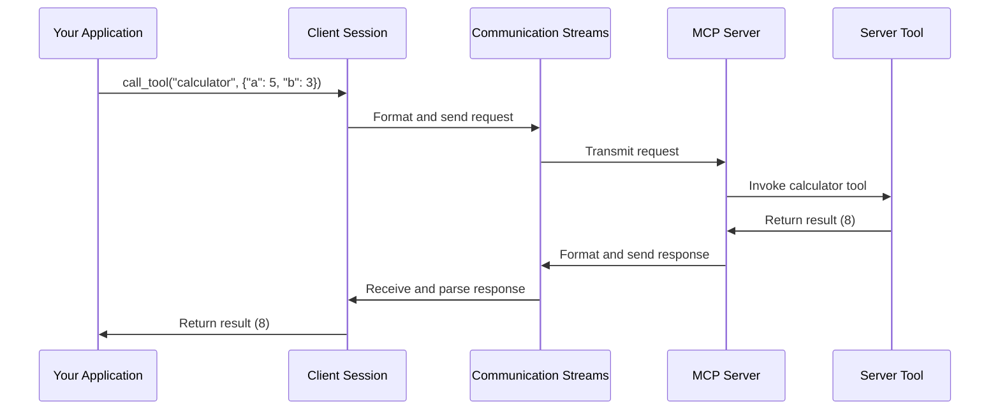

# Chapter 1: Client Session

## Introduction: Your Gateway to AI Services

Imagine you want to talk to an AI assistant, use specialized tools, or access AI resources. How do you connect to these services? This is where the **Client Session** comes in - it's your personal intermediary that knows how to communicate with Model Context Protocol (MCP) servers.

Think of the Client Session as a helpful translator. You say "I want to use this tool" in your Python code, and the Client Session translates that into a format the server understands, sends your request, and then translates the server's response back into a format your code can work with.

## A Simple Example: Connecting to an MCP Server

Let's say you want to use an AI tool provided by an MCP server. First, you need to establish a connection:

```python
from mcp.client.session import ClientSession
from mcp.shared.memory import create_connected_server_and_client_session

# Connect to an MCP server
async with create_connected_server_and_client_session(server) as client_session:
    # Now you can interact with the server
    result = await client_session.call_tool("calculator", {"operation": "add", "a": 5, "b": 3})
    print(result)  # This will print 8
```

In this simple example, we created a Client Session that connects to an MCP server, then used it to call a tool named "calculator" with parameters to add two numbers.

## Key Concepts of Client Session

The Client Session handles several important tasks for you:

### 1. Connection Management

The Client Session establishes and maintains a connection to the MCP server. It handles the communication channels, ensuring messages are sent and received properly.

### 2. Request-Response Handling

When you want to use a service, the Client Session:
1. Formats your request correctly
2. Sends it to the server
3. Waits for the response
4. Parses the response for you to use

### 3. Tool Invocation

Tools are functions provided by the server that your code can call:

```python
# List available tools
tools = await client_session.list_tools()
print(f"Available tools: {[tool.name for tool in tools]}")

# Call a specific tool
result = await client_session.call_tool("text_summarizer", {"text": "Long text to summarize..."})
print(result)  # The summarized text
```

This code first lists all available tools, then calls a specific text summarizer tool.

### 4. Resource Access

Resources are data provided by the server:

```python
# List available resources
resources = await client_session.list_resources()
print(f"Available resources: {[res.uri for res in resources]}")

# Access a specific resource
data = await client_session.get_resource("resource://examples/dataset")
print(data)  # The resource content
```

This lets you see what resources are available and retrieve them when needed.

### 5. Prompt Rendering

Prompts are templates that the server can fill in:

```python
# Render a prompt
result = await client_session.render_prompt("greeting", {"name": "Alice"})
print(result)  # Might print "Hello, Alice!"
```

This sends parameters to the server, which uses them to generate a response from a template.

## How the Client Session Works Behind the Scenes

When you use a Client Session, several things happen under the hood:



1. Your code calls a method on the Client Session
2. The Client Session formats your request into a proper MCP request
3. The request is sent through communication streams to the server
4. The server processes your request and generates a response
5. The response is sent back through the streams
6. The Client Session parses the response
7. Your code receives the result in a usable format

## Advanced Features: Error Handling and Cancellation

The Client Session also handles error cases and request cancellation:

```python
try:
    result = await client_session.call_tool("unknown_tool", {})
except Exception as e:
    print(f"An error occurred: {e}")
```

If a tool doesn't exist or encounters an error, the Client Session will raise an exception that your code can catch and handle.

You can also cancel in-flight requests if they're taking too long:

```python
import anyio

async with anyio.create_task_group() as tg:
    task = tg.start_soon(client_session.call_tool, "slow_tool", {})
    # If you need to cancel:
    await tg.cancel_scope.cancel()
```

This code starts a tool call in a separate task and then demonstrates how you could cancel it if needed.

## Lifecycle of a Client Session

The Client Session has a defined lifecycle:

1. **Creation**: When you create a Client Session, it establishes communication channels with the server
2. **Initialization**: The session is initialized with the server, establishing capabilities
3. **Usage**: You call methods to interact with the server
4. **Cleanup**: When done, the session properly closes connections

The typical pattern is to use a context manager (`async with`) to ensure proper cleanup:

```python
async with ClientSession(...) as session:
    # Use the session here
    # When this block exits, the session is automatically cleaned up
```

## Implementation Details

Under the hood, the Client Session uses asynchronous communication streams to talk with the server. It keeps track of in-flight requests and matches responses to their corresponding requests.

For example, when you call a tool:

```python
async def call_tool(self, name: str, arguments: dict | None = None) -> ToolCallResult:
    """Call a tool on the server."""
    request = ClientRequest(
        CallToolRequest(
            method="tools/call",
            params=CallToolRequestParams(name=name, arguments=arguments),
        )
    )
    result = await self.send_request(request, CallToolResult)
    return result
```

This creates a properly formatted request and uses the general `send_request` method to handle the communication, waiting for and returning the result.

## Conclusion

The Client Session is your primary interface to the MCP server. It handles all the complex communication details so you can focus on using the services the server provides. With the Client Session, you can:

- Call tools to perform tasks
- Access resources for data
- Render prompts for text generation
- Handle errors and manage the connection lifecycle

In the next chapter, we'll explore how to set up your own [FastMCP Server](02_fastmcp_server_.md), which will allow you to provide tools, resources, and prompts that others can access through their Client Sessions.

