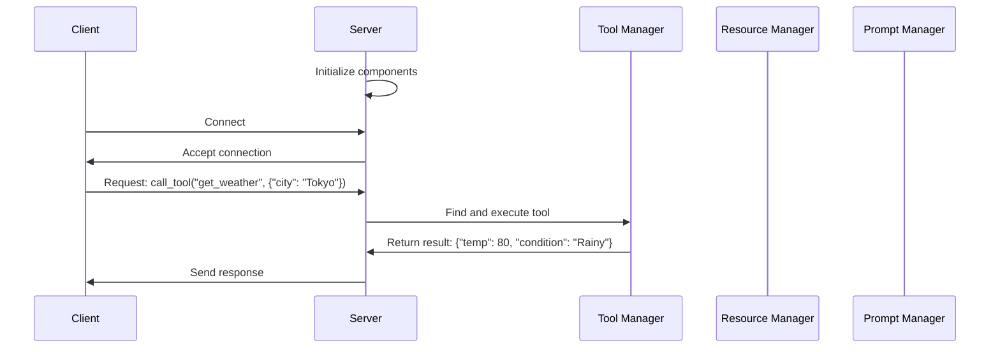

# Chapter 2: FastMCP Server

## Transitioning from Client to Server

In [Chapter 1: Client Session](01_client_session_.md), we learned how clients connect to MCP servers. Now let's explore the other side of the connection - the FastMCP Server that receives and processes those client requests.

## What is FastMCP Server?

Imagine you're building a restaurant. The [Client Session](01_client_session_.md) is like the customer who places orders, but who coordinates all the chefs, ingredients, and recipes behind the scenes? That's the FastMCP Server - the restaurant manager who ensures everything runs smoothly.

The FastMCP Server is a framework that:
- Accepts connections from clients
- Manages tools (functions clients can call)
- Organizes resources (data clients can access)
- Handles prompts (templates for generating text)
- Orchestrates how these components work together

## A Simple Example: Your First MCP Server

Let's create a basic server with one simple tool:

```python
from mcp.server.fastmcp import FastMCP

# Create a server
app = FastMCP(name="my_first_server")

# Add a greeting tool
@app.tool()
def greeting(name: str) -> str:
    """Generate a greeting for a person."""
    return f"Hello, {name}!"

# Run the server
if __name__ == "__main__":
    app.run()
```

This code:
1. Creates a new FastMCP server named "my_first_server"
2. Defines a tool called "greeting" that takes a name and returns a greeting
3. Starts the server when the script is run

Now clients can connect and call the "greeting" tool!

## Key Components of FastMCP Server

### 1. Server Core

The server core handles initialization, connections, and message routing:

```python
# Create a server with some options
app = FastMCP(
    name="weather_service",
    host="localhost",
    port=8080
)
```

This creates a server that will listen for connections on localhost at port 8080.

### 2. Tool Management

Tools are functions that clients can call:

```python
@app.tool()
def add(a: int, b: int) -> int:
    """Add two numbers together."""
    return a + b
```

This registers a tool named "add" that adds two numbers. When a client calls this tool with arguments `{"a": 5, "b": 3}`, they'll get back `8`.

### 3. Resource Management

Resources are data that clients can access:

```python
app.add_resource(
    "templates/greeting",
    "Hello, {name}! Welcome to our service."
)
```

This adds a text template that clients can retrieve and use. The resource is identified by the URI "templates/greeting".

### 4. Prompt Management

Prompts are templates for generating text:

```python
app.add_prompt(
    "welcome-message",
    "Welcome to {service_name}, {user_name}!"
)
```

This adds a prompt template that can be rendered with different variables.

## Building a Weather Information Server

Let's build a simple weather information server as a practical example:

```python
from mcp.server.fastmcp import FastMCP

app = FastMCP(name="weather_service")

# Weather data (simplified for example)
weather_data = {
    "New York": {"temp": 72, "condition": "Sunny"},
    "London": {"temp": 65, "condition": "Cloudy"},
    "Tokyo": {"temp": 80, "condition": "Rainy"}
}

@app.tool()
def get_weather(city: str) -> dict:
    """Get current weather for a city."""
    if city in weather_data:
        return weather_data[city]
    return {"error": "City not found"}

if __name__ == "__main__":
    app.run()
```

This server provides a tool that clients can use to get weather information for different cities.

## How FastMCP Server Works Behind the Scenes

When a FastMCP Server runs, several things happen:



1. The server initializes all its components
2. When a client connects, the server establishes a session
3. The client sends a request (e.g., to call a tool)
4. The server routes the request to the appropriate manager
5. The manager processes the request and returns a result
6. The server sends the result back to the client

## Implementation Details

### Server Initialization

When you create a FastMCP instance, it sets up several managers:

```python
def __init__(self, name: str = "mcp-server", **kwargs):
    self.name = name
    self.tool_manager = ToolManager()
    self.resource_manager = ResourceManager()
    self.prompt_manager = PromptManager()
    # Other initialization...
```

Each manager is responsible for handling a specific type of functionality:
- `ToolManager` handles registering and executing tools
- `ResourceManager` manages resource data
- `PromptManager` handles prompt templates

### Handling Client Connections

When a client connects, the server creates a session to manage that connection:

```python
async def handle_client(self, client_stream, server_stream):
    # Create a session for this client
    session = ServerSession(
        client_stream,
        server_stream,
        self.get_initialization_options()
    )
    
    # Process messages in this session
    async with session:
        await self._process_client_messages(session)
```

This creates a dedicated session for each client connection and processes messages from that client.

### Processing Client Requests

When a client sends a request, the server routes it to the appropriate handler:

```python
async def _process_client_messages(self, session):
    async for message in session.incoming_messages:
        # Handle different types of messages
        if message.method == "tools/call":
            await self._handle_tool_call(message, session)
        elif message.method == "resources/get":
            await self._handle_resource_get(message, session)
        # Handle other message types...
```

Based on the message type, the server directs it to the correct handler, which processes the request and sends back a response.

## Adding Context to Your Tools

Tools can also access context information about the current session:

```python
from mcp.server.fastmcp import FastMCP, Context

app = FastMCP(name="context_example")

@app.tool()
def get_client_info(ctx: Context) -> dict:
    """Get information about the client."""
    return {
        "client_id": ctx.client_id,
        "session_started": ctx.session_start_time
    }
```

By adding a `ctx` parameter with type `Context`, your tool can access information about the client and session.

## Connecting with Other MCP Components

FastMCP Server works with several other components covered in this tutorial:

- It manages [Tool Management](03_tool_management_.md) for registering and executing functions
- It handles [Resource Management](04_resource_management_.md) for storing and retrieving data
- It provides [Prompt Management](05_prompt_management_.md) for templates and text generation
- It can use different [Transport Mechanisms](07_transport_mechanisms_.md) for communication
- It supports [Authentication and Authorization](08_authentication_and_authorization_.md) for security

## Testing Your Server

You can test your server using the client session we learned about in Chapter 1:

```python
from mcp.client.session import ClientSession
from mcp.shared.memory import create_connected_server_and_client_session

# Connect to our weather server
async with create_connected_server_and_client_session(app) as client:
    # Call the weather tool
    result = await client.call_tool("get_weather", {"city": "Tokyo"})
    print(f"Weather in Tokyo: {result}")
    # Output: Weather in Tokyo: {'temp': 80, 'condition': 'Rainy'}
```

This code creates a client session connected to our server and calls the "get_weather" tool.

## Conclusion

The FastMCP Server is the central orchestrator in the MCP ecosystem. It manages tools, resources, and prompts, and handles client connections and requests. By using FastMCP Server, you can focus on building your AI application's functionality without worrying about the communication infrastructure.

In the next chapter, we'll dive deeper into [Tool Management](03_tool_management_.md), exploring how to create more sophisticated tools with different parameter types, return values, and behaviors.

