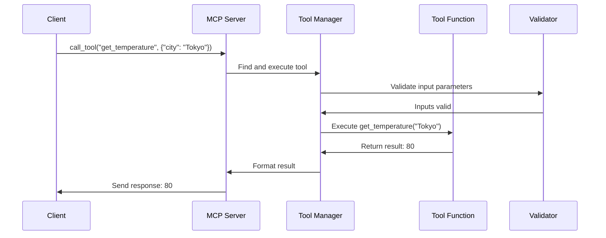

# Chapter 3: Tool Management

## From Server to Tools: Building Your AI's Capabilities

In [Chapter 2: FastMCP Server](02_fastmcp_server_.md), we learned how to set up a server that can respond to client requests. Now, let's explore how to give your server useful abilities through **Tool Management**.

## What Are Tools and Why Do We Need Them?

Imagine your AI assistant is like a new employee. By default, they can have conversations, but what if you want them to:
- Look up information in a database
- Call an external API to check the weather
- Calculate complex equations
- Generate images

These specialized capabilities are what we call **tools**. Tools are functions that you define and make available to language models (LLMs) through your MCP server.

The **ToolManager** is like an organized toolbox that:
1. Keeps track of all available tools
2. Makes sure tools are used correctly (with proper inputs)
3. Executes tools when requested
4. Formats the results properly

## A Simple Example: Building a Calculator Toolset

Let's create a simple calculator service with a few tools:

```python
from mcp.server.fastmcp import FastMCP

app = FastMCP(name="calculator-service")

@app.tool()
def add(a: int, b: int) -> int:
    """Add two numbers together."""
    return a + b

@app.tool()
def multiply(a: int, b: int) -> int:
    """Multiply two numbers together."""
    return a * b
```

This code creates a server with two mathematical tools. The `@app.tool()` decorator registers each function as an available tool that clients can call.

## Key Concepts of Tool Management

### 1. Tool Registration

Tools need to be registered with the ToolManager to make them available:

```python
# Direct way using the tool manager
from mcp.server.fastmcp.tools import ToolManager

manager = ToolManager()
manager.add_tool(add)
manager.add_tool(multiply)
```

Most of the time, you'll use the convenient decorator syntax we saw earlier, but this shows what's happening under the hood.

### 2. Tool Parameters and Types

Tools accept parameters with specific types, which are automatically converted and validated:

```python
@app.tool()
def greet(name: str, times: int = 1) -> str:
    """Greet someone multiple times."""
    return f"Hello, {name}! " * times
```

Here, `name` must be a string, and `times` is an optional integer parameter with a default value of 1.

### 3. Input Validation

The ToolManager automatically validates inputs before executing the tool:

```python
# This will work
result = await client.call_tool("add", {"a": 5, "b": 3})  # Returns 8

# This would fail validation (wrong type)
result = await client.call_tool("add", {"a": "five", "b": 3})  # Error!
```

If a client sends invalid inputs (wrong types or missing required parameters), the ToolManager will return a helpful error message instead of executing the tool.

### 4. Structured Output

Tools can return different types of data:

```python
@app.tool()
def get_user(user_id: int) -> dict:
    """Get user information."""
    return {"name": "Alice", "age": 30, "role": "Admin"}
```

The output is automatically converted to a format the client can understand.

## Building a Weather Information Service

Let's build a more realistic example - a weather service with several tools:

```python
from mcp.server.fastmcp import FastMCP

app = FastMCP(name="weather-service")

# Our "database" of weather data
weather_data = {
    "New York": {"temp": 72, "condition": "Sunny"},
    "London": {"temp": 65, "condition": "Cloudy"},
    "Tokyo": {"temp": 80, "condition": "Rainy"}
}
```

Now let's add some tools to interact with this data:

```python
@app.tool()
def get_temperature(city: str) -> int:
    """Get the temperature for a city."""
    if city in weather_data:
        return weather_data[city]["temp"]
    return 0  # Default if city not found

@app.tool()
def get_condition(city: str) -> str:
    """Get the weather condition for a city."""
    if city in weather_data:
        return weather_data[city]["condition"]
    return "Unknown"
```

Each tool has a clear purpose, accepts specific parameters, and returns a specific type of data.

## How Tools Work Behind the Scenes

When a client calls a tool, several things happen:



1. The client sends a request to call a specific tool with parameters
2. The server routes the request to the Tool Manager
3. The Tool Manager validates the input parameters
4. If valid, the Tool Manager executes the tool function
5. The result is formatted appropriately
6. The server sends the response back to the client

## Implementation Details

Let's look at how tool management is implemented in the code:

### The ToolManager Class

The core of tool management is the `ToolManager` class:

```python
class ToolManager:
    def __init__(self):
        self._tools: dict[str, Tool] = {}
    
    def add_tool(self, fn, name=None, description=None):
        tool = Tool.from_function(fn, name, description)
        self._tools[tool.name] = tool
        return tool
        
    async def call_tool(self, name, arguments, context=None):
        tool = self._tools.get(name)
        if not tool:
            raise ToolError(f"Unknown tool: {name}")
        return await tool.run(arguments, context=context)
```

This simplified version shows how the ToolManager:
1. Stores tools in a dictionary
2. Creates Tool objects from functions
3. Retrieves and runs tools when requested

### The Tool Class

Each tool is represented by a `Tool` class that wraps your function:

```python
class Tool:
    @classmethod
    def from_function(cls, fn, name=None, description=None):
        # Extract name, description, parameters from function
        # Create and return a Tool instance
        
    async def run(self, arguments, context=None):
        # Validate arguments
        # Convert arguments to the right types
        # Call the function
        # Format the result
```

The Tool class handles:
1. Extracting metadata from your function
2. Validating and converting input arguments
3. Calling your function with the right parameters
4. Processing and formatting the result

## Advanced Features

### Tool Annotations

You can add extra metadata to tools using annotations:

```python
from mcp.types import ToolAnnotations

@app.tool(annotations=ToolAnnotations(
    title="Temperature Tool",
    readOnlyHint=True  # This tool doesn't modify any data
))
def get_temperature(city: str) -> int:
    # Implementation...
```

Annotations help clients understand what tools do and how they should be used.

### Context Injection

Tools can access information about the current request using context:

```python
from mcp.server.fastmcp import Context

@app.tool()
def get_client_info(ctx: Context) -> dict:
    """Get information about the client."""
    return {
        "client_id": ctx.client_id,
        "session_started": ctx.session_start_time
    }
```

By adding a `ctx` parameter of type `Context`, your tool automatically receives information about the current session.

### Structured Output

Tools can return complex data structures:

```python
from pydantic import BaseModel

class WeatherInfo(BaseModel):
    temperature: int
    condition: str
    humidity: int
    
@app.tool()
def get_full_weather(city: str) -> WeatherInfo:
    """Get complete weather information for a city."""
    # Fetch data...
    return WeatherInfo(
        temperature=75,
        condition="Partly Cloudy",
        humidity=45
    )
```

The ToolManager automatically converts your Pydantic models to JSON that clients can understand.

## Conclusion

Tool Management is the heart of your AI application's capabilities. By defining and organizing tools, you give language models the ability to:

1. Access your data and services
2. Perform calculations and transformations
3. Take actions in the real world

In this chapter, we've learned how to create, register, and use tools with proper validation and type conversion. We've seen how the ToolManager orchestrates the execution of tools and formats their results.

In the next chapter, we'll explore [Resource Management](04_resource_management_.md), which allows you to share data with clients in a structured way. While tools are functions clients can call, resources are data clients can access.

