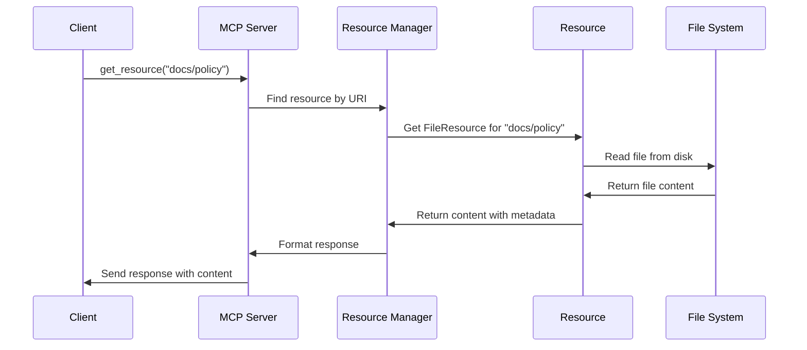

# Chapter 4: Resource Management

## From Tools to Resources: Providing Context to Your AI

In [Chapter 3: Tool Management](03_tool_management_.md), we learned how to create functions that an AI can call. Now, let's explore how to provide information and data that the AI can access through **Resource Management**.

## What Are Resources and Why Do We Need Them?

Imagine your AI assistant is a researcher who needs to access various information sources. While tools are like actions the AI can perform, resources are like reference materials it can consult.

Think of resources as books in a library:
- A PDF document is like a book with fixed content
- A database connection is like a reference desk that can answer specific questions
- A template is like a fill-in-the-blank worksheet that generates new content

The **ResourceManager** acts as a librarian who:
1. Organizes all available resources
2. Helps find the right resource when needed
3. Ensures resources are properly formatted and accessible
4. Creates dynamic resources based on templates and parameters

## A Simple Example: Creating a Knowledge Base

Let's create a simple knowledge base with a few resources:

```python
from mcp.server.fastmcp import FastMCP
from pathlib import Path

app = FastMCP(name="knowledge-base")

# Add a simple text resource
app.add_resource("facts/greeting", "Hello, world!")

# Add a file resource
app.add_file_resource("documents/report", Path("/path/to/report.pdf"))
```

This code adds two resources to our server: a simple text string and a file. Each resource has a URI (like "facts/greeting") that clients can use to access it.

## Key Concepts of Resource Management

### 1. Resource Types

There are several types of resources you can provide:

```python
# Simple string resource
app.add_resource("text/welcome", "Welcome to our service!")

# Function resource (generated dynamically)
@app.resource("data/timestamp")
def get_timestamp():
    from datetime import datetime
    return datetime.now().isoformat()
```

The first example adds a static text resource. The second creates a dynamic resource that generates a timestamp whenever it's accessed.

### 2. Resource URIs and Identification

Every resource needs a unique identifier:

```python
# Add a resource with explicit URI
app.add_resource(
    uri="documents/readme",
    content="This is the README file."
)

# Resources can have metadata
app.add_resource(
    uri="images/logo",
    content=open("logo.png", "rb").read(),
    mime_type="image/png"
)
```

The URI is how clients will request the resource. You can also specify the MIME type to indicate what kind of data the resource contains.

### 3. Resource Templates

Templates allow you to create resources dynamically based on parameters:

```python
@app.resource_template("greetings/{name}")
def personalized_greeting(name: str):
    return f"Hello, {name}! Welcome to our service."
```

This creates a template that can generate personalized greetings. When a client requests "greetings/Alice", they'll receive "Hello, Alice! Welcome to our service."

## Building a Document Repository for an AI Assistant

Let's build a more realistic example - a document repository that an AI can reference:

```python
from mcp.server.fastmcp import FastMCP
from pathlib import Path

app = FastMCP(name="document-repository")

# Add company documents
docs_folder = Path("/company/documents")
app.add_file_resource("docs/policy", docs_folder / "policy.pdf")
app.add_file_resource("docs/faq", docs_folder / "faq.txt")

# Add dynamic data
@app.resource("data/employee-count")
def get_employee_count():
    # In a real app, this might query a database
    return "Our company has 42 employees."
```

This repository contains both static documents and dynamically generated information.

## How Clients Access Resources

From a client's perspective, accessing resources is straightforward:

```python
# List available resources
resources = await client.list_resources()
print(f"Available resources: {[res.uri for res in resources]}")

# Get a specific resource
policy_doc = await client.get_resource("docs/policy")
print(f"Policy document: {policy_doc[:100]}...")  # First 100 chars

# Get a templated resource
greeting = await client.get_resource("greetings/Bob")
print(greeting)  # "Hello, Bob! Welcome to our service."
```

The client can discover what resources are available and then retrieve the ones it needs.

## How Resources Work Behind the Scenes

When a client requests a resource, several things happen:



1. The client sends a request for a specific resource URI
2. The server routes the request to the Resource Manager
3. The Resource Manager finds the resource by URI
4. The resource object retrieves its content (from a file, function, etc.)
5. The content and metadata are returned to the Resource Manager
6. The server formats and sends the response to the client

## Implementation Details

Let's look at how resource management is implemented in the code:

### The ResourceManager Class

The core of resource management is the `ResourceManager` class:

```python
class ResourceManager:
    def __init__(self):
        self._resources = {}  # URI -> Resource mapping
        self._templates = {}  # Template pattern -> ResourceTemplate
    
    def add_resource(self, resource):
        # Register a resource by its URI
        self._resources[str(resource.uri)] = resource
        return resource
        
    async def get_resource(self, uri):
        # First check concrete resources
        if resource := self._resources.get(str(uri)):
            return resource
            
        # Then check templates
        for template in self._templates.values():
            if params := template.matches(str(uri)):
                return await template.create_resource(str(uri), params)
```

This simplified version shows how the ResourceManager:
1. Stores resources in a dictionary by URI
2. Tries to find a direct match for a requested URI
3. If no direct match, checks templates that might match the URI pattern

### Resource Types

Different resource types handle content differently:

```python
# FileResource reads from a file
class FileResource(Resource):
    def __init__(self, uri, path, **kwargs):
        super().__init__(uri, **kwargs)
        self.path = Path(path).resolve()
        
    async def read(self):
        # Read file content from disk
        if self.is_binary:
            return await anyio.Path(self.path).read_bytes()
        return await anyio.Path(self.path).read_text()
```

This shows how a `FileResource` reads its content from a file when requested.

### Resource Templates

Templates are a powerful way to create dynamic resources:

```python
class ResourceTemplate:
    def __init__(self, uri_template, creator_fn):
        self.uri_template = uri_template
        self._creator_fn = creator_fn
        self._pattern = self._compile_pattern(uri_template)
    
    def matches(self, uri):
        # Check if URI matches this template
        match = self._pattern.match(uri)
        return match.groupdict() if match else None
```

Templates use patterns (like "greetings/{name}") to match URIs and extract parameters.

## Integration with Other Components

Resource Management integrates with several other components:

- Resources can be used with [Tool Management](03_tool_management_.md) to provide data to tools
- [Prompt Management](05_prompt_management_.md) often uses resources as context for generating responses
- The [Client Session](01_client_session_.md) provides methods to access resources remotely

## Common Use Cases for Resources

Resources are particularly useful for:

1. **Reference documentation**: Provide the AI with manuals, guides, or policies
2. **Current data**: Give the AI access to up-to-date information
3. **Context for decision-making**: Supply relevant background information
4. **Templates for generation**: Provide patterns for consistent output

## Conclusion

Resource Management is like a library system for your AI assistant. By organizing and providing access to different types of information, you give your AI the context it needs to perform tasks effectively.

In this chapter, we've learned how to create, register, and access different types of resources. We've seen how the ResourceManager organizes these resources and how clients can retrieve them when needed.

In the next chapter, we'll explore [Prompt Management](05_prompt_management_.md), which helps structure the conversations and requests you send to language models, often incorporating the resources we've discussed here.

