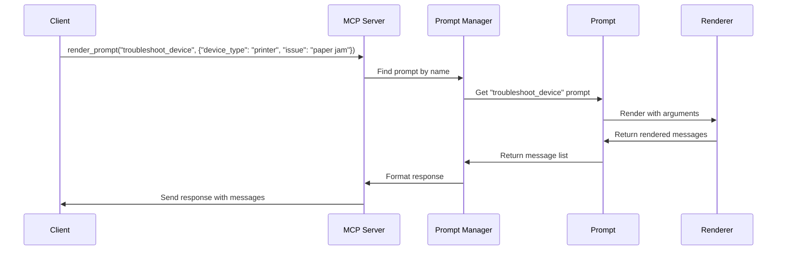

# Chapter 5: Prompt Management

## From Resources to Conversations: Structuring AI Interactions

In [Chapter 4: Resource Management](04_resource_management_.md), we learned how to provide information and data to our AI systems. Now, let's explore how to structure the conversations we have with these systems through **Prompt Management**.

## What Are Prompts and Why Do We Need to Manage Them?

Imagine you're directing a movie. Each actor needs to know their lines and when to say them. Without a script, the scene would be chaotic and unpredictable.

When working with Large Language Models (LLMs), **prompts** serve as these scripts. They guide the AI in understanding what we want and how it should respond.

**Prompt Management** is like having an organized collection of scripts for different scenes, with the ability to:
1. Create reusable conversation templates
2. Fill in dynamic variables (like character names or settings)
3. Ensure consistent AI responses across similar situations
4. Maintain a library of conversation patterns that work well

## A Simple Example: Creating Your First Prompt

Let's create a simple greeting prompt:

```python
from mcp.server.fastmcp import FastMCP

app = FastMCP(name="greeting-service")

@app.prompt()
def greeting() -> str:
    """A simple greeting prompt."""
    return "Hello! How can I help you today?"
```

This code creates a prompt named "greeting" that returns a simple message. The `@app.prompt()` decorator registers this function as a prompt that clients can use.

## Key Concepts of Prompt Management

### 1. Prompt Templates

Prompts are templates that can be reused across different interactions:

```python
@app.prompt()
def technical_question(topic: str) -> str:
    """A template for technical questions."""
    return f"I have a question about {topic}. Can you explain how it works?"
```

This creates a prompt template that can be customized with different topics.

### 2. Message Types

Prompts can include different types of messages to structure a conversation:

```python
from mcp.server.fastmcp.prompts.base import UserMessage, AssistantMessage

@app.prompt()
def conversation() -> list:
    """A multi-turn conversation template."""
    return [
        UserMessage("What's the weather like today?"),
        AssistantMessage("It's sunny and 75 degrees."),
        UserMessage("Should I bring a jacket?")
    ]
```

This creates a prompt with multiple turns of conversation, alternating between user and assistant messages.

### 3. Dynamic Content with Arguments

Prompts can accept arguments to create dynamic content:

```python
@app.prompt()
def personalized_help(name: str, issue: str) -> str:
    """Personalized help request."""
    return f"Hi, my name is {name}. I need help with {issue}."
```

When rendering this prompt, you can provide different names and issues to customize it.

## How Clients Use Prompts

From a client's perspective, using prompts is straightforward:

```python
# Render a simple prompt
greeting = await client.render_prompt("greeting")
print(greeting)  # List of message objects

# Render a prompt with arguments
help_request = await client.render_prompt("personalized_help", 
                                         {"name": "Alice", "issue": "login"})
print(help_request)  # Message with "Hi, my name is Alice. I need help with login."
```

The client can request any registered prompt and provide arguments if needed.

## Building a Customer Support System

Let's build a more realistic example - templates for a customer support system:

```python
@app.prompt()
def support_intro(customer_name: str) -> str:
    """Introduction for customer support conversations."""
    return f"Hello {customer_name}, welcome to customer support. How can I assist you today?"

@app.prompt()
def troubleshoot_device(device_type: str, issue: str) -> list:
    """Troubleshooting script for devices."""
    return [
        UserMessage(f"I'm having trouble with my {device_type}. {issue}"),
        AssistantMessage(f"I understand you're having an issue with your {device_type}. Let me help.")
    ]
```

These prompts provide consistent templates for different customer support scenarios.

## How Prompts Work Behind the Scenes

When a client requests a prompt, several things happen:



1. The client requests a specific prompt with arguments
2. The server routes the request to the Prompt Manager
3. The Prompt Manager finds the prompt by name
4. The prompt function is called with the provided arguments
5. The result is converted to a list of messages
6. The server sends the rendered messages back to the client

## Implementation Details

Let's look at how prompt management is implemented in the code:

### The PromptManager Class

The core of prompt management is the `PromptManager` class:

```python
class PromptManager:
    def __init__(self, warn_on_duplicate_prompts: bool = True):
        self._prompts: dict[str, Prompt] = {}
        self.warn_on_duplicate_prompts = warn_on_duplicate_prompts
    
    def add_prompt(self, prompt: Prompt) -> Prompt:
        """Add a prompt to the manager."""
        existing = self._prompts.get(prompt.name)
        if existing:
            if self.warn_on_duplicate_prompts:
                logger.warning(f"Prompt already exists: {prompt.name}")
            return existing
        self._prompts[prompt.name] = prompt
        return prompt
```

This class maintains a dictionary of prompts indexed by name and provides methods to add, retrieve, and list prompts.

### The Prompt Class

Each prompt is represented by a `Prompt` class:

```python
class Prompt:
    @classmethod
    def from_function(cls, fn, name=None, description=None):
        # Extract name, description, parameters from function
        # Create and return a Prompt instance
        
    async def render(self, arguments=None):
        # Validate arguments
        # Call the function with arguments
        # Convert result to messages
        # Return list of messages
```

The Prompt class handles:
1. Extracting metadata from your function
2. Validating and processing arguments
3. Calling your function with the right parameters
4. Converting the result to a standard message format

### Rendering Prompts

The most important functionality is rendering prompts:

```python
async def render_prompt(self, name: str, arguments: dict | None = None) -> list[Message]:
    """Render a prompt by name with arguments."""
    prompt = self.get_prompt(name)
    if not prompt:
        raise ValueError(f"Unknown prompt: {name}")

    return await prompt.render(arguments)
```

This method finds a prompt by name, validates that it exists, and then renders it with any provided arguments.

## Advanced Features

### Rich Content in Prompts

Prompts can include more than just text:

```python
@app.prompt()
def document_analysis() -> list:
    """A prompt with embedded resources."""
    return [
        UserMessage("Please analyze this document:"),
        UserMessage(content=EmbeddedResource(
            type="resource",
            resource=TextResourceContents(
                uri="documents/report.txt",
                text="Quarterly sales have increased by 15%...",
                mimeType="text/plain",
            )
        ))
    ]
```

This creates a prompt that includes both text and an embedded document.

### Integration with Resources

Prompts can use [Resource Management](04_resource_management_.md) to include dynamic content:

```python
@app.prompt()
async def knowledge_prompt(resource_manager, topic: str) -> list:
    """Prompt that includes knowledge from resources."""
    # Get relevant information from resources
    resource = await resource_manager.get_resource(f"knowledge/{topic}")
    
    return [
        UserMessage(f"Tell me about {topic}"),
        UserMessage(f"Here's what I know: {resource}")
    ]
```

This combines prompt templates with dynamic resource retrieval.

## Use Cases for Prompt Management

Prompt Management is particularly valuable for:

1. **Consistent user experiences**: Maintain a uniform voice and style
2. **Complex multi-turn dialogues**: Script conversations with multiple exchanges
3. **Specialized domain interactions**: Create templates for specific industries or tasks
4. **A/B testing different prompts**: Compare different approaches to see which works best

## Conclusion

Prompt Management is like having a script supervisor for your AI applications. By creating structured templates for interactions, you ensure that your AI responds consistently and effectively across different scenarios.

In this chapter, we've learned how to create, register, and render prompts with different message types and dynamic content. We've seen how the PromptManager organizes these prompts and how clients can request them when needed.

In the next chapter, we'll explore the [Elicitation Framework](06_elicitation_framework_.md), which helps extract specific information from users through guided conversations, often using the prompts we've discussed here.

