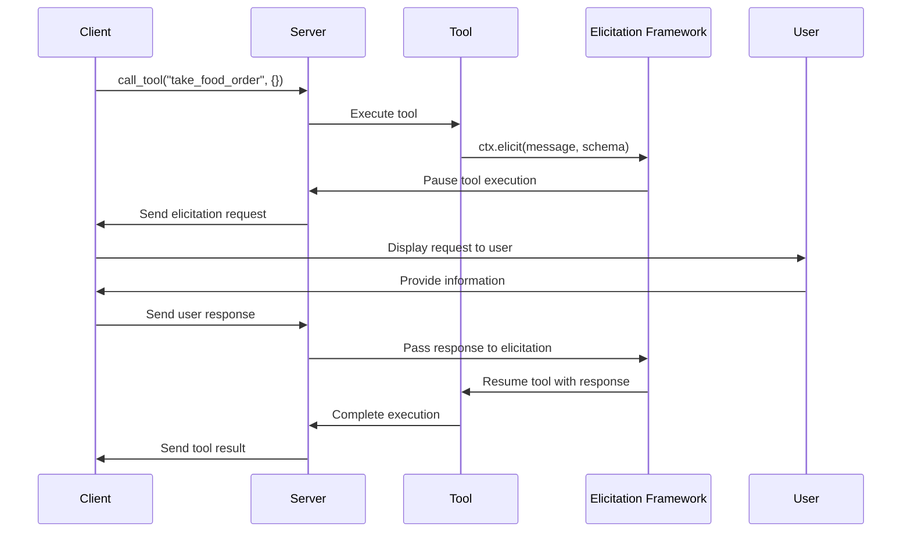

# Chapter 6: Elicitation Framework

## From Prompts to Interactive Queries: Asking Users for Information

In [Chapter 5: Prompt Management](05_prompt_management_.md), we learned how to structure conversations with AI systems. Now, let's explore how to make these conversations truly interactive by asking users for specific information during tool execution through the **Elicitation Framework**.

## What Is Elicitation and Why Do We Need It?

Imagine you're at a restaurant. You order a steak, but the server needs to ask follow-up questions: "How would you like that cooked?" and "Which side dish would you prefer?" These questions help customize your order to your preferences.

Similarly, AI tools sometimes need additional information during execution to complete their tasks effectively. The **Elicitation Framework** provides a structured way for tools to:

1. Ask users specific questions
2. Validate the responses
3. Use the information to complete their tasks

## A Simple Example: A Weather Tool That Needs Your Location

Let's imagine a simple weather tool that needs to know your location:

```python
from mcp.server.fastmcp import FastMCP, Context
from pydantic import BaseModel, Field

app = FastMCP(name="weather-service")

class LocationInfo(BaseModel):
    city: str = Field(description="The city name")
    country: str = Field(description="The country name")
```

Here, we've created a Pydantic model that defines what information we need from the user - a city and country.

Now, let's create a tool that uses elicitation to ask for this information:

```python
@app.tool()
async def get_weather(ctx: Context) -> str:
    """Get weather for a location."""
    result = await ctx.elicit(
        message="Please provide your location:",
        schema=LocationInfo
    )
    
    if result.action == "accept" and result.data:
        return f"Weather for {result.data.city}, {result.data.country}: Sunny, 75°F"
    else:
        return "Weather information request cancelled."
```

This tool uses `ctx.elicit()` to ask the user for their location. If the user provides the information, it returns the weather; otherwise, it acknowledges the cancellation.

## Key Concepts of the Elicitation Framework

### 1. Elicitation Schemas

Schemas define what information you're requesting:

```python
class UserDetails(BaseModel):
    name: str = Field(description="Your full name")
    age: int = Field(description="Your age in years")
    email: str = Field(description="Your email address")
```

This schema asks for name, age, and email. The descriptions help users understand what information is being requested.

### 2. Elicitation Context

The Context object provides the `elicit()` method:

```python
async def ask_for_info(ctx: Context) -> str:
    result = await ctx.elicit(
        message="I need some information to proceed:",
        schema=UserDetails
    )
    # Process the result...
```

The `elicit()` method pauses tool execution, asks the user for information, and returns the result when the user responds.

### 3. Elicitation Results

Results contain the user's response:

```python
if result.action == "accept":
    # User provided the information
    user_name = result.data.name
    user_age = result.data.age
elif result.action == "decline":
    # User explicitly declined to provide information
elif result.action == "cancel":
    # User cancelled the operation
```

The result contains an action (accept, decline, or cancel) and the data if the user provided it.

## Building a Restaurant Order Tool

Let's build a more realistic example - a tool that takes food orders:

```python
from pydantic import BaseModel, Field

class OrderDetails(BaseModel):
    main_dish: str = Field(description="What main dish would you like?")
    cooking_preference: str = Field(description="How would you like it cooked?")
    side_dish: str = Field(description="Which side dish would you prefer?")
```

This schema defines the information needed for a food order.

Now, let's create the order tool:

```python
@app.tool()
async def take_food_order(ctx: Context) -> str:
    """Take a food order from the user."""
    result = await ctx.elicit(
        message="Please provide your order details:",
        schema=OrderDetails
    )
    
    if result.action == "accept" and result.data:
        return (f"Order confirmed: {result.data.main_dish} "
                f"({result.data.cooking_preference}) with {result.data.side_dish}")
    else:
        return "Order was not completed."
```

This tool asks for order details and confirms the order if the user provides the information.

## How Elicitation Works Behind the Scenes

When a tool uses elicitation, several things happen:



1. The client calls a tool on the server
2. The tool execution begins
3. When the tool needs information, it calls `ctx.elicit()`
4. The elicitation framework pauses the tool execution
5. The server sends an elicitation request to the client
6. The client displays the request to the user
7. The user provides the requested information
8. The client sends the response back to the server
9. The elicitation framework resumes the tool execution with the user's response
10. The tool completes its execution and returns a result
11. The server sends the result back to the client

## Implementation Details

Let's look at how elicitation is implemented in the code:

### The Context Class

The `Context` class provides the `elicit()` method:

```python
class Context:
    async def elicit(
        self, 
        message: str, 
        schema: type[BaseModel]
    ) -> ElicitResult:
        """Request information from the user."""
        # Validate schema contains only primitive types
        self._validate_elicitation_schema(schema)
        
        # Create elicitation parameters
        params = ElicitParams(message=message, schema=schema)
        
        # Send elicitation request and wait for response
        return await self._session.elicit(params)
```

This method validates the schema, creates the elicitation parameters, and sends the request to the user.

### Schema Validation

The framework validates schemas to ensure they only contain supported types:

```python
def _validate_elicitation_schema(self, schema: type[BaseModel]) -> None:
    """Ensure schema only contains primitive types."""
    for field_name, field in schema.__fields__.items():
        if not self._is_primitive_type(field.type_):
            raise TypeError(f"Field '{field_name}' must be a primitive type")
```

This ensures that elicitation only asks for information that can be easily provided and processed.

## Advanced Features

### Optional Fields

You can make fields optional in your elicitation schemas:

```python
class SurveyResponse(BaseModel):
    rating: int = Field(description="Rate our service (1-5)")
    comments: str | None = Field(
        default=None, 
        description="Additional comments (optional)"
    )
```

Optional fields have a default value (usually `None`) and are marked as such in the description.

### Handling Different User Responses

Tools can respond differently based on what the user provides:

```python
@app.tool()
async def personalized_greeting(ctx: Context) -> str:
    """Generate a personalized greeting."""
    result = await ctx.elicit(
        message="May I know your name?",
        schema=NameSchema
    )
    
    if result.action == "accept":
        return f"Hello, {result.data.name}! Nice to meet you."
    elif result.action == "decline":
        return "Hello there! I understand you prefer to stay anonymous."
    else:  # cancel
        return "Operation cancelled."
```

This allows tools to gracefully handle different user responses.

## Common Use Cases for Elicitation

The Elicitation Framework is particularly useful for:

1. **Personalization**: Collecting user preferences to tailor responses
2. **Data Collection**: Gathering information needed for operations
3. **Interactive Workflows**: Creating multi-step processes with user input
4. **Confirmation**: Asking users to confirm important actions
5. **Progressive Disclosure**: Asking for additional details only when needed

## Conclusion

The Elicitation Framework transforms tools from one-way functions into interactive experiences. By providing a structured way to ask users for information during execution, it enables more personalized and effective AI interactions.

In this chapter, we've learned how to define elicitation schemas, request information from users, and process their responses. We've seen how the elicitation process works behind the scenes and how it enables more interactive and useful tools.

In the next chapter, we'll explore [Transport Mechanisms](07_transport_mechanisms_.md), which handle how clients and servers communicate with each other, ensuring all these interactive features work seamlessly across different platforms and environments.

