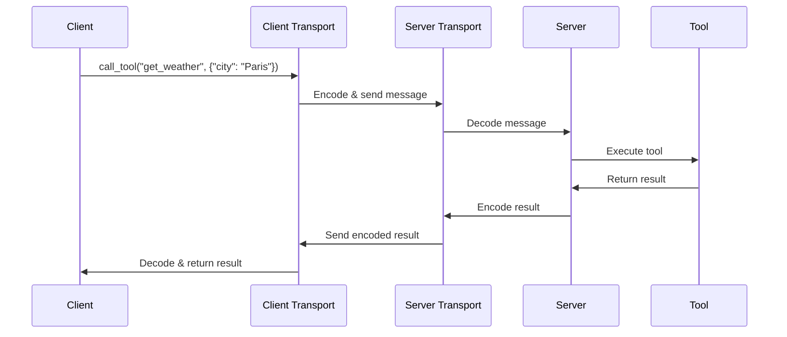

# Chapter 7: Transport Mechanisms

## From Elicitation to Communication: How Data Flows Between Client and Server

In [Chapter 6: Elicitation Framework](06_elicitation_framework_.md), we learned how tools can ask users for information during execution. Now, let's explore how all these messages actually travel between clients and servers through **Transport Mechanisms**.

## What Are Transport Mechanisms and Why Do We Need Them?

Imagine you want to send a birthday card to your friend. You have several options:
- Hand-deliver it personally
- Mail it through the postal service
- Send a digital e-card via email

Each method delivers the same birthday wishes but uses a different delivery mechanism with its own advantages and limitations.

Similarly, **Transport Mechanisms** in MCP are different ways for clients and servers to exchange messages. They answer the question: "How do these messages physically travel from point A to point B?"

## A Simple Example: Connecting to a Server

Let's see a basic example of connecting to a server using different transport mechanisms:

```python
# Using WebSockets transport
from mcp.client.websocket import websocket_client

async with websocket_client("ws://example.com/mcp") as streams:
    async with ClientSession(*streams) as session:
        # Now you can use the session
        result = await session.call_tool("calculator", {"a": 5, "b": 3})
```

This code connects to a server using WebSockets and creates a session for communicating with the server.

## Key Transport Mechanisms

Let's explore the main transport mechanisms available in MCP:

### 1. Standard Input/Output (stdio)

This is the simplest transport, using standard input and output streams:

```python
from mcp.client.stdio import stdio_client

async with stdio_client() as streams:
    async with ClientSession(*streams) as session:
        # Communicate with a server running on the same machine
        result = await session.call_tool("echo", {"message": "Hello"})
```

**When to use**: Perfect for local applications where the client and server run on the same machine, such as CLI tools or embedded AI assistants.

### 2. WebSockets

WebSockets provide a persistent connection for real-time communication:

```python
from mcp.client.websocket import websocket_client

async with websocket_client("ws://example.com/mcp") as streams:
    async with ClientSession(*streams) as session:
        # Real-time communication with a remote server
        await session.call_tool("chat", {"message": "Hello"})
```

**When to use**: Ideal for web applications that require real-time updates, like chat applications or collaborative tools.

### 3. HTTP Streaming

HTTP Streaming uses regular HTTP connections but keeps them open for continuous data flow:

```python
from mcp.client.streamable_http import streamable_http_client

async with streamable_http_client("http://example.com/mcp") as streams:
    async with ClientSession(*streams) as session:
        # Streaming communication over HTTP
        await session.call_tool("generate_text", {"prompt": "Once upon a time"})
```

**When to use**: Great for web environments where WebSockets might be blocked, or when you need compatibility with existing HTTP infrastructure.

## Building a Multi-Transport Weather Service

Let's create a weather service that supports different transport mechanisms:

```python
from mcp.server.fastmcp import FastMCP

app = FastMCP(name="weather-service")

@app.tool()
def get_weather(city: str) -> str:
    """Get weather for a city."""
    # In a real app, this would call a weather API
    return f"It's sunny in {city} today!"
```

This creates a simple weather service with one tool. Now let's run it with different transports:

### Running with WebSockets

```python
from mcp.server.websocket import run_websocket_server

# Run the server with WebSockets transport
if __name__ == "__main__":
    run_websocket_server(app, host="localhost", port=8000)
```

This runs our weather service using WebSockets on port 8000.

### Running with HTTP Streaming

```python
from mcp.server.streamable_http import run_streamable_http_server

# Run the server with HTTP Streaming transport
if __name__ == "__main__":
    run_streamable_http_server(app, host="localhost", port=8000)
```

This runs the same service using HTTP Streaming instead.

## How Transports Work Behind the Scenes

When messages flow between client and server, several steps happen:



1. The client creates a request (e.g., to call a tool)
2. The client transport encodes the request into a message format
3. The message travels through the chosen transport mechanism
4. The server transport receives and decodes the message
5. The server processes the request and generates a response
6. The response follows the same path back to the client

## Implementation Details

Let's look at how transports are implemented in the code:

### The Transport Interface

All transports implement a common interface for reading and writing messages:

```python
class ReadStream:
    """A stream for reading MCP messages."""
    async def receive(self) -> bytes:
        """Receive the next message."""
        # Implementation varies by transport

class WriteStream:
    """A stream for writing MCP messages."""
    async def send(self, data: bytes) -> None:
        """Send a message."""
        # Implementation varies by transport
```

These abstract classes define the interface that all transports must implement, allowing the rest of the system to work with any transport.

### WebSocket Implementation

Here's a simplified look at the WebSocket client implementation:

```python
@asynccontextmanager
async def websocket_client(url: str) -> AsyncGenerator[tuple[ReadStream, WriteStream], None]:
    """Connect to a WebSocket server."""
    # Create a WebSocket connection
    async with connect_websocket(url) as websocket:
        # Create read and write streams
        read_stream = WebSocketReadStream(websocket)
        write_stream = WebSocketWriteStream(websocket)
        
        # Return the streams
        yield (read_stream, write_stream)
```

This function creates a WebSocket connection and returns read and write streams that the [Client Session](01_client_session_.md) can use to communicate with the server.

### HTTP Streaming Implementation

The HTTP Streaming transport is more complex because it needs to handle both request and response:

```python
class StreamableHTTPServerTransport:
    """Server-side HTTP streaming transport."""
    
    async def handle_request(self, scope, receive, send):
        """Handle an incoming HTTP request."""
        # Extract request data
        request = Request(scope, receive)
        
        # Process the request
        if request.method == "POST":
            # Handle incoming message
            await self._handle_post(request, send)
        elif request.method == "GET":
            # Start streaming response
            await self._handle_get(request, send)
```

This class handles HTTP requests and maintains a streaming connection for continuous data flow.

## Choosing the Right Transport

Different transports have different strengths:

| Transport | Pros | Cons | Best For |
|-----------|------|------|----------|
| stdio | Simple, no network setup | Local only | CLI tools, local apps |
| WebSockets | Real-time, bidirectional | Might be blocked by firewalls | Web apps, real-time features |
| HTTP Streaming | Works in most environments | More overhead | Public web services, broad compatibility |

When deciding which transport to use, consider:
1. Where your application will run (local machine vs. web)
2. Network constraints (firewalls, proxies)
3. Performance requirements (latency, bandwidth)
4. Compatibility needs (browsers, existing infrastructure)

## Integration with Other Components

Transport mechanisms integrate with several other components:

- They carry messages between [Client Session](01_client_session_.md) and [FastMCP Server](02_fastmcp_server_.md)
- They transmit tool calls defined in [Tool Management](03_tool_management_.md)
- They deliver resources accessed through [Resource Management](04_resource_management_.md)
- They carry prompts from [Prompt Management](05_prompt_management_.md)
- They support interactive features of the [Elicitation Framework](06_elicitation_framework_.md)

## Advanced Features: Security and Resilience

Transports also handle important security and resilience features:

```python
# Configure transport security settings
security_settings = TransportSecuritySettings(
    enable_dns_rebinding_protection=True,
    allowed_hosts=["localhost", "example.com"],
    allowed_origins=["https://example.com"]
)

# Use settings when creating a server
manager = StreamableHTTPSessionManager(
    app=app,
    security_settings=security_settings
)
```

These settings help protect your applications from common security issues like DNS rebinding attacks.

## Conclusion

Transport Mechanisms are the invisible pathways that make all MCP communication possible. By understanding the different options and their trade-offs, you can choose the right transport for your application's needs.

In this chapter, we've learned about the different ways clients and servers can communicate, how to configure various transports, and how they work behind the scenes. We've seen how to build applications that support multiple transport options, making them more flexible and accessible.

In the next chapter, we'll explore [Authentication and Authorization](08_authentication_and_authorization_.md), which ensures that only the right users can access your services and that they can only do what they're allowed to do.

