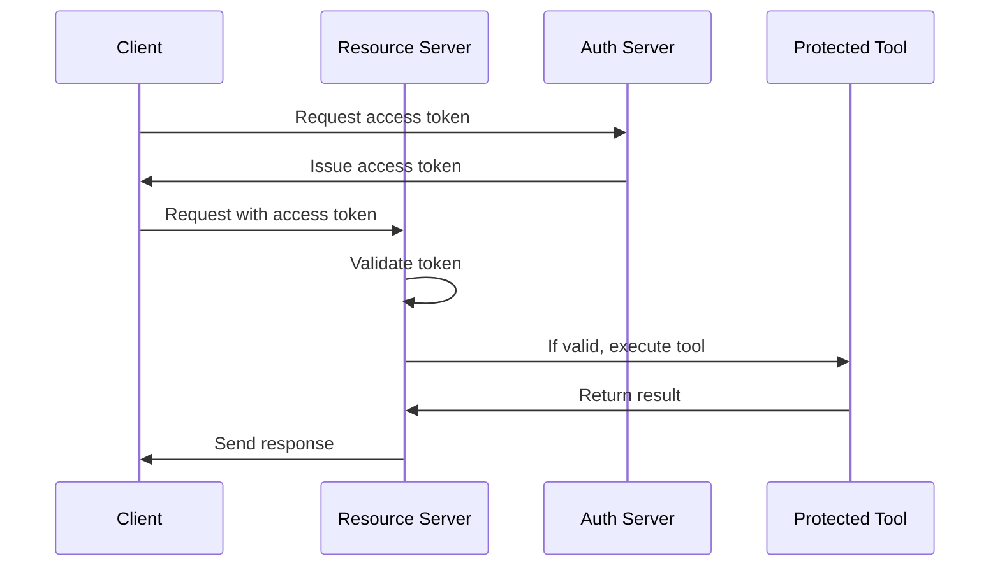

# Chapter 8: Authentication and Authorization

## From Open Channels to Secure Access: Protecting Your MCP Services

In [Chapter 7: Transport Mechanisms](07_transport_mechanisms_.md), we learned how data flows between clients and servers. Now, let's explore how to ensure that only authorized users can access your services through **Authentication and Authorization**.

## What Are Authentication and Authorization?

Imagine a secure building with multiple rooms containing valuable information:

- At the front desk, security guards verify your ID to confirm you're allowed in the building. This is **authentication** - proving you are who you say you are.

- Once inside, your access badge only opens specific doors based on your clearance level. This is **authorization** - determining what you're allowed to do.

The MCP authentication system works similarly, ensuring only verified clients can access protected resources and only perform actions they're permitted to do.

## A Simple Example: Creating a Protected Weather Service

Let's secure our weather service so only authenticated users can access it:

```python
from mcp.server.fastmcp import FastMCP
from mcp.server.auth.settings import AuthSettings

# Create a server with authentication
app = FastMCP(
    name="secure-weather-service",
    auth_settings=AuthSettings(
        issuer_url="https://auth.example.com",
        resource_server_url="https://api.example.com"
    )
)
```

This creates a server that requires authentication via the specified authorization server.

## Key Concepts of Authentication and Authorization

### 1. Authentication vs. Authorization

Let's clarify the difference:

```python
# Authentication: Verifying identity
# token = "I am Alice" + signature

# Authorization: Checking permissions
# token contains: {user: "Alice", permissions: ["read:weather", "premium"]}
```

Authentication proves identity, while authorization determines what that identity is allowed to do.

### 2. OAuth 2.1 Roles

There are three main roles in the OAuth system:

```python
# 1. Client - The app requesting access
client = ClientSession(...)  # Your app

# 2. Authorization Server - Issues tokens
auth_server = FastMCP(auth_provider=YourAuthProvider())

# 3. Resource Server - Protects your API
resource_server = FastMCP(auth_settings=AuthSettings(...))
```

These roles work together to create a secure system.

### 3. Access Tokens and Scopes

Access tokens are like temporary keys with specific permissions:

```python
# Access token request with specific scopes
token_response = await client.request_token(
    scopes=["read:weather", "premium_features"]
)

# Using the token for access
weather = await client.call_tool("get_weather", {"city": "London"})
```

Scopes are named permissions that limit what the token can be used for.

## Setting Up Authentication on Your Server

Let's set up a complete authentication system:

```python
from mcp.server.fastmcp import FastMCP
from mcp.server.auth.settings import AuthSettings, ClientRegistrationOptions

# Configure auth settings
auth_settings = AuthSettings(
    issuer_url="https://auth.example.com",
    resource_server_url="https://api.example.com",
    required_scopes=["read:weather"],  # Scopes required to access this API
    client_registration_options=ClientRegistrationOptions(enabled=True)
)
```

This creates auth settings that require the "read:weather" scope and enable client registration.

## Protecting Your Tools with Scopes

You can secure specific tools with required scopes:

```python
@app.tool(required_scopes=["premium_features"])
def get_detailed_forecast(city: str) -> dict:
    """Get detailed weather forecast (premium feature)."""
    # Only accessible with premium_features scope
    return {"city": city, "forecast": "Detailed forecast data..."}
```

This tool can only be accessed by clients with the "premium_features" scope.

## How Authentication Works Behind the Scenes

When a client tries to access a protected resource, several steps occur:



1. The client requests an access token from the authorization server
2. The authorization server verifies the client and issues a token
3. The client sends the token with requests to the resource server
4. The resource server validates the token before executing any tools
5. If the token is valid and has the required scopes, the operation proceeds

## Implementation Details

Let's look at how authentication is implemented in the code:

### Authentication Middleware

The server uses middleware to check tokens on incoming requests:

```python
from mcp.server.auth.middleware.bearer_auth import BearerAuthMiddleware

# This middleware is added to your server automatically
# when auth_settings are provided
auth_middleware = BearerAuthMiddleware(
    app=your_app,
    auth_settings=auth_settings
)
```

This middleware extracts and validates the access token from each request.

### Token Validation

When a token arrives, it's validated before processing:

```python
# Inside the middleware:
token = extract_token_from_request(request)
if not token:
    return Response("Unauthorized", status_code=401)
    
if not token_has_required_scopes(token, required_scopes):
    return Response("Forbidden", status_code=403)
```

The validation checks if the token exists and has the necessary scopes.

## Client Authentication

From the client side, you need to obtain and use tokens:

```python
from mcp.client.session import ClientSession

# Create an authenticated session
session = ClientSession(
    client_id="your_client_id",
    client_secret="your_client_secret"
)

# Request an access token
await session.authenticate()

# Now all requests use this token automatically
result = await session.call_tool("get_weather", {"city": "Paris"})
```

The client handles obtaining, storing, and refreshing tokens automatically.

## Common Authentication Patterns

Here are some common authentication patterns:

### 1. Public Client (e.g., browser app)

```python
# For a public client (no client secret)
session = ClientSession(
    client_id="browser_app",
    auth_flow="device_code"  # User authenticates on another device
)
```

This pattern is used for applications that can't securely store secrets.

### 2. Confidential Client (e.g., server app)

```python
# For a confidential client (with client secret)
session = ClientSession(
    client_id="server_app",
    client_secret="SECRET_KEY",
    auth_flow="client_credentials"
)
```

This pattern is used for server-to-server communication.

## Security Best Practices

Always follow these security guidelines:

1. **Never share client secrets** in public code or with users
2. **Use HTTPS** for all production communication
3. **Request minimal scopes** - only ask for what you need
4. **Validate all tokens** on the server side
5. **Expire tokens** after a reasonable time period

## Conclusion

Authentication and Authorization create a secure foundation for your MCP services. By implementing OAuth 2.1, you ensure that only the right users can access your services and only perform actions they're permitted to do.

In this chapter, we've learned how to secure MCP servers, protect specific tools with scopes, and create authenticated client sessions. We've seen how the authentication process works behind the scenes and explored different authentication patterns for various use cases.

You've now completed all chapters of this tutorial! With these building blocks, you can create sophisticated, secure AI applications using the MCP framework.

