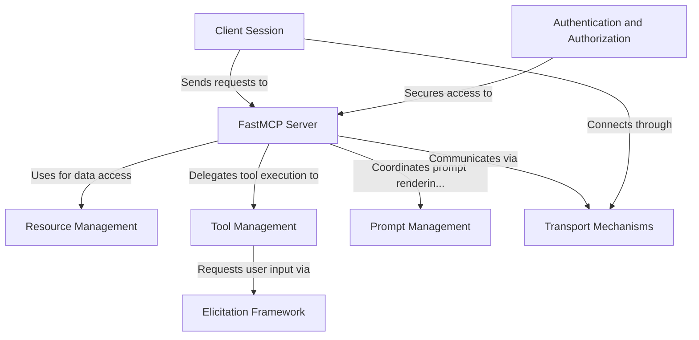

# Tutorial: python-sdk

The Python SDK implements the **Model Context Protocol** (MCP), a standardized way for applications to interact with **Large Language Models**. It provides a server framework that manages tools, resources, and prompts, along with a *client interface* for connecting to MCP servers. The SDK supports different *transport mechanisms* (HTTP, WebSockets, stdio), **OAuth authentication**, and an **elicitation framework** allowing tools to request additional information from users during execution.

**Source Repository:** [https://github.com/modelcontextprotocol/python-sdk](https://github.com/modelcontextprotocol/python-sdk)

## Chapters

1. [Client Session
](01_client_session_.md)
2. [FastMCP Server
](02_fastmcp_server_.md)
3. [Tool Management
](03_tool_management_.md)
4. [Resource Management
](04_resource_management_.md)
5. [Prompt Management
](05_prompt_management_.md)
6. [Elicitation Framework
](06_elicitation_framework_.md)
7. [Transport Mechanisms
](07_transport_mechanisms_.md)
8. [Authentication and Authorization
](08_authentication_and_authorization_.md)
