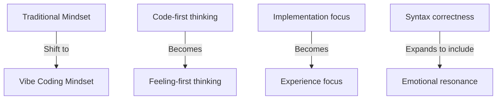
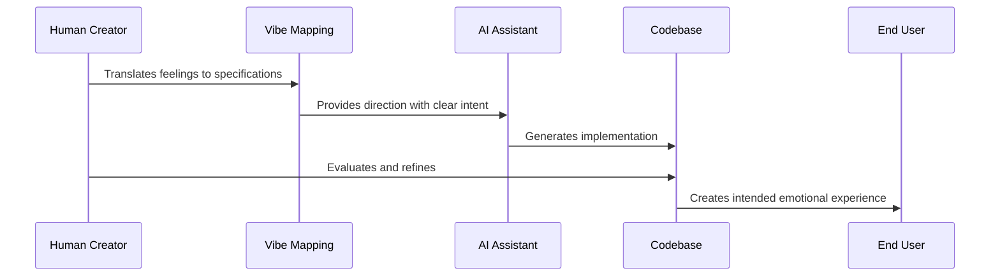

# Chapter 1: Vibe Coding

Welcome to the world of Vibe Coding! In this chapter, we'll explore a fundamental shift in how we think about programming in the age of AI assistance. If you've ever felt that coding is more than just typing instructions into a computer, you're already thinking like a vibe coder.

## What Problem Does Vibe Coding Solve?

Traditional programming education often presents coding as a purely logical activity - just following rules and syntax. But have you ever noticed how your code turns out differently depending on your mood, environment, or even the music you're listening to? That's because programming is deeply human.

**Central Use Case**: Imagine you want to create a personal website that feels "cozy and nostalgic, like a warm coffee shop on a rainy day." How would you translate that feeling into HTML, CSS, and JavaScript?

Traditional approaches might leave you searching for specific code snippets without guidance on the overall feeling. Vibe Coding gives you a framework for translating these human feelings into technical decisions.

## Vibe Coding: The Core Concept

Vibe Coding recognizes that programming is:

1. **A Human Activity**: Influenced by our psychology, environment, and emotional state
2. **Creative Expression**: Similar to other art forms like music, cooking, or painting
3. **A Partnership with AI**: Where humans provide the vision and AI helps with implementation

Think of it like cooking. Traditional programming education is like following a recipe exactly - measure precisely, follow steps rigidly. Vibe Coding is recognizing that great chefs consider the mood they want to create, adapt to available ingredients, and trust their intuition while cooking.

## The Vibe Coder's Mindset

To practice Vibe Coding, start by shifting your mindset:



When approaching a project with Vibe Coding:

1. Begin with how you want people to feel
2. Collect references that capture this feeling
3. Translate these feelings into design and technical choices
4. Collaborate with AI to implement the technical aspects
5. Continuously check if the implementation matches the intended feeling

## Vibe Coding in Practice

Let's return to our example of creating a "cozy, rainy day coffee shop" website. Here's how a vibe coder might approach this:

1. **Capture the Feeling**: First, they'd collect references - photos of coffee shops, rainy day color palettes, cozy typography samples

2. **Translate to Technical Elements**: Next, they'd make specific choices:

```
Color Palette: Warm browns (#5E4B36), soft grays (#E0E0E0), muted blues (#7D95A8)
Typography: Serif fonts for headings, comfortable line height (1.6)
Layout: Generous padding (24px), slightly asymmetrical
Animations: Slow fade transitions (0.5s ease-in-out)
Background: Subtle rain droplet texture overlay
```

This small snippet shows how feelings ("cozy", "warm") become specific technical decisions.

3. **AI Collaboration**: Then they might ask AI for implementation help:

```
Human: I need a header for my cozy coffee shop website. Colors should be warm browns 
(#5E4B36) with serif typography. It should feel relaxed and inviting.

AI: Here's a simple header implementation:

<header class="cozy-header">
  <h1>Morning Brew Café</h1>
  <p>A cozy corner for rainy days</p>
</header>

<style>
  .cozy-header {
    background-color: #5E4B36;
    color: #E0E0E0;
    padding: 24px;
    font-family: 'Libre Baskerville', serif;
  }
</style>
```

The code is simple, but the intention behind it - creating a cozy feeling - guides every choice.

## How Vibe Coding Works Behind the Scenes

When you practice Vibe Coding, here's what's happening:



The magic happens in the "Vibe Mapping" step - this is where you translate abstract feelings ("cozy", "energetic", "minimal") into concrete specifications that can guide implementation.

## Vibe Coding vs. Traditional Coding

Traditional coding focuses primarily on what the code does. Vibe Coding adds an additional layer - how the code feels.

Consider these two approaches to creating a button:

**Traditional approach**: "Create a functional button that submits a form"

**Vibe Coding approach**: "Create a button that feels friendly and approachable, like it's inviting the user to click it, while submitting the form"

Both achieve the same functional result, but the Vibe Coding approach considers the emotional experience.

## Why Vibe Coding Matters in the AI Era

As AI tools like ChatGPT become better at generating code, the unique value humans bring is increasingly about direction, taste, and emotional intelligence. AI can write a function, but it needs your guidance to create code that resonates emotionally.

In this relationship:
- **You** provide the vision, aesthetic direction, and emotional intelligence
- **AI** handles implementation details, syntax, and technical execution

Think of yourself as a film director and AI as your production crew. The crew handles cameras and lighting, but your artistic vision guides the entire production.

## Conclusion

Vibe Coding isn't about abandoning technical skills - it's about recognizing that programming is a deeply human activity that benefits from embracing our emotional intelligence alongside our logical thinking.

As you continue your journey, you'll learn how to formalize your creative vision into documents that can guide both human and AI collaborators. This process begins with creating a clear blueprint for your project, which we'll explore in the next chapter: [Product Requirements Document (PRD)](02_product_requirements_document__prd__.md).

By embracing Vibe Coding, you're preparing yourself for a future where the most valuable programmers aren't just those who memorize syntax, but those who can translate human feelings into digital experiences that resonate with users.

---

