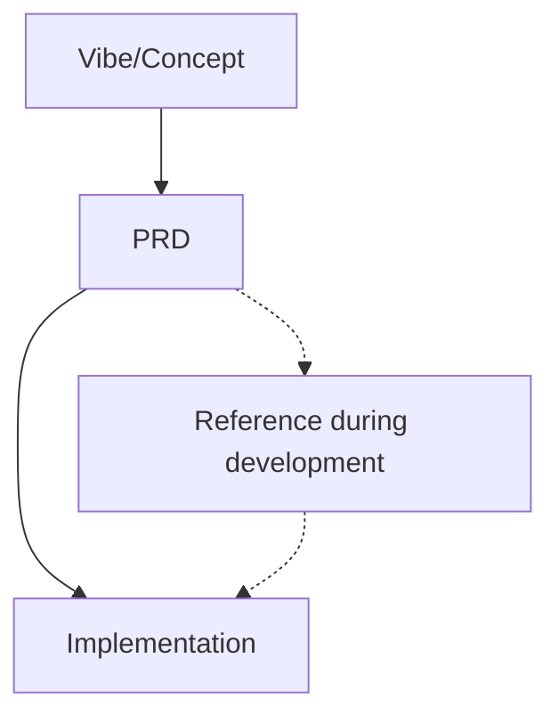
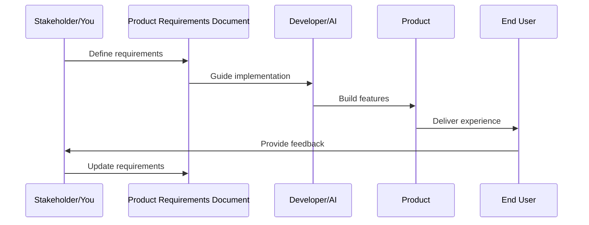

# Chapter 2: Product Requirements Document (PRD)

In [Chapter 1: Vibe Coding](01_vibe_coding_.md), we learned how to approach programming as a creative, emotion-driven activity. Now, let's explore how to translate those vibes and creative ideas into a structured plan that guides implementation – the Product Requirements Document (PRD).

## What Problem Does a PRD Solve?

Have you ever started building something, only to find yourself constantly changing direction as new ideas pop up? Or maybe you've worked with someone else and realized you both had completely different ideas about what you were creating?

**Central Use Case**: Imagine you're building that "cozy, rainy day coffee shop" website we mentioned in Chapter 1. You have a vibe in mind, but how do you make sure:
1. You don't forget important features
2. You don't get distracted by unnecessary features
3. Everyone involved shares the same vision
4. You know when you're actually done

This is exactly what a PRD helps solve. It's like an architect's blueprint before building a house – you wouldn't want your builder to start laying foundation without knowing where the kitchen goes!

## The PRD Blueprint

A Product Requirements Document (PRD) is simply a clear plan that defines what you're building before you start coding. Think of it as a map for your journey:



The beauty of a PRD is that it helps you translate abstract feelings (your vibe) into concrete, actionable items that you can implement.

## Key Components of a PRD

Let's break down the essential elements of a beginner-friendly PRD:

### 1. Product Overview

This is your elevator pitch - a brief description of what you're building and why it matters.

```markdown
# Morning Brew Café Website
A cozy coffee shop website that evokes the feeling of a 
warm café on a rainy day. The site will showcase our menu, 
ambiance, and allow customers to order online.
```

This simple overview immediately tells anyone what you're building and the feeling you want to create.

### 2. User Personas

User personas are fictional characters that represent your typical users. They help you empathize with your audience.

```markdown
## Primary User: "Rainy Day Rachel"
- 28-year-old remote worker
- Visits coffee shops to work 3x weekly
- Values cozy ambiance and good WiFi
- Frustrated by crowded venues and slow ordering
```

By defining who you're building for, you can make better decisions about features and design.

### 3. Feature Requirements

This section lists all the functionality your product needs, organized by priority.

```markdown
## Features
### Must-Have:
- Homepage with cozy café imagery and warm colors
- Menu display with photos and prices
- Contact information and business hours
- Mobile-responsive design

### Should-Have:
- Online ordering system
- Location map with directions
- Newsletter signup
```

Breaking features into priority levels helps you focus on what's truly essential.

### 4. Technical Specifications

Here, you define the technical details that developers need to know.

```markdown
## Technical Specifications
- Colors: Warm browns (#5E4B36), soft grays (#E0E0E0)
- Typography: Libre Baskerville for headings, Open Sans for body
- Stack: HTML/CSS/JavaScript, with optional PHP for contact form
- Hosting: Standard web hosting with PHP support
```

These specifications create consistency and reduce the need for decisions during development.

### 5. Success Metrics

How will you know if your product is successful? Define clear, measurable goals.

```markdown
## Success Metrics
- Website loads in under 3 seconds
- 80% of visitors view the menu page
- 20% of visitors use the contact form
- 10% increase in in-store visitors after launch
```

Good metrics are specific and measurable, giving you a clear way to evaluate success.

## Creating Your First PRD

Let's walk through creating a simple PRD for our coffee shop website:

1. **Start with a template**: Begin with a basic structure including the components we discussed above.

2. **Fill in the big picture first**: Write your overview and user personas before diving into detailed features.

3. **List features, then prioritize**: Write down all possible features, then honestly categorize them as "must-have," "should-have," or "nice-to-have."

4. **Add technical details**: Include specific colors, fonts, technologies, and other technical requirements.

5. **Define success**: Clearly state how you'll measure whether the final product meets your goals.

Here's a snippet of what this might look like:

```markdown
# Morning Brew Café Website PRD

## Overview
A cozy website for our coffee shop that makes visitors feel
warm and welcome, even on rainy days.

## User Personas
[User personas here]

## Features
[Prioritized features here]

## Technical Specifications
[Technical details here]

## Success Metrics
[Measurable goals here]
```

This simple document becomes your roadmap during development, keeping you focused on what matters most.

## Using AI to Refine Your PRD

One of the powerful aspects of modern PRD creation is having deep conversations with AI to refine your requirements. Here's how to do it effectively:

1. **Share your draft PRD**: Show your PRD to an AI assistant like Claude or ChatGPT.

2. **Ask targeted questions**: For example:

```
Based on this PRD for my coffee shop website, what essential
features might I be missing? Are my priorities aligned with
my goals? Is there anything that seems unnecessary?
```

3. **Roleplay different perspectives**: Have the AI take on different roles to expose blind spots.

```
Could you review this PRD from the perspective of:
1. A busy coffee shop customer who wants to order quickly
2. An older customer who isn't tech-savvy
3. A developer who needs to implement this website
```

4. **Challenge assumptions**: Ask the AI to question your core assumptions.

```
What assumptions am I making in this PRD that might be risky?
What alternative approaches might work better?
```

These conversations help refine your PRD and prevent scope creep (the slow expansion of project requirements) by forcing you to justify each feature.

## How a PRD Works Behind the Scenes

When you create and use a PRD, here's what's happening:



The PRD serves as a central reference point that aligns everyone's understanding and sets clear expectations. It creates a feedback loop that keeps development focused on user needs.

## When to Create a PRD

You might be wondering, "Do I need a PRD for every project?" The answer depends on your project's complexity:

- **Small personal project**: A lightweight PRD with just the basics
- **Medium project with stakeholders**: A more detailed PRD with clear priorities
- **Large project with multiple teams**: A comprehensive PRD with detailed specifications

Even for small projects, having at least a simple PRD helps maintain focus and prevents the common problem of endlessly tweaking features without ever finishing.

## PRD Example: Coffee Shop Website

Let's look at what a simple PRD might look like for our coffee shop website example:

```markdown
# Morning Brew Café Website PRD

## Overview
A website for Morning Brew Café that creates a cozy, welcoming feeling
reminiscent of our physical café on rainy days. The website will inform
visitors about our offerings and facilitate online ordering.

## User Personas
### Rainy Day Rachel (Primary)
- 28-year-old remote worker
- Visits coffee shops 3x weekly to work
- Values cozy atmosphere and good WiFi
- Wants to check menu and place orders online

## Features (Prioritized)
### Must-Have:
- Homepage with café imagery and warm color scheme
- Menu page with photos, descriptions, and prices
- About Us page with our story and philosophy
- Contact page with business hours and location

### Should-Have:
- Online ordering system
- Newsletter signup
- Instagram feed integration
- Events calendar

### Nice-to-Have:
- Customer loyalty program
- Staff profiles
- Coffee brewing tutorials
- Blog with coffee tips

## Technical Specifications
- Color palette: Warm browns (#5E4B36), soft grays (#E0E0E0)
- Typography: Serif fonts for headings, sans-serif for body
- Responsive breakpoints: Mobile (<768px), Tablet (<1024px), Desktop (>1024px)
- Technology: HTML/CSS/JavaScript, optional WordPress CMS

## Success Metrics
- Site loads in <3 seconds on desktop, <5 seconds on mobile
- 20% of visitors view the menu page
- 5% of visitors place online orders
- 10% increase in foot traffic to physical café after launch
```

This simple document provides clear direction for implementation while remaining focused on creating the cozy vibe we want for our coffee shop website.

## Conclusion

A Product Requirements Document transforms vague ideas and feelings into a concrete plan of action. It helps prevent scope creep, aligns expectations, and provides a reference point throughout development.

Remember that a PRD isn't set in stone—it's a living document that can evolve as you learn more. The key is having a clear plan before you dive into implementation.

With your PRD in hand, you're ready to start implementing your vision. But how do you effectively communicate with AI to help build your product? That's what we'll explore in our next chapter: [Prompt Engineering](03_prompt_engineering_.md).

---

