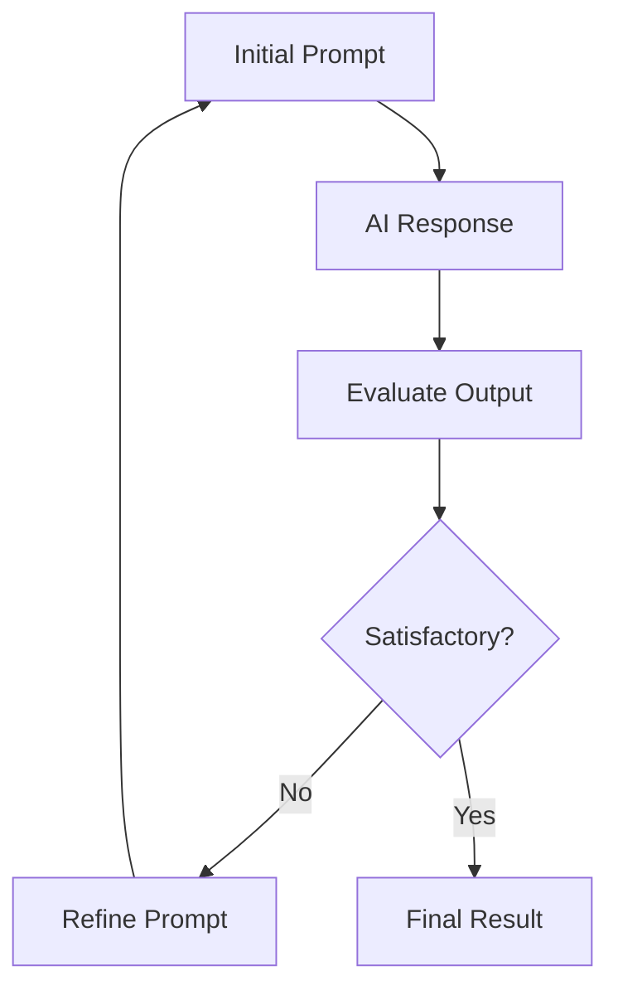
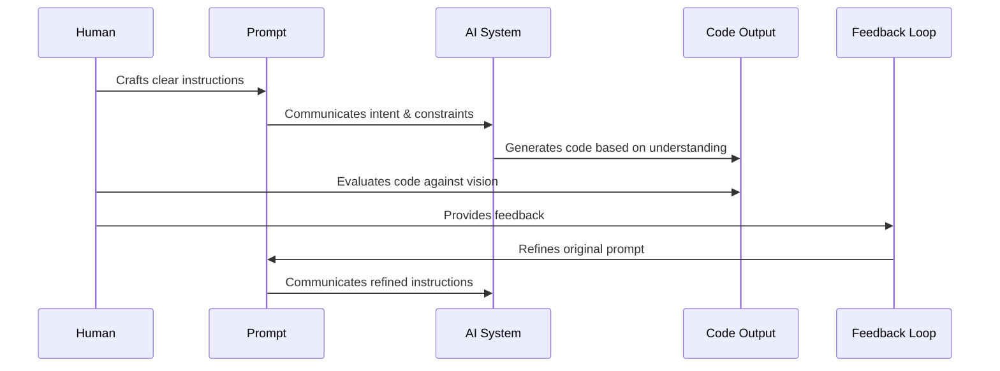

# Chapter 3: Prompt Engineering

In [Chapter 2: Product Requirements Document (PRD)](02_product_requirements_document__prd__.md), we learned how to create a structured plan for our project. Now it's time to explore how to effectively communicate with AI to bring that plan to life through the art of prompt engineering.

## What Problem Does Prompt Engineering Solve?

Have you ever asked an AI to help you with code, only to receive something completely different from what you wanted? Or maybe you got code that worked but didn't match the style or vibe you were going for?

**Central Use Case**: Imagine you want to create a "neon cyberpunk-styled button" for your website. You could simply ask an AI, "Make a button," but you'd likely get a generic result. With proper prompt engineering, you can guide the AI to create exactly the button you envision—with the right colors, animations, and overall cyberpunk feel.

Prompt engineering bridges the gap between your creative vision and what the AI produces.

## The Art of Prompt Engineering

Think of prompt engineering like being a movie director. The AI is your talented crew with all the technical skills, but it needs your clear guidance to create the scene you're envisioning.

### Key Components of an Effective Prompt

A well-crafted prompt typically includes:

1. **Context**: Background information about your project
2. **Objective**: What you want to create
3. **Vibe/Style**: The aesthetic feel you're aiming for
4. **Technical Requirements**: Languages, frameworks, or constraints
5. **References**: Examples or inspirations (when helpful)

Here's a simple template you can follow:

```
I'm building [project type]. I need [specific component] 
that [functionality]. It should feel [vibe/aesthetic] 
and use [technical requirements].
```

This template provides the AI with all the essential information in a clear, structured way.

## Prompt Engineering in Action

Let's see how we can use prompt engineering to create our cyberpunk button:

### Basic Prompt (Not Very Effective)

```
Create a button for my website.
```

This prompt is too vague. The AI has no idea what kind of button you want or what your website is about.

### Improved Prompt

```
Create an HTML/CSS button for my cyberpunk-themed website. 
It should glow neon blue, have a slight hover animation, 
and feel futuristic.
```

This is better! The AI now knows your button should fit a cyberpunk aesthetic with specific features.

### Well-Engineered Prompt

```
I'm building a cyberpunk-themed music app. Create a "Play" 
button using HTML and CSS that:
- Glows electric blue (#00FFFF)
- Has a subtle pulse animation
- Shows a glitch effect on hover
- Works on mobile devices
```

This prompt is excellent because it:
- Provides context (cyberpunk music app)
- States the specific component needed (Play button)
- Details the visual style (glow, color, animations)
- Includes technical requirements (HTML/CSS, mobile compatibility)

## Types of Prompts for Different Coding Tasks

Different coding tasks require different prompt approaches:

### Component Creation Prompts

For creating UI elements like buttons, forms, or cards:

```
Create a login form for my lo-fi study app using React. 
It should feel calm and minimal with soft pastel colors 
and gentle animations.
```

This prompt focuses on a specific UI component with clear aesthetic direction.

### Styling Prompts

For getting help with visual design:

```
Write CSS for a header that feels like a vaporwave sunset 
with gradient colors from purple to pink and cyan. Add a 
subtle animation that feels dreamy.
```

This prompt specifically targets the visual styling with emotional descriptors.

### Functionality Prompts

For implementing features or behaviors:

```
Write JavaScript that makes my image gallery smoothly 
transition between photos when clicked. The animation 
should feel elegant and not too fast.
```

This prompt focuses on behavior and interaction, still with an aesthetic direction.

### Debugging Prompts

For fixing issues in your code:

```
My button animation looks jerky instead of smooth. Here's 
my CSS: [code]. How can I fix it to make it flow better?
```

This prompt clearly identifies the problem and provides the relevant code.

## The Iterative Prompt Refinement Process

Prompt engineering is rarely a one-shot process. Think of it as a conversation:



Let's see how this works in practice:

### Initial Prompt
```
Create a cyberpunk button with HTML and CSS.
```

### AI Response
*AI generates a basic button with some neon styling*

### Evaluation
"The button is too simple and doesn't have the glitchy feel I want."

### Refined Prompt
```
The button looks good, but make it more glitchy. Add a 
flickering effect to the glow and make the text appear 
to distort slightly when hovered.
```

### Final Result
*AI generates an improved button with the requested effects*

This back-and-forth process helps you progressively guide the AI toward your vision.

## How Prompt Engineering Works Behind the Scenes

When you craft a prompt for an AI system, here's what's happening:



The AI doesn't "see" your website or truly "understand" aesthetics like humans do. It relies entirely on your textual descriptions and examples to generate appropriate code. That's why being clear, specific, and providing context is so important.

## Prompt Templates for Common Coding Scenarios

Here are some ready-to-use templates for different situations:

### Website Component Template

```
I'm building a [style] website for [purpose]. Create a 
[component] using [technology] that feels [aesthetic 
description] and functions to [behavior description].
```

Example:
```
I'm building a minimalist website for a photographer. 
Create a photo gallery using HTML/CSS/JS that feels elegant 
and simple, and functions to display images in a grid that 
expands when clicked.
```

### Styling Request Template

```
Style this [component] to look [aesthetic description]. 
Use [color scheme/reference] and make it feel [emotional 
quality].

Here's my HTML:
[your HTML code]
```

Example:
```
Style this navigation menu to look retro-futuristic. Use 
dark backgrounds with bright accent colors and make it feel 
innovative yet nostalgic.

Here's my HTML:
<nav>
  <ul>
    <li><a href="#">Home</a></li>
    <li><a href="#">About</a></li>
    <li><a href="#">Contact</a></li>
  </ul>
</nav>
```

### Bug Fix Template

```
My code isn't working as expected. I want it to [desired 
behavior], but instead it's [current behavior].

Here's my code:
[your code]

How can I fix it?
```

These templates provide a starting point that you can customize for your specific needs.

## Prompt Engineering Best Practices

To get the best results from AI coding assistants:

### 1. Be Specific About Aesthetics

Instead of saying:
```
Make it look cool.
```

Say:
```
Make it look like a retro arcade interface with pixel fonts, 
scanlines, and a neon green (#39FF14) and black color scheme.
```

The more specific you are about the visual style, the better the AI can match your vision.

### 2. Provide Examples When Possible

```
Create a button similar to the ones on synthwave.com, with 
that same glowing pink border and retro font style.
```

References to existing designs help the AI understand your aesthetic goals.

### 3. Break Down Complex Requests

Instead of asking for an entire complex feature at once, break it down:

```
First, let's create the basic structure for the music player.
Then we'll style it with our vaporwave aesthetic.
Finally, we'll add the playback functionality.
```

This step-by-step approach helps the AI focus on one aspect at a time.

### 4. Specify Technical Constraints

```
Create this using only CSS (no JavaScript) and ensure it's 
compatible with modern browsers including mobile Safari.
```

Being clear about technical limitations helps the AI generate appropriate solutions.

### 5. Use Clear Feedback for Refinement

When refining a prompt, be specific about what's working and what isn't:

```
I like the color scheme of the button, but the animation is 
too fast and jarring. Please make it smoother and about half 
the speed.
```

This targeted feedback helps the AI understand exactly what to adjust.

## Common Prompt Engineering Pitfalls

### Being Too Vague

❌ "Make a cool website"
✅ "Create a landing page for a jazz cafe with a warm, intimate atmosphere using earth tones and elegant typography"

### Overloading With Requirements

❌ A paragraph with 15 different requirements
✅ Breaking complex requests into a series of focused prompts

### Inconsistent Direction

❌ Asking for minimalist design, then requesting lots of flashy features
✅ Maintaining consistent aesthetic direction throughout your prompts

### Ignoring Context

❌ Jumping straight to specific details without setting context
✅ Starting with project context before diving into specifics

## Conclusion

Prompt engineering is the art of clearly communicating your creative vision to AI systems. By providing context, being specific about aesthetics, and iteratively refining your prompts, you can guide AI to generate code that matches your unique vibe.

Remember that prompt engineering is a skill that improves with practice. Don't be afraid to experiment with different approaches and learn from each interaction with AI systems.

With the prompt engineering skills you've learned in this chapter, you're now ready to establish an effective collaboration workflow with AI. In [Chapter 4: AI Collaboration Workflow](04_ai_collaboration_workflow_.md), we'll explore how to structure this collaboration for maximum creativity and productivity.

---

