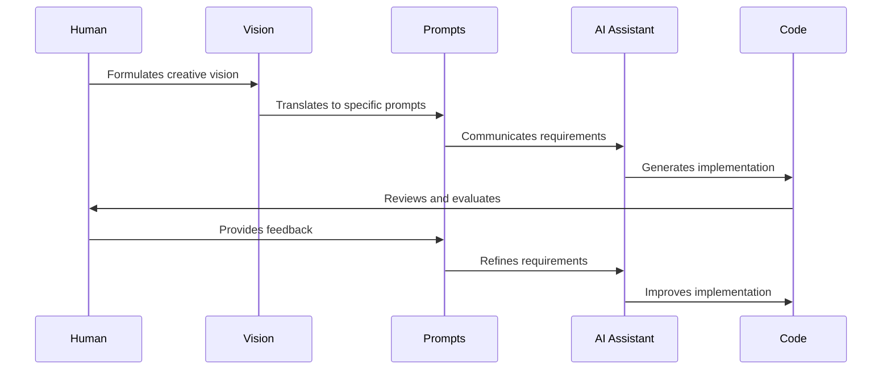

# Chapter 4: AI Collaboration Workflow

In [Chapter 3: Prompt Engineering](03_prompt_engineering_.md), we learned how to craft effective prompts to communicate with AI. Now, let's explore how to establish a complete workflow for collaborating with AI throughout your creative process.

## What Problem Does AI Collaboration Workflow Solve?

Have you ever felt lost about how to work with AI beyond just writing a single prompt? Or maybe you've gotten good results once but struggled to repeat that success consistently?

**Central Use Case**: Imagine you're building a personal portfolio website with a "neon cyberpunk" aesthetic. You have a vision in mind but aren't sure how to break down the project into manageable pieces that you can effectively collaborate with AI on. An AI Collaboration Workflow gives you a structured approach to this partnership—from initial vision to final implementation.

## The Dance of Human and AI Collaboration

Think of working with AI like a dance partnership. You, the human, are the lead dancer with the creative vision and direction. The AI is your dance partner, following your lead but contributing strength and technical execution.

This dance requires:
1. Clear leadership (your creative direction)
2. Responsive following (AI's implementation)
3. Continuous communication (your prompts and feedback)
4. Mutual adaptation (learning from each interaction)

## Key Phases of the AI Collaboration Workflow

Let's break down the workflow into four main phases:

### 1. Vision Formation 💭

This is where you clarify what you want to create before involving AI:

```
// Vision Document Example
Project: Cyberpunk Portfolio
Feel: Neon-lit, futuristic, edgy, technological
Key Elements: Glowing text, dark background, circuit patterns
User Journey: Impress → Engage → Contact
```

This simple document captures your creative vision. Think of it as creating a mood board or creative brief before starting a design project.

### 2. Conceptual Translation 🔄

This phase bridges your creative vision and technical implementation:

```
// Cyberpunk Vision to Technical Elements
Colors: Neon pink (#FF00FF), electric blue (#00FFFF)
Typography: Glitch effects, monospace fonts
Layout: Asymmetrical grid, terminal-inspired sections
Animation: Subtle scan lines, typing effects
```

Here you're translating abstract feelings into concrete technical specifications that the AI can understand.

### 3. Implementation Dialogue 💬

This is the back-and-forth conversation with AI to create the actual code:

```
You: Create a header for my cyberpunk portfolio with a glowing logo.
AI: [Provides initial code]
You: I like it, but can we make the glow pulse slowly?
AI: [Provides updated code]
```

This dialogue is iterative—you provide direction, evaluate the AI's output, and guide refinements until it matches your vision.

### 4. Integration & Polishing ✨

In this final phase, you combine the various components and refine the details:

```javascript
// Combining header and navigation components
import Header from './components/Header';
import Navigation from './components/Navigation';

function App() {
  return (
    <div className="cyberpunk-theme">
      <Header />
      <Navigation />
      {/* More components */}
    </div>
  );
}
```

This phase is about bringing all the pieces together into a cohesive whole and adding those final touches that elevate the project.

## Effective Communication Patterns

To collaborate effectively with AI, certain communication patterns work better than others:

### The Spiral Pattern 🌀

Start broad and progressively get more specific:

```
1. "Create a cyberpunk website structure"
2. "Design the hero section with a neon glow effect"
3. "Refine the button animation to be more glitchy"
```

This pattern allows you to focus on the big picture first and then drill down into details.

### The Feedback Loop Pattern 🔄

Provide specific feedback to guide improvements:

```
"The animation is too fast (observation). It doesn't feel 
smooth enough for our vibe (reasoning). Can we slow it down 
by 50% and add easing (direction)?"
```

Clear feedback helps the AI understand exactly how to improve its output.

## How AI Collaboration Workflow Works Behind the Scenes

When you follow this workflow, here's what's happening:



This cycle repeats throughout the project, with each iteration bringing the implementation closer to your vision.

## Common Challenges and Solutions

### Challenge 1: Maintaining Context

AI has limited memory of your conversation. To address this:

```
// Context Reminder Template
"As a reminder, we're building a cyberpunk portfolio with 
these key elements: [list key elements]. Now, let's continue 
with the contact form..."
```

Periodic context reminders help the AI stay aligned with your project's goals.

### Challenge 2: Vision Drift

Sometimes you can lose sight of your original vision. Create a reference:

```
// Vision Reference
Core Feeling: Technological but human
Color Palette: [specific colors]
Key Interactions: [specific interactions]
```

Refer back to this reference when you feel your project drifting from the original vision.

### Challenge 3: Technical Limitations

Sometimes the AI might not be able to implement your exact vision:

```
You: Can you create a 3D holographic effect for my logo?
AI: That's challenging in standard web technologies, but 
    we could simulate it with these techniques...
```

Be prepared to adapt your vision based on technical possibilities while preserving the core feeling.

## Practical Example: Building a Portfolio Section

Let's see how this workflow might look in practice, focusing on creating a "Projects" section for our cyberpunk portfolio:

### 1. Vision Formation

```
// Projects Section Vision
Purpose: Showcase my best work
Feel: Interactive terminal/dashboard
Key Feature: Glowing project cards that reveal details on hover
```

### 2. Conceptual Translation

```
// Technical Specifications
Layout: Grid of 3 cards per row on desktop
Card Design: Dark background with neon borders
Interaction: Terminal "boot up" animation on hover
```

### 3. Implementation Dialogue

You: "Create a project card component for my cyberpunk portfolio. It should look like a terminal window with a glowing border."

AI responds with initial code. You review and provide feedback:

```
"I like the design, but can we make the glow effect more 
subtle and add a typing animation when hovering to reveal 
the project description?"
```

The AI refines the implementation based on your feedback.

### 4. Integration & Polishing

```javascript
// Adding the ProjectGrid to our page
function PortfolioPage() {
  return (
    <main>
      <Header />
      <ProjectGrid projects={myProjects} />
      <ContactSection />
    </main>
  );
}
```

Finally, you integrate the component and make final adjustments to ensure consistency with the rest of the site.

## Setting Up Your Collaborative Environment

To make this workflow as smooth as possible, consider:

1. **Documentation Habits**: Keep a record of your vision and key decisions
2. **Conversation Management**: Use a tool that lets you easily reference past conversations
3. **Project Structure**: Organize your files in a way that makes integration easier

```
// Example project structure
portfolio-site/
  ├── vision-doc.md        # Your creative direction
  ├── component-specs.md   # Technical translations
  ├── ai-conversations/    # Records of AI dialogues
  └── src/                 # Actual code
```

This organization helps you maintain clarity throughout the collaboration process.

## Conclusion

The AI Collaboration Workflow transforms how we create digital experiences by establishing a structured partnership between human creativity and AI implementation abilities. By following the four phases—Vision Formation, Conceptual Translation, Implementation Dialogue, and Integration & Polishing—you can maintain creative control while leveraging AI's technical capabilities.

Remember that you are the creative director in this partnership. The AI is your skilled implementation partner, but your vision and aesthetic judgment are what make the project uniquely yours.

In our next chapter, [Vibe Translation](05_vibe_translation_.md), we'll dive deeper into how to translate abstract feelings and aesthetics into concrete technical specifications that AI can implement effectively.

---

