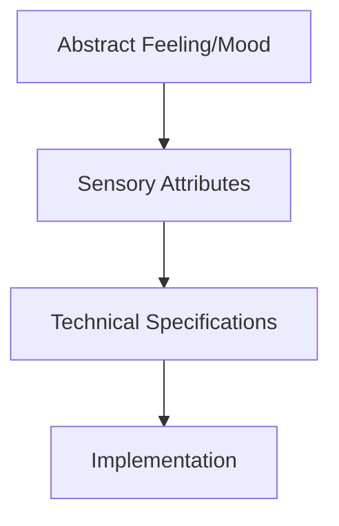
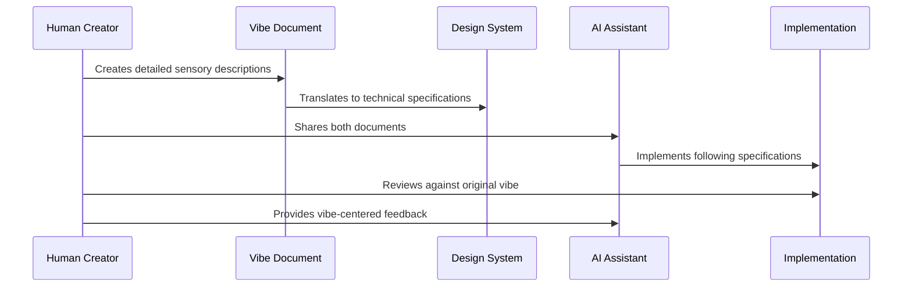

# Chapter 5: Vibe Translation

In [Chapter 4: AI Collaboration Workflow](04_ai_collaboration_workflow_.md), we learned how to establish effective partnerships with AI. Now, let's explore one of the most magical aspects of vibe coding: how to translate abstract feelings and aesthetic intentions into concrete technical specifications that both humans and AI can implement.

## What Problem Does Vibe Translation Solve?

Have you ever had a clear feeling or mood in mind for a project, but struggled to explain it technically? Or maybe you've tried describing a "vintage, cozy feeling" to a developer, only to receive something that looks completely different from what you imagined?

**Central Use Case**: Imagine you want to create a website that feels like "a rainy day in a jazz café" — how do you turn that abstract feeling into colors, fonts, animations, and interactions that developers or AI can implement?

Vibe Translation gives you a structured approach to convert these emotional and aesthetic concepts into specific technical choices.

## The Art of Vibe Translation

Think of Vibe Translation like being a movie director. You can't just tell your cinematographer "make it feel sad" — you need to specify lighting, colors, camera movements, and music that create sadness. Similarly, you can't just tell AI "make it cozy" — you need to translate that feeling into technical specifications.



Let's break down the Vibe Translation process into three key parts:

### 1. Documenting Your Vision

Before you can translate a vibe, you need to capture it clearly:

```markdown
# Jazz Café Vibe Documentation

## Core Feeling: 
Warm, intimate, slightly melancholic, sophisticated

## Sensory Attributes:
- Visual: Warm amber lighting, deep browns, soft focus
- Sound: Gentle background chatter, soft jazz, rain on windows
- Texture: Smooth wooden surfaces, warm ceramic mugs
- Movement: Unhurried, gentle transitions, relaxed pacing
```

This simple documentation helps clarify your vision before attempting to translate it to code. It focuses on the sensory experience, which is easier to translate than abstract concepts.

### 2. Creating a Sensory-to-Code Map

Next, we create a bridge between sensory experiences and code elements:

```markdown
## Visual → Code Translation
- Warm amber lighting → Color palette with ambers (#CD8500) and browns (#5E2C04)
- Soft focus → Subtle blur effects, gentle shadows (box-shadow: 0 4px 12px rgba(0,0,0,0.1))
- Intimate space → Comfortable padding (padding: 24px), slightly inward layout

## Movement → Code Translation
- Unhurried pace → Slow transitions (transition: all 0.5s ease-in-out)
- Gentle movements → Subtle hover effects (transform: translateY(-3px))
- Relaxed rhythm → Generous line height (line-height: 1.8)
```

This mapping bridges the gap between how something feels and how to implement it. It gives you specific technical choices that will evoke the desired feelings.

### 3. Implementation Guides

Finally, we create specific implementation instructions:

```css
/* Cozy Jazz Café Button */
.jazz-cafe-button {
  background-color: #5E2C04;
  color: #F4EAD5;
  padding: 12px 24px;
  border-radius: 6px;
  transition: all 0.5s ease-in-out;
  border: none;
  box-shadow: 0 4px 12px rgba(0,0,0,0.15);
}
```

This code snippet implements our "jazz café vibe" into a specific element. The color choices, shadow, padding, and transition all work together to create the warm, unhurried feeling we documented.

## Vibe Translation in Practice: Our Jazz Café Example

Let's see how to apply Vibe Translation to our central use case. We'll work through translating "rainy day in a jazz café" into a complete website design.

### Step 1: Create a Detailed Vibe Document

Start by expanding your vision into detailed sensory descriptions:

```markdown
# Jazz Café Website Vibe

## Core Feeling
A warm sanctuary on a rainy day, intimate and sophisticated,
with the gentle melancholy of jazz music.

## Key Sensory Elements
- Deep wooden browns with amber accents
- Soft, diffused lighting effects
- Gentle, unhurried movements
- Comfortable spacing, like a cozy booth
- Smooth, warm interactions
```

This document becomes your reference point throughout development. It's what you'll share with collaborators (human or AI) to communicate your vision.

### Step 2: Translate to a Design System

Next, convert these sensory elements into specific design choices:

```markdown
# Jazz Café Design System

## Colors
- Primary: Deep Brown (#5E2C04)
- Secondary: Warm Amber (#CD8500)
- Background: Cream Paper (#F4EAD5)
- Text: Dark Coffee (#2C1C10)

## Typography
- Headings: Serif font (Georgia), slightly larger size
- Body: Readable serif (Merriweather), comfortable line height (1.8)

## Spacing
- Generous padding (24px base unit)
- Comfortable margins between sections (48px)

## Interactions
- Slow, gentle transitions (0.5s ease-in-out)
- Subtle hover states (slight movement, shadow changes)
- Gradual page transitions (fade effects)
```

This design system translates your feelings into technical specifications that can be consistently applied across your project.

### Step 3: Implement Specific Components

Now, let's create specific code snippets for key components:

```html
<!-- Jazz Café Header -->
<header class="jazz-header">
  <h1>Midnight Notes</h1>
  <p>A jazz café for rainy evenings</p>
</header>
```

```css
/* Jazz Café Header Styling */
.jazz-header {
  background-color: #5E2C04;
  color: #F4EAD5;
  padding: 48px 24px;
  text-align: center;
  box-shadow: inset 0 0 100px rgba(0,0,0,0.3);
}
```

This code creates a header with our warm colors, comfortable spacing, and a subtle shadow that creates a soft lighting effect—all evoking our jazz café vibe.

### Step 4: Add Interactions That Reinforce the Vibe

The way elements respond to users should also reflect your vibe:

```css
/* Jazz Café Button Hover State */
.jazz-cafe-button:hover {
  transform: translateY(-3px);
  box-shadow: 0 6px 15px rgba(0,0,0,0.2);
  background-color: #6E3C14;
}
```

This hover effect creates a gentle, smooth movement upward with enhanced shadow—giving a warm, responsive feeling that matches our café vibe.

## How Vibe Translation Works Behind the Scenes

When you practice Vibe Translation, here's what's happening:



The key insight is that the Vibe Document and Design System act as translation layers between your emotional intent and the technical implementation. They provide a shared language that both humans and AI can understand.

## Translating Different Aesthetic Movements

Different subcultural aesthetics have their own "vocabulary" of visual and interactive elements. Here are quick translations for three popular aesthetics:

### Vaporwave Translation

```css
/* Vaporwave Button */
.vaporwave-button {
  background: linear-gradient(to right, #ff6ad5, #c774e8);
  border: 2px solid #8795e8;
  color: white;
  font-family: "VCR OSD Mono", monospace;
  text-shadow: 2px 2px #ff6ad5;
  padding: 10px 20px;
}
```

Vaporwave uses gradients, glitch effects, retro computer fonts, and bright neon colors to create a nostalgic digital aesthetic.

### Cyberpunk Translation

```css
/* Cyberpunk Card */
.cyberpunk-card {
  background-color: #0c0c14;
  border-left: 3px solid #00f0ff;
  color: #ffffff;
  font-family: "Rajdhani", sans-serif;
  box-shadow: 0 0 15px rgba(0, 240, 255, 0.5);
  padding: 15px;
}
```

Cyberpunk combines dark backgrounds, neon accents, futuristic fonts, and glowing elements to create a high-tech dystopian feel.

### Lo-fi Translation

```css
/* Lo-fi Player */
.lofi-player {
  background-color: #e9e2d0;
  border-radius: 8px;
  box-shadow: 3px 3px 0 #303030;
  font-family: "Space Mono", monospace;
  color: #303030;
  padding: 16px;
}
```

Lo-fi aesthetics use muted colors, simple shapes, slight imperfections, and warm tones to create a relaxed, nostalgic feeling.

## Advanced Vibe Translation Techniques

As you become more comfortable with basic Vibe Translation, you can explore more sophisticated techniques:

### 1. Mood Boards

Create visual collections of images, colors, typography, and design elements that capture your intended feeling:

```html
<div class="mood-board">
  
  <div class="color-swatch" style="background-color: #5E2C04;"></div>
  
  <div class="typography-sample">Midnight Notes</div>
</div>
```

Mood boards are powerful communication tools when working with AI or human collaborators.

### 2. Sensory Experience Maps

Document how you want users to feel as they move through your application:

```markdown
# User Journey Sensory Map

1. First arrival: Warm welcome, gentle introduction
   - Soft fade-in animations
   - Welcoming typography
   
2. Exploration: Curiosity and discovery
   - Subtle hover effects to encourage interaction
   - Gradual revealing of content
   
3. Engagement: Immersion and focus
   - Reduced distractions
   - Smooth transitions between content
```

This approach helps ensure the emotional experience remains consistent throughout the user journey.

### 3. Reference Anchoring

Use existing websites or applications as reference points:

```
"The navigation menu should transition like on Apple.com, 
but with warmer colors and slightly slower animations that
feel more like the relaxed pace of our jazz café vibe."
```

Reference anchoring gives AI concrete examples to understand your aesthetic goals.

## Common Vibe Translation Challenges

### Challenge 1: Vague Aesthetic Descriptions

❌ "Make it feel cool and modern"  
✅ "Create a minimal design with plenty of whitespace, a monochrome color scheme, and subtle micro-interactions that feel precise and intentional"

The second description gives specific sensory and technical details that can be implemented.

### Challenge 2: Inconsistent Vibe Elements

❌ Mixing neon cyberpunk colors with rounded, cute interface elements  
✅ Ensuring all elements (colors, shapes, animations, typography) work together toward the same feeling

Consistency across all design elements creates a more powerful and cohesive vibe.

### Challenge 3: Forgetting Interaction Vibes

❌ Focusing only on visual elements and neglecting how interactions feel  
✅ Designing both visual elements AND how they respond to user actions

Remember that how elements move and respond is just as important to the vibe as how they look.

## Conclusion

Vibe Translation is the bridge between your creative vision and technical implementation. By creating detailed sensory documentation, mapping those sensory elements to technical specifications, and implementing them consistently, you can create digital experiences that genuinely evoke the feelings you intend.

Remember that effective Vibe Translation requires practice. Start by clearly documenting how you want your project to feel, then methodically translate those feelings into specific technical choices. With time, you'll develop an intuitive understanding of which code elements create which emotional effects.

Now that you can translate your aesthetic vision into technical specifications, let's explore how to orchestrate AI systems to implement these specifications efficiently in [AI Orchestration Patterns](06_ai_orchestration_patterns_.md).

---

