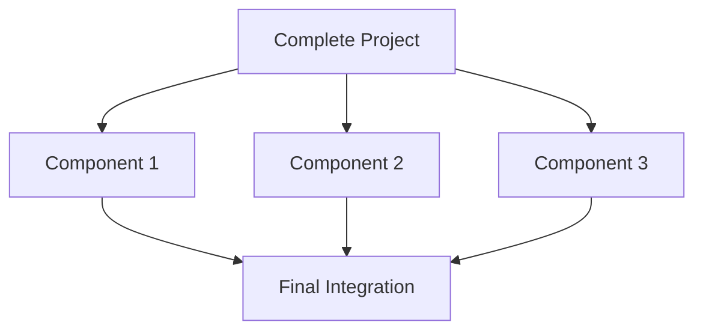
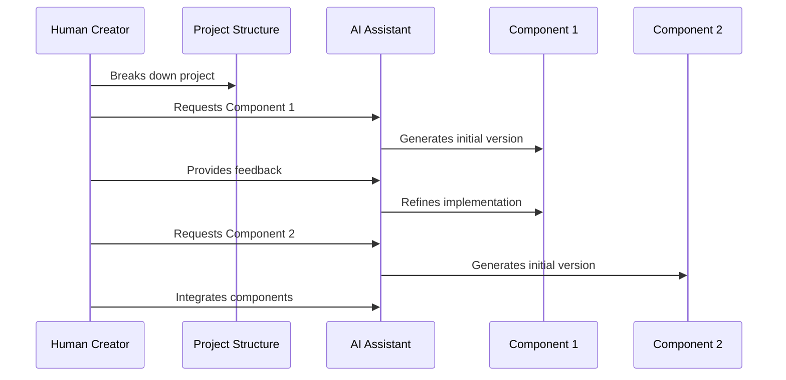

# Chapter 6: AI Orchestration Patterns

In [Chapter 5: Vibe Translation](05_vibe_translation_.md), we learned how to convert abstract feelings into concrete technical specifications. Now, let's explore how to coordinate multiple AI processes to build complete applications—a practice known as AI Orchestration.

## What Problem Does AI Orchestration Solve?

Have you ever felt overwhelmed when trying to build a complex project with AI? Maybe you got great results for individual components but struggled to make them work together cohesively?

**Central Use Case**: Imagine you're building a personal portfolio website with multiple sections—a hero area, about me, project showcase, and contact form. Each section has its own look and functionality, but they need to work together as a unified experience. AI Orchestration helps you manage this complexity by giving you strategies for breaking down projects and coordinating AI assistance across the entire development process.

Think of yourself as a film director. You're not handling every camera, light, and sound equipment yourself—instead, you're coordinating specialists to create a cohesive movie. Similarly, with AI Orchestration, you direct multiple AI processes to build a complete application.

## Core AI Orchestration Patterns

Let's explore four powerful patterns for orchestrating AI:

### 1. Divide and Conquer Pattern

This pattern breaks your complex project into smaller, manageable pieces that you tackle separately.



**Example: Portfolio Website**

```javascript
// Breaking down the portfolio website
const portfolioParts = {
  hero: "Create an attention-grabbing hero section",
  about: "Design a section that tells my story",
  projects: "Showcase my best work with descriptions",
  contact: "Add a form for visitors to reach me"
};
```

This code represents how you might mentally break down your project before working with AI. Each component becomes a separate conversation with AI, focused on just that piece.

### 2. Iterative Refinement Pattern

This pattern starts with a basic implementation and progressively improves it through multiple rounds of feedback.

```javascript
// Starting with a simple hero section
let heroSection = await askAI("Create a basic hero section with my name and title");

// Refining with specific feedback
heroSection = await askAI("The hero looks good, but make the background gradient darker 
                          and add a subtle animation to my name");
```

Here, you're not trying to get the perfect result in one go. Instead, you start simple and provide specific feedback to guide the AI toward your vision step by step.

### 3. Parallel Exploration Pattern

This pattern generates multiple approaches to the same problem, allowing you to compare and choose the best one.

```javascript
// Exploring different project section designs
const designA = await askAI("Create a grid-based project showcase");
const designB = await askAI("Create a carousel-style project showcase");
const designC = await askAI("Create a masonry layout project showcase");

// Compare and select or combine the best elements
```

This approach helps you avoid getting stuck with the first solution. By exploring multiple options, you can discover approaches you might not have initially considered.

### 4. Layered Implementation Pattern

This pattern builds your project in layers, starting with the foundation and adding complexity gradually.

```javascript
// Layer 1: Basic structure
const baseStructure = await askAI("Create HTML structure for a contact form");

// Layer 2: Add styling
const styledForm = await askAI("Add CSS to style this contact form with a 
                               minimalist aesthetic", baseStructure);

// Layer 3: Add functionality
const functionalForm = await askAI("Add JavaScript to validate input fields", styledForm);
```

Each layer builds upon the previous one, allowing you to focus on one aspect at a time rather than trying to get everything right simultaneously.

## Using AI Orchestration Patterns in Practice

Let's see how to apply these patterns to our portfolio website example:

### Step 1: Project Breakdown (Divide and Conquer)

First, create a clear breakdown of your project components:

```markdown
# Portfolio Website Components
- Navigation menu
- Hero section
- About me section
- Skills section
- Project showcase
- Testimonials
- Contact form
- Footer
```

This simple document serves as your project map, helping you manage complexity by focusing on one component at a time.

### Step 2: Component Development (Choose a Pattern for Each Component)

For each component, select the most appropriate pattern:

**Hero Section (Iterative Refinement)**
```javascript
// Start with a basic prompt
let hero = await askAI("Create a hero section for my portfolio with my name 
                       (Sam Chen) and title (UX Designer)");

// Refine with specific feedback
hero = await askAI("Make the background a gradient from dark blue to purple 
                   and add a subtle particle animation");
```

**Project Showcase (Parallel Exploration)**
```javascript
// Explore different approaches
const gridLayout = await askAI("Create a grid layout for my projects");
const cardLayout = await askAI("Create a card-based layout for my projects");

// Choose the preferred approach or combine elements
```

### Step 3: Integration Strategy

Plan how your components will fit together:

```javascript
// Integration strategy example
const integrationPlan = {
  sharedStyles: "Define colors, fonts, and spacing used across components",
  componentOrder: ["nav", "hero", "about", "projects", "contact", "footer"],
  transitionEffects: "Smooth scroll between sections with fade-in animations"
};
```

This plan ensures that even though you developed components separately, they'll work together as a unified experience.

## How AI Orchestration Works Behind the Scenes

When you use these patterns, here's what's happening:



The key insight is that you maintain the high-level vision and structure, while the AI handles implementation details for each component. Your role is to provide clear direction and ensure everything works together cohesively.

## Orchestration in Different Contexts

The patterns adapt to different project types:

### Visual Design Orchestration

When focusing on aesthetics and UI:

```javascript
// Divide and Conquer for visual components
const designComponents = {
  colorPalette: "Generate a warm, approachable color scheme",
  typography: "Suggest font pairings for a modern but friendly feel",
  iconStyle: "Create a consistent icon style for my portfolio"
};
```

This approach breaks visual design into manageable decisions that build toward a cohesive look.

### Functional Development Orchestration

When building interactive features:

```javascript
// Layered Implementation for functionality
// Layer 1: User interface elements
const formUI = await askAI("Create a contact form with name, email, and message fields");

// Layer 2: Add validation logic
const validatedForm = await askAI("Add input validation to ensure valid email format");
```

This approach ensures you have a solid foundation before adding complex functionality.

## Common Orchestration Challenges and Solutions

### Challenge 1: Maintaining Consistency

When different components are created separately, they might not look or feel unified.

**Solution: Style Guide Creation**
```javascript
// Create a central style reference
const styleGuide = await askAI("Create a style guide with colors, typography, 
                               spacing, and component patterns for my portfolio");

// Reference in component requests
const aboutSection = await askAI("Create an about section following this 
                                style guide", styleGuide);
```

A shared style guide helps ensure consistency across all AI-generated components.

### Challenge 2: Managing Context Limitations

AI assistants have limited context windows and can't remember everything about your project.

**Solution: Component Summaries**
```javascript
// Create brief summaries of each component
const heroSummary = "Dark blue to purple gradient background with particle animation";
const aboutSummary = "Clean layout with alternating text and image sections";

// Reference in integration
const integration = await askAI("Combine these components with smooth transitions", 
                               {hero: heroSummary, about: aboutSummary});
```

Brief summaries help you reference previous work without exceeding context limits.

## Conclusion

AI Orchestration Patterns give you strategies for managing complex projects by breaking them into manageable pieces, refining them iteratively, exploring alternatives, and building in layers. By taking on the role of director rather than trying to handle every detail yourself, you can create cohesive applications that would be overwhelming to build in one go.

Remember that the best pattern depends on your specific project needs. Divide and Conquer works well for clearly separable components, Iterative Refinement is perfect for complex elements that need polish, Parallel Exploration helps when you're unsure about the best approach, and Layered Implementation works well for building functionality progressively.

Now that you understand how to orchestrate AI processes, let's explore the environments where this work happens in [Development Environments](07_development_environments_.md).

---

