# Chapter 7: Development Environments

In [Chapter 6: AI Orchestration Patterns](06_ai_orchestration_patterns_.md), we explored how to coordinate multiple AI processes to build complete applications. Now, let's discover the different environments where your code lives throughout its journey from idea to reality.

## What Problem Do Development Environments Solve?

Have you ever experienced this situation? You create an amazing feature on your computer, it works perfectly, but when you share it with users, it breaks mysteriously. Or maybe you've accidentally deleted important user data while testing a new feature?

**Central Use Case**: Imagine you're building a personal blog application. You want to add a new "dark mode" feature. If you develop and test this feature directly on your live blog, you might accidentally break the site for all your readers! Development environments solve this problem by giving your code different places to live during different stages of its lifecycle.

## The Three Gardens of Code

Think of your code like a plant that needs different environments as it grows. Just as a plant moves from a nursery (protected, controlled) to a garden (real-world conditions), your code needs different environments as it matures.

```mermaid
graph LR
    A[Development 🌱] -->|Testing & QA| B[Staging 🔍]
    B -->|Deployment| C[Production 🚀]
```



Let's explore each of these environments:

### 1. Development Environment: The Nursery 🌱

This is where your code first takes root – typically your personal computer or a dedicated development server.

**Key characteristics:**
- Safe place to experiment and make mistakes
- Quick feedback cycles
- Often uses fake or sample data
- Usually accessible only to developers
- Performance isn't the priority
- Debugging tools are enabled

**Example setup:**
```javascript
// config.js - Development environment
const config = {
  database: 'local_test_db',
  apiKeys: 'fake_keys',
  debug: true,
  loggingLevel: 'verbose'
};
```

In this example, we're using a local test database instead of the real one, fake API keys for external services, and turning on debugging and verbose logging to help identify issues.

### 2. Staging Environment: The Greenhouse 🔍

Staging is where your code gets hardened before facing the real world – it's as close to production as possible, but still protected.

**Key characteristics:**
- Mirror of production environment
- Uses anonymized or realistic test data
- Limited access (developers and testers)
- Used for final testing and quality assurance
- Integration with other systems
- Performance testing happens here

**Example setup:**
```javascript
// config.js - Staging environment
const config = {
  database: 'staging_db',
  apiKeys: 'staging_keys',
  debug: false,
  loggingLevel: 'warning'
};
```

Notice how the configuration is becoming more like what we'd use in the real world – we're using a dedicated staging database, actual staging API keys, and we've reduced debugging information.

### 3. Production Environment: The Garden 🚀

This is where your code serves real users and fulfills its purpose – the real-world environment.

**Key characteristics:**
- Serves real users with real data
- Optimized for performance and reliability
- Strict security measures
- Limited access (only operations team)
- Monitoring and alerting in place
- Changes are carefully controlled

**Example setup:**
```javascript
// config.js - Production environment
const config = {
  database: 'production_db',
  apiKeys: 'real_keys',
  debug: false,
  loggingLevel: 'error'
};
```

In production, we use the real database with user data, real API keys that cost money when used, disable debugging for security and performance, and only log errors to keep the system efficient.

## Why We Need All Three Environments

Using separate environments creates several important benefits:

1. **Safety**: Mistakes in development don't affect real users
2. **Freedom**: Developers can experiment without fear
3. **Validation**: Staging proves features work before reaching users
4. **Reliability**: Production stays stable and secure

Imagine you're a chef. You wouldn't experiment with new recipes during the dinner rush with paying customers. Instead, you'd:
- Try new ideas in your test kitchen (Development)
- Have staff taste-test the dish before adding it to the menu (Staging)
- Carefully prepare it for paying customers once it's perfected (Production)

## Moving Code Between Environments

The journey of code through environments follows a specific path:


This diagram shows how code moves from Development to Staging for testing, then to Production for user access, and how user feedback loops back to Development for improvements.

## Environment Setup Examples

Let's see how you might set up different environments for our blog example:

### Development Environment Setup

```javascript
// Blog app - Development setup
const devSetup = {
  database: 'sqlite://:memory:', // In-memory database
  mediaStorage: './local-uploads',
  features: {
    darkMode: true,  // Our new feature being developed
  }
};
```

This setup uses a simple in-memory database that resets when you restart the application, stores uploads in a local folder, and enables the dark mode feature we're developing.

### Staging Environment Setup

```javascript
// Blog app - Staging setup
const stagingSetup = {
  database: 'mysql://staging-server/blog_db',
  mediaStorage: 's3://staging-bucket/media',
  features: {
    darkMode: true,  // Testing our new feature
  }
};
```

The staging environment uses a dedicated MySQL database and Amazon S3 for media storage, similar to production. Our dark mode feature is enabled for testing.

### Production Environment Setup

```javascript
// Blog app - Production setup
const productionSetup = {
  database: 'mysql://production-server/blog_db',
  mediaStorage: 's3://production-bucket/media',
  features: {
    darkMode: false,  // Not yet released to users
  }
};
```

Production uses the real database and storage systems. Notice that our dark mode feature is still disabled until we're confident it works perfectly.

## Feature Flags: Bridging Environments

One powerful technique for managing features across environments is using "feature flags" - switches that turn features on or off:

```javascript
// Feature flag example
const features = {
  darkMode: process.env.ENABLE_DARK_MODE === 'true',
  newCommentSystem: process.env.ENABLE_NEW_COMMENTS === 'true',
  betaSearch: process.env.ENABLE_BETA_SEARCH === 'true'
};
```

Feature flags let you deploy the same code to all environments but control which features are active in each one. This allows for:
- Testing features in development and staging while keeping them off in production
- Gradually rolling out features to small groups of users
- Quickly disabling problematic features without redeploying

## How Development Environments Work Behind the Scenes

Let's understand what happens when we use different environments:


When a developer makes changes, those changes go through a pipeline that applies the appropriate configuration for each environment. The configuration tells the application how to behave in that specific environment.

## Common Environment Challenges

### Challenge 1: "It Works on My Machine"

This classic problem happens when code works in development but fails in staging or production.

**Solution**: Make environments as similar as possible, using containerization tools like Docker:

```javascript
// Docker example (simplified)
// Dockerfile
FROM node:14
WORKDIR /app
COPY package*.json ./
RUN npm install
COPY . .
CMD ["npm", "start"]
```

Docker helps create consistent environments by packaging your application with everything it needs to run.

### Challenge 2: Environment-Specific Bugs

Sometimes bugs only appear in specific environments.

**Solution**: Use environment variables to configure your application:

```javascript
// Using environment variables
const databaseUrl = process.env.DATABASE_URL || 'sqlite://:memory:';
const debugMode = process.env.DEBUG_MODE === 'true';
const apiKey = process.env.API_KEY || 'fake_key_for_development';
```

This approach lets you change behavior without changing code. The application reads its configuration from the environment where it's running.

## Best Practices for Managing Environments

1. **Automate Environment Setup**: Use scripts or tools to create environments consistently
2. **Version Control Your Configurations**: Keep environment settings in version control (with sensitive data properly secured)
3. **Document Environment Differences**: Make sure everyone understands what's different between environments
4. **Monitor All Environments**: Set up basic monitoring even for development to catch issues early
5. **Regular Synchronization**: Keep staging in sync with production data (sanitized if necessary)

## Conclusion

Development environments are essential gardens where your code can safely grow from idea to production-ready application. By understanding the purpose of Development, Staging, and Production environments, you can create a smooth journey for your code that minimizes risk and maximizes quality.

Each environment serves a specific purpose in your code's lifecycle:
- Development is for creativity and experimentation
- Staging is for verification and testing
- Production is for serving real users reliably

In the next chapter, [Operational Procedures](08_operational_procedures_.md), we'll explore how to maintain these environments and keep your application running smoothly once it's live.

---

