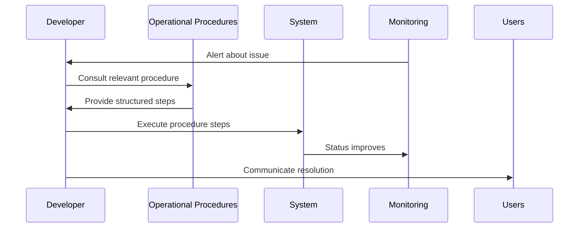
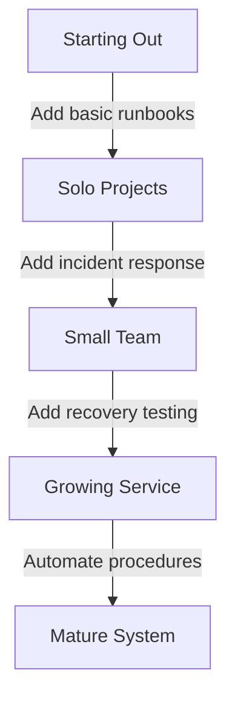

# Chapter 8: Operational Procedures

In [Chapter 7: Development Environments](07_development_environments_.md), we explored the different places where your code lives during development. Now, let's discover how to keep your applications running smoothly once they're live through operational procedures.

## What Problem Do Operational Procedures Solve?

Have you ever experienced the panic of your website suddenly going down and not knowing what to do? Or maybe you've made a change that broke everything and wished you had a clear plan to fix it?

**Central Use Case**: Imagine you've built a personal blog using a modern framework like Next.js, hosted on Vercel, with a Supabase database. Your blog is gaining popularity, but one day you wake up to urgent messages - the site is down! How do you figure out what happened, fix it quickly, and prevent it from happening again?

Operational procedures are your emergency plans, maintenance schedules, and troubleshooting guides that transform chaotic moments into calm, methodical responses.

## The Four Pillars of Operational Procedures

Think of operational procedures like the maintenance manual for a car. You have instructions for regular oil changes, what to do if a warning light appears, and how to recover after a breakdown.

Let's explore the four main types of operational procedures:

### 1. Runbooks: Your Step-by-Step Guides 📖

Runbooks are detailed, step-by-step instructions for performing specific tasks. They're like cooking recipes for your application.

**Example runbook snippet** for checking why your blog is slow:

```markdown
# Blog Performance Check Runbook

1. Check Vercel dashboard for deployment status
2. Run `curl -o /dev/null -s -w "%{time_total}\n" https://yourblog.com`
3. Check Supabase logs for slow queries
4. Verify CDN cache is working with browser inspector
```

This simple runbook gives you specific commands and steps to diagnose performance issues, eliminating guesswork when you're under pressure.

### 2. Incident Response Plans: Your Emergency Protocols 🚨

Incident response plans are your playbooks for handling outages or security breaches. They define who does what during an emergency.

**Example incident response plan snippet**:

```markdown
# Blog Outage Response Plan

## Severity Levels
- Level 1: Slow performance
- Level 2: Features broken
- Level 3: Complete outage

## Initial Response
1. Confirm the issue
2. Post status update for readers
3. Determine severity level
```

This plan helps you categorize problems and provides a clear first response, so you don't freeze when issues arise.

### 3. Recovery Procedures: Your Restoration Instructions 🔄

Recovery procedures help you get back to normal after something breaks. They're your roadmap back to stability.

**Example recovery procedure**:

```markdown
# Database Recovery Procedure

1. Access Supabase dashboard
2. Navigate to Backups section
3. Select most recent backup before incident
4. Create a temporary restore
5. Verify data integrity before full restoration
```

This procedure ensures you can recover your blog's data without making the situation worse through hasty actions.

### 4. Infrastructure Maintenance: Your Preventive Care Plan 🔧

Infrastructure maintenance procedures are scheduled activities that keep your systems healthy and prevent problems.

**Example maintenance schedule**:

```markdown
# Blog Maintenance Schedule

## Weekly
- Check for framework updates
- Review error logs
- Backup content

## Monthly
- Test recovery procedures
- Update dependencies
- Review performance metrics
```

Regular maintenance helps catch small issues before they become major problems, similar to how regular health check-ups prevent serious illness.

## Creating Your First Operational Procedures

Let's walk through creating basic operational procedures for our blog example:

### Step 1: List Critical Functions

Start by identifying what's most important for your application:

```markdown
# Critical Blog Functions
- Content display
- Comment system
- Admin dashboard
- Image uploads
```

This simple list helps you prioritize which procedures to create first - focus on what would hurt most if it broke.

### Step 2: Draft Simple Runbooks

For each critical function, create a basic troubleshooting runbook:

```markdown
# Comment System Troubleshooting

1. Check if comments are loading at all
2. Verify Supabase connection in browser console
3. Test adding a new comment
4. Check for errors in Vercel logs
5. Verify database permissions
```

Keep runbooks simple at first - you can expand them as you learn more about what typically goes wrong.

### Step 3: Create an Incident Response Plan

Develop a basic plan for handling outages:

```markdown
# Blog Incident Response

## Who to Contact
- You (site owner): email@example.com
- Hosting support: Vercel help desk
- Database support: Supabase help desk

## Communication Templates
- Brief outage: "We're experiencing technical difficulties..."
- Extended outage: "We're working on restoring service..."
```

This plan ensures you're not composing explanations for users while also trying to fix the problem.

### Step 4: Document Recovery Steps

Write down how to restore from backups:

```markdown
# Content Recovery Procedure

1. Access your Git repository
2. Look for the last working commit
3. Create a new branch from that commit
4. Deploy this branch as a temporary fix
5. Verify the site is working again
```

Having recovery steps documented in advance prevents panic-induced mistakes when restoring systems.

### Step 5: Schedule Regular Maintenance

Create a simple maintenance calendar:

```markdown
# Maintenance Calendar

## Every Sunday
- Run npm audit to check for vulnerabilities
- Review Vercel analytics for unusual patterns

## First of Month
- Update all dependencies in staging environment
- Test site thoroughly after updates
```

A regular schedule turns maintenance from a forgotten task into a routine habit.

## How Operational Procedures Work Behind the Scenes

When you implement operational procedures, here's what's happening:



The magic happens when the alert comes in - instead of panicking or trying random fixes, you consult your procedures, which give you clear, tested steps to follow.

## Using AI to Enhance Your Operational Procedures

Modern AI tools can help create and improve your operational procedures:

```markdown
# AI-Assisted Runbook Creation

1. Describe your system to AI: "I have a Next.js blog with Supabase database"
2. Ask for specific procedures: "Create a runbook for troubleshooting login issues"
3. Provide additional context: "Users might login with Google or email"
4. Review and customize the AI suggestions
5. Test the procedures in a safe environment
```

AI assistants can help draft initial procedures based on best practices, which you then customize for your specific setup.

## Common Operational Procedures for Web Applications

Here are some essential procedures to consider for any web application:

### 1. Database Backup Verification

```markdown
# Weekly Database Check

1. Navigate to Supabase Dashboard
2. Verify last 7 daily backups exist
3. Perform a test restore on a sample table
4. Check data integrity with `SELECT COUNT(*) FROM posts`
```

This procedure ensures your backups are actually working - many developers only discover backup problems when it's too late.

### 2. Security Update Procedure

```markdown
# Security Update Process

1. Set up notifications for security advisories
2. Create a staging branch for updates
3. Run `npm update` followed by `npm audit fix`
4. Test thoroughly before deploying to production
```

Having a clear process for security updates helps you apply them quickly when vulnerabilities are discovered.

### 3. Performance Degradation Response

```markdown
# When The Site Gets Slow

1. Check server CPU/memory in hosting dashboard
2. Run Lighthouse test to identify bottlenecks
3. Review recent database queries for slowness
4. Check for sudden traffic increases in analytics
```

This procedure helps you methodically identify performance issues rather than making random optimizations.

## Real-World Examples: Handling a Blog Outage

Let's see how our procedures would work in a real scenario where your blog goes down:

### Phase 1: Detection and Response

```markdown
# Outage Detection

1. Monitoring alert shows 500 errors on the site
2. Confirm by visiting the site - it's not loading
3. Check Vercel status page - their service is up
4. Classify as Severity Level 3: Complete Outage
5. Post initial status update for readers
```

These initial steps help you confirm there's a real problem and communicate with users while you investigate.

### Phase 2: Diagnosis Using Runbooks

```markdown
# Diagnosis Steps

1. Check Vercel deployment logs for errors
2. Found: Database connection error
3. Check Supabase status - it's operational
4. Run database connection test from local environment
5. Found: Database credentials were changed
```

The runbook walks you through logical troubleshooting steps rather than random guessing.

### Phase 3: Recovery

```markdown
# Recovery Actions

1. Update environment variables in Vercel dashboard
2. Trigger new deployment with correct credentials
3. Verify site loads and can read from database
4. Confirm comments and other features work
5. Post resolution update for readers
```

The recovery procedure provides a clear path back to normal operation.

### Phase 4: Post-Incident Improvement

```markdown
# Incident Review

1. Document what happened and how it was fixed
2. Add credential verification to weekly maintenance
3. Update runbooks with new learned information
4. Create alert for database connection failures
```

The incident becomes a learning opportunity to improve your procedures for next time.

## Scaling Your Operational Procedures as You Grow

As your application grows, your procedures should evolve:



Begin with simple documentation, then gradually add more structure as your application becomes more important to users.

## Conclusion

Operational procedures transform the chaotic moments of system issues into calm, methodical responses. By creating runbooks, incident response plans, recovery procedures, and maintenance schedules, you're preparing yourself to handle problems effectively before they even happen.

Remember that good operational procedures are living documents that improve over time. Start simple, test your procedures regularly, and update them as you learn more about your system's behavior.

With your operational procedures in place, you're ready to ensure your application not only works correctly but maintains high quality over time. In [Chapter 9: Quality Assurance](09_quality_assurance_.md), we'll explore how to systematically verify that your application meets both functional requirements and quality standards.

---

