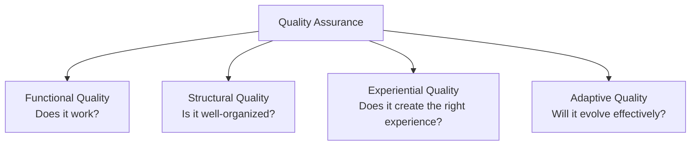
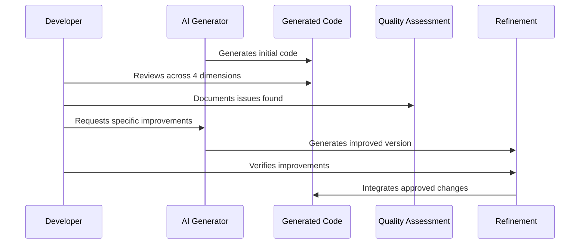

# Chapter 9: Quality Assurance

In [Chapter 8: Operational Procedures](08_operational_procedures_.md), we learned how to keep our applications running smoothly. Now, let's explore how to systematically evaluate and improve AI-generated code through Quality Assurance.

## What Problem Does Quality Assurance Solve?

Have you ever received code from an AI that seemed to work at first glance, but later you discovered bugs, messy organization, or a user experience that just didn't feel right?

**Central Use Case**: Imagine you've used AI to generate a weather dashboard application with a "calm, minimalist aesthetic." The code runs, but before sharing it with users, you want to make sure it's truly high-quality. How do you systematically evaluate and improve this code beyond just checking if it works?

Quality Assurance gives you a framework to comprehensively assess AI-generated code across multiple dimensions, similar to how an editor reviews a manuscript before publication.

## The Four Dimensions of Code Quality

Quality Assurance for AI-generated code involves evaluating four key dimensions:



Let's explore each dimension and how to evaluate it:

### 1. Functional Quality: Does It Work?

This dimension focuses on whether the code correctly performs its intended tasks.

#### Key Evaluation Methods:

1. **Manual Testing**: Interact with the application to verify it works as expected
2. **Edge Case Testing**: Try unusual inputs to see if the code handles them correctly
3. **Console Error Checking**: Look for errors or warnings in the browser console
4. **Performance Testing**: Check if the application responds quickly

For our weather dashboard example:

```javascript
// Testing the weather API connection
async function testWeatherAPI() {
  try {
    const response = await fetch('https://weather-api.example/data?city=Tokyo');
    const data = await response.json();
    console.log('API Test Result:', data ? 'Success' : 'Failed');
  } catch (error) {
    console.error('API Test Failed:', error);
  }
}
```

This simple function helps test if our weather API connection works correctly. By running it with different city parameters, we can verify the core functionality of our application.

### 2. Structural Quality: Is It Well-Organized?

This dimension examines how the code is organized and whether it follows good programming practices.

#### Key Evaluation Methods:

1. **Code Readability**: Is the code easy to understand?
2. **Organization Check**: Are related functions grouped together?
3. **Naming Conventions**: Do variables and functions have clear, descriptive names?
4. **Duplication Scan**: Is there repeated code that could be consolidated?

For our weather dashboard:

```javascript
// Before: Unclear function name and structure
function gd(c) {
  return fetch(`https://api.weather.com/data?loc=${c}`)
    .then(r => r.json());
}

// After: Improved structure and naming
function getWeatherData(cityName) {
  return fetch(`https://api.weather.com/data?location=${cityName}`)
    .then(response => response.json());
}
```

The improved version is much easier to understand and maintain. Clear function names and parameter names make the code's purpose obvious.

### 3. Experiential Quality: Does It Create the Right Experience?

This dimension focuses on whether the application delivers the intended user experience and aesthetic feel.

#### Key Evaluation Methods:

1. **Visual Alignment**: Does the interface match the intended aesthetic?
2. **Interaction Feel**: Do animations and transitions create the right mood?
3. **Responsiveness**: Does the interface adapt well to different devices?
4. **Accessibility**: Can all users, including those with disabilities, use it effectively?

For our calm, minimalist weather dashboard:

```css
/* Before: Busy, high-contrast style */
.weather-card {
  background: linear-gradient(#ff5e62, #ff9966);
  border: 3px solid black;
  box-shadow: 0 8px 15px rgba(0,0,0,0.8);
  transition: all 0.2s;
}

/* After: Calm, minimalist style */
.weather-card {
  background-color: #f8f9fa;
  border-radius: 8px;
  box-shadow: 0 2px 6px rgba(0,0,0,0.1);
  transition: all 0.5s ease;
}
```

The improved style creates a much calmer, more minimalist feel that aligns with our intended experience. The subtle shadow and gentle transition contribute to the peaceful aesthetic.

### 4. Adaptive Quality: Will It Evolve Effectively?

This dimension evaluates how easily the code can be extended, modified, or maintained in the future.

#### Key Evaluation Methods:

1. **Modularity Check**: Is functionality divided into reusable components?
2. **Configuration Review**: Are adjustable values stored as constants or configuration?
3. **Extensibility Assessment**: How easy would it be to add new features?
4. **Documentation Scan**: Is there clear documentation for future developers?

For our weather dashboard:

```javascript
// Before: Hard-coded values, difficult to extend
function setupWeather() {
  fetch('https://weather-api.example/data?city=London')
    .then(response => response.json())
    .then(data => updateDisplay(data));
}

// After: Configurable and extensible
const config = {
  defaultCity: 'London',
  units: 'metric',
  refreshInterval: 30 // minutes
};

function setupWeather(city = config.defaultCity) {
  // Implementation with configuration values
}
```

The improved version uses a configuration object, making it easy to change settings without modifying the core code. This makes future changes and extensions much simpler.

## Quality Assurance in Practice: The Weather Dashboard

Let's see how to apply a complete quality assurance process to our weather dashboard example:

### Step 1: Functional Quality Check

First, we create a simple checklist of core functionality to test:

```javascript
// Test checklist implementation
const testResults = {
  apiConnection: false,
  dataDisplay: false,
  citySearch: false,
  errorHandling: false
};

// Run and mark tests as you complete them
function markTestComplete(testName) {
  testResults[testName] = true;
  console.log(`✅ ${testName} test passed`);
}
```

This simple tracking system helps ensure we test all critical functionality systematically.

### Step 2: Structural Quality Review

Next, we review the code structure and organization:

```javascript
// Structure improvement plan
const codeImprovements = [
  "Organize files by feature (display, api, search)",
  "Standardize naming conventions (camelCase for functions)",
  "Extract repeated fetch logic to a utility function",
  "Add clear comments for complex logic"
];
```

This list helps guide our refactoring efforts to improve code organization.

### Step 3: Experiential Quality Evaluation

For experiential quality, we create a "vibe alignment" checklist:

```javascript
// Vibe alignment check
const vibeGoals = {
  colors: "Soft, muted colors (blues, grays)",
  typography: "Clean, readable font with comfortable spacing",
  motion: "Gentle, slow transitions (0.5s ease)",
  layout: "Generous whitespace, minimal elements"
};
```

This checklist helps ensure the visual and interactive elements create our intended calm, minimalist experience.

### Step 4: Adaptive Quality Assessment

Finally, we evaluate how easily the code can evolve:

```javascript
// Extensibility planning
const futureFeatures = [
  "Weekly forecast display",
  "Weather alerts",
  "Multiple saved locations",
  "Theme customization"
];

// For each feature, rate implementation difficulty (1-5)
```

By thinking about future features now, we can identify and address potential barriers to future development.

## How Quality Assurance Works Behind the Scenes

When you implement quality assurance for AI-generated code, here's what's happening:



The key insight is that quality assurance is an iterative process, with each cycle improving the code across all four quality dimensions.

## Practical Quality Assurance Techniques

Let's explore some specific techniques for each quality dimension:

### Functional Quality Techniques

**Code Testing Snippets:**

```javascript
// Quick function test
function testTemperatureConversion() {
  const celsius = 20;
  const fahrenheit = convertToFahrenheit(celsius);
  console.assert(fahrenheit === 68, 'Conversion is incorrect!');
}
```

This simple test verifies that a specific function works correctly. By writing similar tests for each function, you can systematically verify functional correctness.

**Feedback for AI Improvement:**

```
The weather data isn't displaying correctly for cities with spaces
in their names (like "New York"). Please update the search function
to properly encode city names in the API request URL.
```

Specific, detailed feedback helps the AI understand exactly what needs to be fixed.

### Structural Quality Techniques

**Code Linting Setup:**

```javascript
// Example ESLint rule set (simplified)
const lintRules = {
  'no-unused-vars': 'error',
  'camelcase': 'warn',
  'max-depth': ['warn', 3],
  'prefer-const': 'error'
};
```

Linting tools automatically check your code against established best practices and can identify many structural issues.

**Code Organization Feedback:**

```
Please reorganize the weather display functions into a separate
module called 'weatherDisplay.js' to improve code organization.
All functions related to showing weather data should be moved there.
```

Clear direction about code organization helps the AI improve structural quality.

### Experiential Quality Techniques

**Visual Consistency Check:**

```css
/* Color palette definition for consistency */
:root {
  --primary-color: #2b6cb0;
  --background-color: #f7fafc;
  --text-color: #1a202c;
  --accent-color: #4299e1;
}
```

Defining a central color palette helps ensure visual consistency across the application.

**Animation Feel Feedback:**

```
The current weather change animation is too abrupt (0.2s).
Please make it gentler and slower (0.5s with ease-in-out)
to match our calm aesthetic.
```

Specific feedback about the feel of animations helps align the user experience with your intended vibe.

### Adaptive Quality Techniques

**Documentation Template:**

```javascript
/**
 * Fetches weather data for the specified city
 * @param {string} cityName - The city to get weather for
 * @param {string} units - Either 'metric' or 'imperial'
 * @returns {Promise<Object>} - Weather data object
 */
function getWeatherData(cityName, units = 'metric') {
  // Implementation details...
}
```

Good documentation makes the code much easier to understand and modify in the future.

**Extensibility Feedback:**

```
The current implementation hard-codes the weather data properties.
Please refactor it to dynamically display whatever properties
the API returns, so we can easily show new data types in the future.
```

This guidance helps the AI make the code more flexible for future changes.

## AI-Specific Quality Assurance Challenges

Working with AI-generated code presents unique quality assurance challenges:

### 1. Hallucinated Features

AI sometimes "hallucinates" features or functions that don't exist. Always verify that imported libraries, APIs, and functions actually exist.

```javascript
// AI might generate code that imports non-existent modules
import { formatWeather } from './weatherUtils';

// Verify each import actually exists in your project
```

### 2. Inconsistent Patterns

AI may mix different coding styles or patterns in a single project.

```javascript
// AI might mix naming conventions
function get_weather_data() { /* snake_case */ }
function updateUserInterface() { /* camelCase */ }

// Standardize on one convention
```

### 3. Over-Engineering

AI often creates overly complex solutions for simple problems.

```javascript
// AI might create an entire class hierarchy for simple data
class WeatherData {
  constructor(temperature, conditions, humidity) {
    this.temperature = temperature;
    this.conditions = conditions;
    this.humidity = humidity;
  }
  // Many methods and complexity...
}

// When a simple object would suffice:
const weatherData = { temperature, conditions, humidity };
```

## Building a Quality Assurance Checklist

To make quality assurance a consistent practice, create a simple checklist:

```markdown
# Weather Dashboard QA Checklist

## Functional Quality
- [ ] API connection works for valid cities
- [ ] Temperature displays in correct units
- [ ] Weather condition icons display correctly
- [ ] Search function handles special characters

## Structural Quality
- [ ] Code follows consistent naming conventions
- [ ] Related functions are grouped together
- [ ] No duplicated code
- [ ] Clear error handling

## Experiential Quality
- [ ] Colors match calm, minimalist aesthetic
- [ ] Animations are gentle and subtle
- [ ] Layout has appropriate whitespace
- [ ] Text is readable on all backgrounds

## Adaptive Quality
- [ ] Configuration values are centralized
- [ ] Functions are modular and reusable
- [ ] Comments explain the "why" behind complex code
- [ ] Code structure allows for planned future features
```

This checklist provides a systematic way to evaluate code quality across all four dimensions.

## Conclusion

Quality Assurance transforms AI-generated code from "it works" to "it works well." By systematically evaluating functional, structural, experiential, and adaptive quality, you ensure that your applications not only function correctly but are also well-organized, create the intended experience, and can evolve effectively over time.

Remember that quality assurance is an ongoing process, not a one-time event. Each iteration of review and improvement brings your code closer to your ideal vision.

With your quality assurance process in place, you're now ready to document your system effectively, which we'll explore in [System Documentation](10_system_documentation_.md).

---

